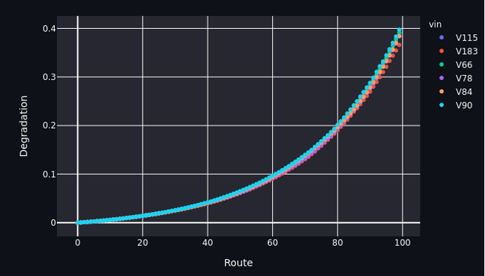
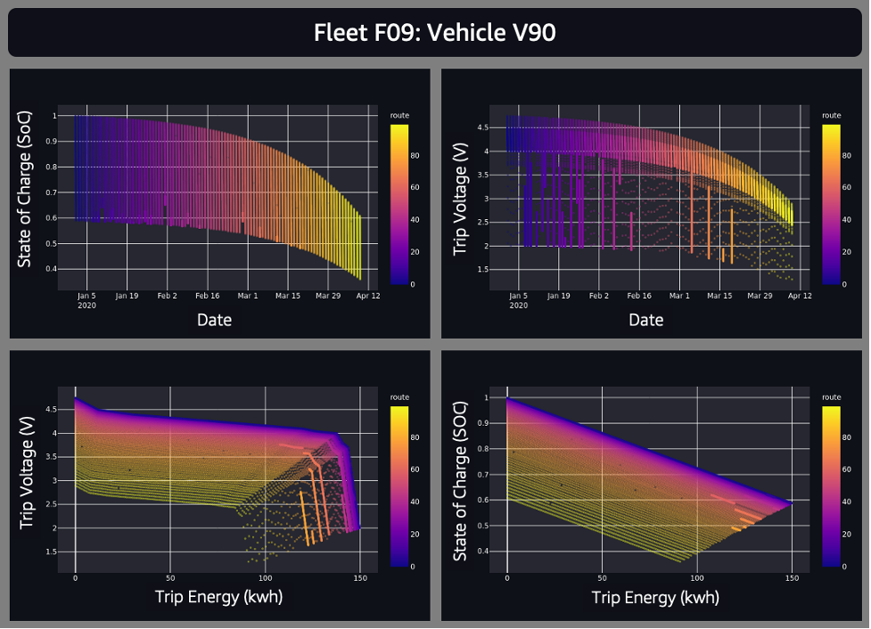

# Synthetic Data Generation Module

The module generates a simulated dataset that mimics real world behavior of n_vehicles over n_routes.

## Battery discharge characteristic
The battery is the most important component in an electric vehicle. The modules uses a phenomenological degradation to generate the data for each vehicle as it progresses through the different routes during its lifecycle. All vehicles start with the ideal battery which is characterized by a cell voltage as a function of discharge.
```
# Battery discharge characteristic from a Spec Speet
battery_dict = {
    'num_cells': 30000,
    'capacity': 12.16,
    'v': [4.75, 4.5, 4.4, 4.3, 4.2, 4.1, 4.05, 4.0, 3.8, 3.7, 2.0],
    'D_Wh': [0, 0.4, 1.0, 2.0, 3.0, 4.0, 4.2, 4.6, 4.7, 4.8, 5.0]
}
```
A vehicle is comprised of several cells that deliver the energy for a given mission.

## Monotonic Battery degradation
As the vehicle ages and with more routes, the battery degrades. For the purpose of generating synthetic data to perform the analysis, a monotonic degradation is imposed on the pristine cell

```
def calc_degradation(cum_trip_dist, cum_trip_hours, cum_load):
    """
    Enforce a degradation in the sample dataset
    :param cum_trip_dist: Cumulative Distance Travelled
    :param cum_trip_hours: Cumulative Trip Hours Logged
    :param cum_load: Cumulative Load carried by the vehicle
    :return:
    """
    nTripFactor = 10
    distFactor = 200  # Used in distance distribution
    tripTimeFactor = 4.0  # Used in trip time distribution
    loadFactor = 10000
    ret_deg_factor = \
        (np.power((1 + 0.35), cum_trip_dist / (nTripFactor * distFactor)) - 1.) + \
        (np.power((1 + 0.35), cum_trip_hours / (nTripFactor * tripTimeFactor)) - 1.) + \
        (np.power((1 + 0.35), cum_load / (nTripFactor * loadFactor)) - 1.)

    return ret_deg_factor * 0.01

```

Shown below are the degradation profile for the different vehicles


## Generate Vehicle Route
This degradation factor is used to generate the route voltage and discharge curve as the vehicle completes its route. 

```
def add_v_battery(trip_pd, battery_dict, degradation=0.):
    """

    For a given route and kwh consumption
    Convert the requirement to a per-cell basis and generate the voltage characteristic

    :param trip_pd: Pandas dataframe to be augmented with Cell Characteristics
    :param battery_dict: Battery Discharge curve specification
    :param degradation: Enforce a degradation to simulate depleted full battery capacity
    :return: Populated DataFrame
    """
```
Shown below are the route profiles for a single vehicle as it goes through its routes


## Configurable parameters for analytic

The user can configure the analytic to generate synthetic data for n_vehicles over n_routes.

```
{
    "analyticSettings": {
        "n_vehicles": 10,
        "n_routes": 100
    }
}
```

For the purpose of analysis, the module is generates data for 100 vehicles, with each vehicle is expected to travel ~100 routes, and every route is assigned a specific distance, speed, load, rolling friction, and drag. The speed is assumed to be constant for each route. The built-in phenomenological damage depends on all the inputs and a random factor to mimic real-world damage and variability. The voltage drop as a function of time in each trip is calculated based on the inputs and the phenomenological model.

<br/>
<br/>

Back to [techniques.md](../../../../../../docs/techniques.md)
