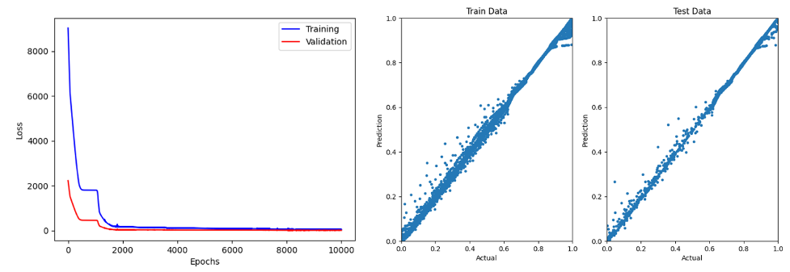

# Model Building using Artificial Neural Networks

This registered out of the box technique in do-pm builds an artificial neural network model using PyTorch. The input artifact for the technique is the data and the output is a trained model.

## Neural Network Model

A dense neural network model is constructed from the input to the output with the hidden layer dimensions specified in the contract. The layers are prepended with a dropout layer to prevent overfitting. In addition the train-test split can also be specified as an inpout to the technique.

## Updatable Model

After the model has been built, the data driven model can be configured to operate in an update mode by specifying a target "layer_name" whose weights and bias can be altered while the other portions of the network are fixed. In the current implementation, we can freeze one layer only but in concept this can be extended to multiple layers which are very close to the output to get more flexibility with the updates. 

## JSON contract

The analyticSettings for the analytic are described below

```
{
    "task": "model_build",
    "analyticSettings": {
        "rel_src_path": "data/<id>",
        "rel_dest_path": "model/<newid2>",
        "neuron_list": [4, 8, 16, 8, 4], # Hidden Layer Configuration
        "input_var_order": ["trip_vel", "trip_dist", "trip_load"], # Order of Inputs to be passed into Model
        "output_var_order": ["trip_v"], # Order of Outputs
        "train_size": 0.8, # Train - Test Split for Model Training
        "max_epoch": 2000, # Max number of epochs for training
        "lr": 0.001, # Learning Rate for Training
        "dropout": 1E-6, # Dropout Regularization for all the dropout layers
        "gpu_mode": true, # Build the model on a GPU or CPU
        "layer_name": "final", # Create the updatable model with teh weights of the "final" layer 
        "range_percent": 20 # Allowed range of variation of the weights and biases
    },
    "inputs": { # Serialized Input Variable Values
    },
    "outputs": # Serialized target Output Variable Values
    {
    },
    "input_artifacts": {
        "data": ["<id>"]
    },
    "output_artifacts": {
        "model": ["<newid2>"]
    },
    "savedState": {},
    "status": ""
}

```

## Plots

After a successful model build, the Loss Vs Epoch plots along with the Predicted vs Actual scatter plots for the train and test datasets are generated.


<br/>
<br/>

Back to [techniques.md](../../../../docs/techniques.md)
