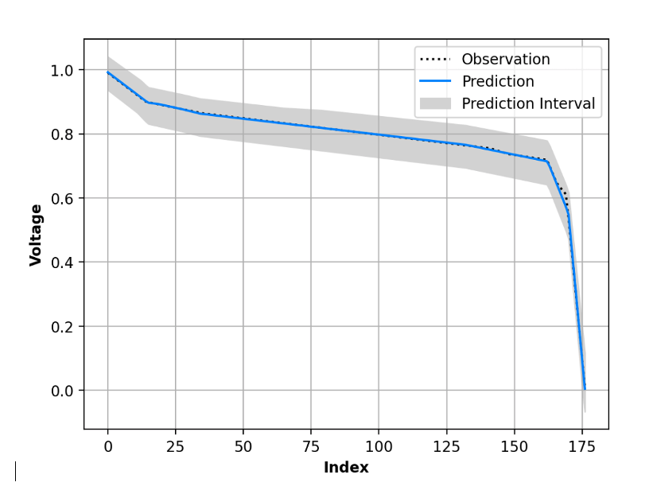

# Model Prediction

The model prediction task takes an input and applies on the model to perform a prediction.

```
# Run the base prediction with this dictionary
model_output = _run_prediction(stub=stub, model_dict=predict_model_dict)
```

In addition to the nominal prediction, several calls to the prediction service is necessary to assemble the uncertainty. Therefore the overall calculation time is minimized by relaying the queries through gRPC to a model server.

```
stub = model_interface_pb2_grpc.ModelServiceStub(
    grpc.intercept_channel(grpc.insecure_channel(name_port), *interceptors)
)
```

If there is a covariance estimate of the model parameters in the model, the model prediction service will perform a multi-variate sampling from the model parameter distribution and run multiple predictions for each model parameter combination. The final output calculates the median values along with the Lower and Upper bound of the predictions.
```
current_state = np.array(_tunableParams_flat)
current_cov = np.array(tunableParamsCov)
# generate samples
samples_2d = np.random.multivariate_normal(current_state, current_cov, num_samples)
```

A sample plot with the prediction along with the uncertainty (depicted by the filled prediction interval) is shown below:



<br/>
<br/>

Back to [techniques.md](../../../../docs/techniques.md)
