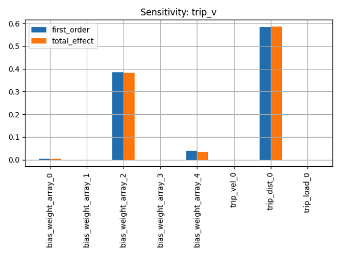
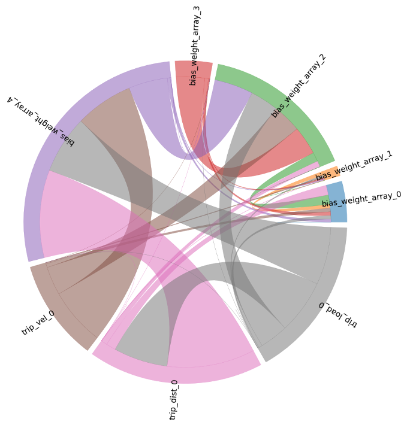

# Model Sensitivity

The aws-do-pm framework contains functionality to perform global sensitivity analysis using Sobol sensitivity. Variance-based measures of sensitivity are attractive because they measure sensitivity across the entire input space, can deal with non-linear responses and can quantify the effect of interactions in non-additive systems. 

The Sobol indices thus provide an estimate of the main and 2-way interaction effects. The sensitivity analysis is performed on the set of updatable model parameters (a subset of all model parameters) to assess the sufficiency of the updatable model parameters for capturing the observed field behavior.

## Analytic Settings Object

The variables in the analyticSettings object are described below:
```
  "analyticSettings": {
    "rel_data_path": "data/<data_id>",
    "rel_model_path": "model/<model_id>",
    "rel_service_path": "service/<service_id>",
    "rel_dest_path": "data/<newid2>",
    "model": "Dict Object", # Dictionary object to invoke the model with
    "num_samples": 1000, # Number of Sobol Saletelli samples
    "num_splits": 10, # Divide the samples into multiple groups for a potential parallel execution
    "percent_range": 20 # Range of Variation of the parameters
  }
```

## Sensitivity Output and Result Interpretation

A sample output of the sensitivity analysis is given below:


For example, this plot shows that the output of the model (trip voltage) is most sensitive to changes in one of the model parameters (bias_weight_array_2). Similarly, the input variable trip_dist has the highest impact on the output trip voltage.

To capture the interaction of multiple variables with each other, the aws-do-pm framework provides the chord plot. A sample plot is shown below.


For example, Each color denotes one variable and the width of the arc connecting two variables denotes the strength of the interaction between them. Understanding the interactions are important because sometimes a variable that is not sensitive by itself might have a large impact on the output through its interaction with another variable with a larger sensitivity. In this particular example, bias_weight_array_1 has a low sensitivity by itself, but cannot be ignored because of its interaction with trip_distance. 

<br/>
<br/>

Back to [techniques.md](../../../../docs/techniques.md)
