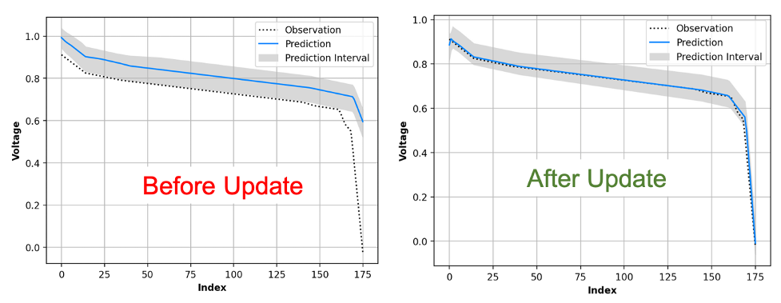

# Model Updating with Unscented Kalman Filter

In aws-do-pm framework, model updating is performed using the Unscented Kalman Filter.
The UKF implementation follows standard formulation described in the link below:
https://en.wikipedia.org/wiki/Kalman_filter#Unscented_Kalman_filter

The steps involved in the UKF-based model update are summarized below:
1.  Initialize the state vector and its covariance.
2.  Generate sigma points.
3.  Propagate sigma points and predict mean and covariance of the state.
4.  Compute sigma points based on predicted mean and covariance.
5.  Calculate output for each sigma point.
6.  Calculate the predicted output as the weighted sum of individual outputs.
7.  Calculate the covariance of the predicted output.
8.  Compute the cross covariance between the predicted state and the predicted output.
9.  Compute the innovation and the filter gain.
10. Update the state vector and its covariance.
11. Repeat steps 2 to 10 for all the data points.

The UKF design parameters (alpha, beta and kappa) as well as the state covariance (P), 
the process noise covariance (Q) and the measurement noise covariance (R) are fixed for the demo example.  
The user may change these values as per the requirements of their application in the 
"task_template_model_update_ukf_grpc.json". All the variables are of type list. The length of the list
equals the number of states in the case pf P and Q and equals the number of outputs in the case of R.

A sample JSON is given below.

````
{
  "task_id": "<newid1>",
  "created_dt": "<timestamp>",
  "updated_dt": "",
  "task_name": "update",
  "technique_name": "model_update_ukf_grpc",
  "task_options": ["-it","--rm"],
  "node_name": "update",
  "dataLocation": "",
  "infraSettings": {},
  "analyticSettings": {
    "rel_data_path": "data/<data_id>",
    "rel_model_path": "model/<model_id>",
    "rel_service_path": "service/<service_id>",
    "rel_dest_path": "model/<newid2>",
    "model": "Dict Object",
    "num_output_points": 50,
    "num_ukf_iter": 40,
    "ukf": {
      "alpha": [
        1
      ],
      "beta": [
        2
      ],
      "kappa": [
        0
      ],
      "P": [
        0.0001
      ],
      "Q": [
        0.0001
      ],
      "R": [
        0.0001
      ]
    }
  },
  "input_artifacts": {
    "data": ["<data_id>"],
    "model": ["<model_id>"],
    "service": ["<service_id>"]
  },
  "output_artifacts": {
    "model": ["<newid2>"]
  },
  "inputs": {
  },
  "outputs": {
  },
  "savedState": {
  }
`````

Below is an example of model predictions, before and after a
model has been updated. Before the update, the model predictions and the actual
observations vary significantly. Most of the observations are beyond the prediction
interval (uncertainty bounds). After the model has been updated, the model predictions
are in line with the observations.



<br/>
<br/>

Back to [techniques.md](../../../../docs/techniques.md)
