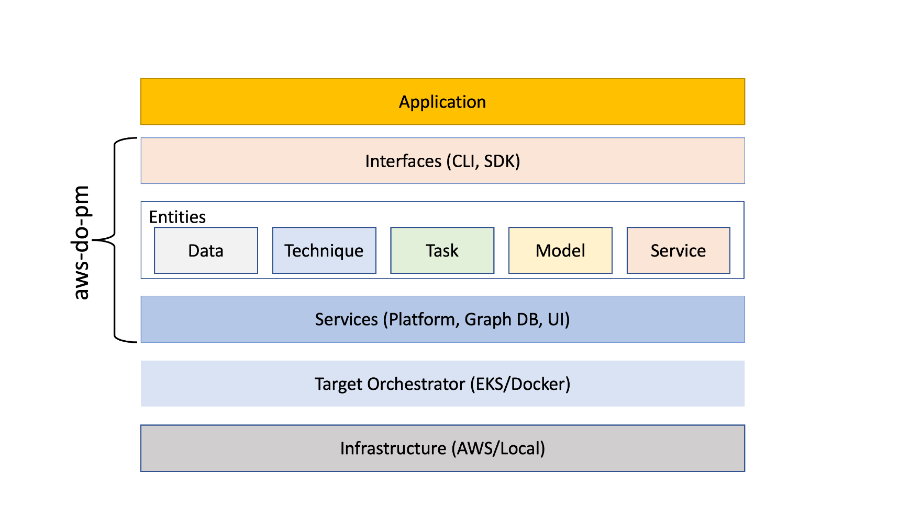

# Inspiration
Predictive models have powered design and analysis of real-world systems 
such as jet engines, automobiles, and powerplants for decades. However, 
their use for operational decisions has been limited by the lack of scalable tools and ease of use of distributed computing systems. For example, if an end user of a model (with 10s of parameters) that predicts the performance of an industrial system wants to update the model with new observations, the end user at a minimum would need to understand the model (e.g., what parameters in the model needs to be updated), know of the techniques that may be useful for updating the model (e.g. Kalman filters), deploy the model in a way that the technique can communicate with, and deploy the technique at scale to update the model. The adoption of these techniques has thus been limited to small-scale problems, given the complexity of the process for even a basic task as “updating models”. Our aim is to enable a broad group of end-users to achieve their outcomes using predictive modeling without worrying about the underlying techniques, orchestration mechanisms, and the infrastructure required to run them.

 
Fig 1. - predictive modeling system run graph slide show

 

# Predictive Modeling (aws-do-pm)
The [aws-do-pm](https://github.com/aws-samples/aws-do-pm) project is an all-in-one template for building a predictive modeling application. It is built on the [Do framework](https://github.com/iankoulski/depend-on-docker) which provides a prescriptive project structure and a set of simple management scripts for building and running your application. An AWS implementation of the Do framework is provided by the [aws-do-docker](https://github.com/aws-sample/aws-do-docker) project, which was extended, to create this code base. 
We demonstrate the power of [aws-do-pm](https://github.com/aws-samples/aws-do-pm) by modeling Electric Vehicles (EVs). The document below will walk you through the process of building, running, and scaling a demo application step by step, starting from a fresh clone of the [aws-do-pm](https://github.com/aws-samples/aws-do-pm) repository to building and automatically deploying continuously updating predictive models for a fleet of Electric Vehicles using Artificial Neural Networks, trained by [PyTorch](https://pytorch.org). Similarly to the included demo, the [aws-do-pm](https://github.com/aws-samples/aws-do-pm) framework can be used to develop predictive modeling applications for other use cases.
The project can be built and deployed in any environment where [Docker](https://docker.com) is available. It can run either on your local machine, on a single server, or on a cluster of servers orchestrated by [Kubernetes](https://kubernetes.io/). For details on provisioning an [Amazon EKS](https://aws.amazon.com/eks/) cluster please refer to the [aws-do-eks](https://github.com/aws-samples/aws-do-eks) project.

# Architecture
This project provides an extensible framework for building predictive modeling and other applications. Its architectural layer digram is shown below.

 
Fig 2. - aws-do-pm architecture

 

Please refer to the [framework](./docs/framework.md) documentation for an architectural deep-dive.

# 0. Prerequisites
There are only two prerequisites that are needed to complete all the steps in this project.

1. [Docker](https://www.docker.com)
2. [AWS User](https://docs.aws.amazon.com/IAM/latest/UserGuide/id_users.html) access keys

# 1. Setup
The [aws-do-pm](https://github.com/aws-samples/aws-do-pm) project is deployed through a one-time container-centric [setup process](./docs/setup.md) which infolves the following steps: clone, configure, build, push, and run.

# 2. Use
The project root directory includes a number of scripts. A brief description of their purpose is included in this section.

* [`./pm`](./pm`) - predictive modeling CLI
* [`./config.sh`](./config.sh) - advanced project configuration
* [`./build.sh`](./build.sh) - build aws-do-pm container images
* [`./login.sh`](./login.sh) - authenticate with the container image registry
* [`./ecr-setup.sh`](./ecr-setup.sh) - create ECR repositories for all container images in the project
* [`./push.sh`](./push.sh) - push aws-do-pm container images to the registry
* [`./pull.sh`](./pull.sh) - pull aws-do-pm container images from the resitry if they are already present there
* [`./run.sh`](./run.sh) - deploy and start all project containerized services
* [`./status.sh`](./status.sh) - show current status of project services
* [`./exec.sh`](./exec.sh) - open a shell into a running service container
* [`./logs.sh`](./logs.sh) - show logs of running services
* [`./test.sh`](./test.sh) - run service unit tests
* [`./stop.sh`](./stop.sh) - stop and remove service containers
* [`./cp-from.sh`](./cp-from.sh) - copy a file from a running service container to a local path
* [`./cp-to.sh`](./cp-to.sh) - copy a file from a local path to a running service container
* [`./ecr-login.sh`](./ecr-login.sh) - create a registry secret that can be used when pulling container images from the registry
* [`./expose.sh`](./expose.sh) - expose a service running in Kubernetes on a local port
* [`./kcfg.sh`](./kcfg.sh) - encode a local kube config and configure the aws-do-pm platform service with Kubernetes access
* [`./ev-demo`](./ev-demo) - execute single electric vehicle demo showing aws-do-pm capabilities
* [`./ev-fleet-demo`](./ev-fleet-demo) - execute electric vehicle fleet demo showing aws-do-pm scale

These scripts are availble both in the project root directory and in the platform container `/app/pm` directory. It is preferable that scripts are exectuted from a platform container shell when possible. A shell can be opened by running `./exec.sh` while the platform is up.

# 3. Demo

Included with the project, there are two demo scripts which showcase the capabilities of the framework to build and deploy predictive modeling applications at scale. The first script [`./ev-demo`](./ev-demo) focuses on demonstrating the capabilities of the framework by building and deploying a continuously updating model (a.k.a. Digital Twin) of a [single electric vehicle](./docs/ev-demo.md). The second script [`./ev-fleet-demo`](./ev-fleet-demo) focuses on demonstrating the scalability of the framework by building and deploying digital twins for a [fleet of electric vehicles](./docs/ev-fleet-demo.md). 

 
Fig 3. - ev-fleet-demo screencast - 100 electric vehicles

 

The battery is the most important component in an electric vehicle. The demo scripts in this project, use phenomenological degradation to generate data for the batteries of electric vehicles. All vehicles start with the “ideal” battery. Each vehicle is expected to travel up to a configured number of routes, and every route is assigned a specific distance, speed, load, rolling friction, and drag. The speed is assumed to be constant for the duration of each route. The built-in phenomenological damage depends on all the inputs and a random factor to mimic real-world damage and variability. The voltage drop as a function of time in each trip is calculated based on the inputs and the phenomenological model.

Please refer to the [EV Demo](./docs/ev-demo.md) and [EV Fleet Demo](./docs/ev-fleet-demo.md) walkthroughs for further details.

# 4. Cleanup
Regardless of the target orchestrator, [cleanup](./docs/cleanup.md) can be done using the same management scripts.

# 5. Develop 
If you wish to develop your own predictive modeling application by extending [aws-do-pm](https://github.com/aws-samples/aws-do-pm), please review the [framework](docs/framework.md) documentation. 
Through the framework's data, model, and technique registration capabilities, it's CLI and SDK, you can implement your own use case. If the included techniques do not fulfill your needs, following the EV example, you can develop and register your own custom techniques. The code for your techniques can be added to this project template, or reside in a separate project. The only requirement of the framework is that your code runs in a [Docker](https://docker.io) container and has an [executor](./docs/techniques.md) that accepts a `--config` argument. 
The framework comes with a number of pre-registered [techniques](docs/techniques.md). Please refer to each technique's documentation details.
Finally, in case you face any issues, check the [troubleshooting](docs/troubleshooting.md) document for known solutions.

# Index
Below is an index of all documents included in the [aws-do-pm](https://github.com/aws-samples/aws-do-pm) project.
* [./docs/setup.md](./docs/setup.md) - One time setup walkthrough
* [./docs/deployment.md](./docs/deployment.md) - EKS setup and deployment walkthrough
* [./docs/ev-demo.md](./docs/ev-demo.md) - Single Electric Vehicle demo
* [./docs/ev-fleet-demo.md](./docs/ev-fleet-demo.md) - Fleet of Electric Vehicles demo
* [./docs/cleanup.md](./docs/cleanup.md) - Cleanup instructions
* [./docs/framework.md](./docs/framework.md) - Framework and Architecture details
* [./docs/techniques.md](./docs/techniques.md) - Technique documentation
* [./docs/troubleshooting.md](./docs/troubleshooting.md) - Troubleshooting tips

# License
This repository is released under the MIT-0 License. See the [LICENSE](LICENSE) file for details.

# References

* [Docker](https://docker.com)
* [Docker Desktop](https://www.docker.com/products/docker-desktop)
* [Docker Compose](https://docs.docker.com/compose/)
* [Kubernetes](https://kubernetes.io)
* [Amazon Web Services (AWS)](https://aws.amazon.com/)
* [Amazon Elastic Kubernetes Service (EKS)](https://aws.amazon.com/eks)
* [Do Framework](https://github.com/iankoulski/do-framework)
* [Depend on Docker Project](https://github.com/iankoulski/depend-on-docker)
* [AWS Do Docker Project](https://github.com/aws-samples/aws-do-docker)
* [EKS Project](https://github.com/aws-samples/aws-do-eks)
