# Single electric vehicle (ev-demo)

The operations included in `ev-demo` are shown on the following flowchart:

<div align="center">

<br/>
Fig 1. - ev-demo flowchart 
</div>
<br/>

The demo is completely automatic and can be executed directly from your shell, as well as from the platform container. 

## 1. Open platform shell
We will open a shell into the platform container and execute the demo script from there against aws-do-pm, running as a local docker-compose deployment. This is recommended in order to avoid any variability due to the users's local shell environment. The commands would be identical when running the demo against a local or distributed Kubernetes instance.

```
./exec.sh
```
Output:
```
root@18aa4d472ec5:/app/pm#
```

## 2. Configure 

### 2.1. Platform
Within the platform shell, execute `pm config set` and review the current settings. If you are running on Docker Compose, the values will already be set. If you are running on Kubernetes, then you will need to set the same values as the initial [setup](./setup.md#2-configure).

### 2.2. Demo
The demo comes with defaults that work. Settings can be adjusted as needed by editing the CONFIGURATION section of the `ev-demo` script.

```
vi ./ev-demo
```

```
############################################################################################
# CONFIGURATION:

# Import system settings
source .env
# Enable QUIET mode to allow command output parsing
export QUIET=true

# Number of vehicles and routes to generate. Only one vehicle will be randomly selected for the demo.
export NUM_VEHICLES=10
export NUM_ROUTES=10

# Number of routes to predict. Route 0 is used for training, route 1 is used for update, predictions start from route 2.
# NUM_PREDICTED_ROUTES<=NUM_ROUTES-2
export NUM_PREDICTED_ROUTES=3

# Model update threshold. If the prediction error is greater than this value, the model for the current vehicle will be udpated.
export MODEL_UPDATE_THRESHOLD=0.05

############################################################################################
```

## 3. Run demo script

```
./ev-demo
```

<details>
<summary>Expand log</summary>
<pre><small>
=================================================================================
                          Executing EV demo
                  for a single vehicle, randomly selected from
                  a fleet of 10 electric vehicles
                       driving 10 routes each
=================================================================================


Launch time: 20220224-023854
</small></pre>
<pre><small>
=================================================================================
          Clearing system ...
=================================================================================

Removing services ...
Clearing graph database ...
Clearing local storage ...
Clearing cloud storage ...
fatal error: An error occurred (NoSuchBucket) when calling the ListObjectsV2 operation: The specified bucket does not exist

remove_bucket failed: Unable to delete all objects in the bucket, bucket will not be deleted.
</small></pre>
<pre><small>
=================================================================================
          Initializing system ...
=================================================================================

{
    "Location": "http://aws-do-pm-alex.s3.amazonaws.com/"
}
Creating Vertex Collection: technique
Creating Vertex Collection: data
Creating Vertex Collection: model
Creating Vertex Collection: service
Creating Vertex Collection: asset
Creating Vertex Collection: task
Creating Vertex Collection: error
Creating Vertex Collection: trash
Creating Vertex Collection: user
Creating Edge Collection: link

Registering technique data_registration ...
task/mrup05ph52bjno3dnltkk7plp39bpg3i
Executing task from wd/task/mrup05ph52bjno3dnltkk7plp39bpg3i/task.json ...
Executing PM task:
['python', '/src/python/pm/task/task_technique_register.py', '--config', 'wd/task/mrup05ph52bjno3dnltkk7plp39bpg3i/task.json']
technique/c03623kizy06twxajbt2wgr7bs7ghumg
Return code: 0

Registering technique model_registration ...
task/qb7sv1h92ab9n0rbmloa3o4dwwh1j2zx
Executing task from wd/task/qb7sv1h92ab9n0rbmloa3o4dwwh1j2zx/task.json ...
Executing PM task:
['python', '/src/python/pm/task/task_technique_register.py', '--config', 'wd/task/qb7sv1h92ab9n0rbmloa3o4dwwh1j2zx/task.json']
technique/vyeadt2bivrpfbgw66h7r8oq4f4dp1wf
Return code: 0

Registering technique model_build_ann ...
task/sr27lkyzsjnsksn741z97rsb8etrr64y
Executing task from wd/task/sr27lkyzsjnsksn741z97rsb8etrr64y/task.json ...
Executing PM task:
['python', '/src/python/pm/task/task_technique_register.py', '--config', 'wd/task/sr27lkyzsjnsksn741z97rsb8etrr64y/task.json']
technique/fyd77r2f504mux7lqyz16upt0ynbti9k
Return code: 0

Registering technique model_serve_grpc ...
task/jb2c4uzgh2ciu8am1j1hc8ahulh8powb
Executing task from wd/task/jb2c4uzgh2ciu8am1j1hc8ahulh8powb/task.json ...
Executing PM task:
['python', '/src/python/pm/task/task_technique_register.py', '--config', 'wd/task/jb2c4uzgh2ciu8am1j1hc8ahulh8powb/task.json']
technique/ghzrgcwia8984k57fvtza1e5sl6mud26
Return code: 0

Registering technique model_service_configure ...
task/mxbqaaeo0hkz2859ey3sg6ym2ldsc0yi
Executing task from wd/task/mxbqaaeo0hkz2859ey3sg6ym2ldsc0yi/task.json ...
Executing PM task:
['python', '/src/python/pm/task/task_technique_register.py', '--config', 'wd/task/mxbqaaeo0hkz2859ey3sg6ym2ldsc0yi/task.json']
technique/lcm7kriknfgy9xxlyofhzhfru9g97le0
Return code: 0

Registering technique model_service_destroy ...
task/ml1f1hjbxlsn1cqmxleqyd58642x5oyo
Executing task from wd/task/ml1f1hjbxlsn1cqmxleqyd58642x5oyo/task.json ...
Executing PM task:
['python', '/src/python/pm/task/task_technique_register.py', '--config', 'wd/task/ml1f1hjbxlsn1cqmxleqyd58642x5oyo/task.json']
technique/l90obo0myv0ko7iyrvq69p88p9pkn8qv
Return code: 0

Registering technique model_update_ukf_grpc ...
task/ske70in52c6nalp68i8mi99s1ahau4fr
Executing task from wd/task/ske70in52c6nalp68i8mi99s1ahau4fr/task.json ...
Executing PM task:
['python', '/src/python/pm/task/task_technique_register.py', '--config', 'wd/task/ske70in52c6nalp68i8mi99s1ahau4fr/task.json']
technique/phbcrp1maka7v11bdhyqx0tdvpm3h2fd
Return code: 0

Registering technique model_predict_grpc ...
task/x8l58tujkhmx4ews4he5ps390h88v204
Executing task from wd/task/x8l58tujkhmx4ews4he5ps390h88v204/task.json ...
Executing PM task:
['python', '/src/python/pm/task/task_technique_register.py', '--config', 'wd/task/x8l58tujkhmx4ews4he5ps390h88v204/task.json']
technique/gs0efg1ggemccochnci9gvbn6436u7dz
Return code: 0

Registering technique model_sensitivity_grpc ...
task/srqmoies40gbr2wuhletoh3gm6ge688u
Executing task from wd/task/srqmoies40gbr2wuhletoh3gm6ge688u/task.json ...
Executing PM task:
['python', '/src/python/pm/task/task_technique_register.py', '--config', 'wd/task/srqmoies40gbr2wuhletoh3gm6ge688u/task.json']
technique/ew1lqmb6osxepmieb5ne4fs3yiz69trg
Return code: 0

</small></pre>
<pre><small>
=================================================================================
       Generating Electric Vehicle data for 10 vehicles, 10 routes each ...
=================================================================================

Number of electrical vehicles: 10
Number of routes per vehicle: 10

Logging in to ecr ************.dkr.ecr.us-west-2.amazonaws.com/ ...
Login Succeeded
100% 10/10 [00:00<00:00, 24.95it/s]
Shape of Overall Pandas DataFrame: (23208, 9)
100% 10/10 [00:01<00:00,  8.09it/s]
100% 10/10 [00:00<00:00, 1187.92it/s]
Exported: wd/generated_ev_data/metadata.json
Task status: wd/generated_ev_data/task_ev_data_generate_status.json
</small></pre>
<pre><small>
=================================================================================
          Registering raw data set ...
=================================================================================


Registering data from local path: wd/generated_ev_data
Temporary destination path: wd/tmp/1/generated_ev_data-20220224023918566
task/dbgrcpuzykme4ef72n8tv7hkpoh4h8n2
Executing task from wd/task/dbgrcpuzykme4ef72n8tv7hkpoh4h8n2/task.json ...
Executing PM task:
['python', '/src/python/pm/data/task_executor_register_data.py', '--config', 'wd/task/dbgrcpuzykme4ef72n8tv7hkpoh4h8n2/task.json']
data/vxm9pykrwrdt401m22dbmqqn8x98oeme
Return code: 0
upload: wd/tmp/1/generated_ev_data-20220224023918566/generated_ev_data/V0_0/input_output.json to s3://aws-do-pm-alex/data/vxm9pykrwrdt401m22dbmqqn8x98oeme/V0_0/input_output.json
upload: wd/tmp/1/generated_ev_data-20220224023918566/generated_ev_data/V0_3/input_output.json to s3://aws-do-pm-alex/data/vxm9pykrwrdt401m22dbmqqn8x98oeme/V0_3/input_output.json
upload: wd/tmp/1/generated_ev_data-20220224023918566/generated_ev_data/V0_1/input_output.json to s3://aws-do-pm-alex/data/vxm9pykrwrdt401m22dbmqqn8x98oeme/V0_1/input_output.json
upload: wd/tmp/1/generated_ev_data-20220224023918566/generated_ev_data/V0_2/input_output.json to s3://aws-do-pm-alex/data/vxm9pykrwrdt401m22dbmqqn8x98oeme/V0_2/input_output.json
upload: wd/tmp/1/generated_ev_data-20220224023918566/generated_ev_data/V0_6/input_output.json to s3://aws-do-pm-alex/data/vxm9pykrwrdt401m22dbmqqn8x98oeme/V0_6/input_output.json
upload: wd/tmp/1/generated_ev_data-20220224023918566/generated_ev_data/V1_0/input_output.json to s3://aws-do-pm-alex/data/vxm9pykrwrdt401m22dbmqqn8x98oeme/V1_0/input_output.json
upload: wd/tmp/1/generated_ev_data-20220224023918566/generated_ev_data/V1_1/input_output.json to s3://aws-do-pm-alex/data/vxm9pykrwrdt401m22dbmqqn8x98oeme/V1_1/input_output.json
upload: wd/tmp/1/generated_ev_data-20220224023918566/generated_ev_data/V1_2/input_output.json to s3://aws-do-pm-alex/data/vxm9pykrwrdt401m22dbmqqn8x98oeme/V1_2/input_output.json
upload: wd/tmp/1/generated_ev_data-20220224023918566/generated_ev_data/V1_3/input_output.json to s3://aws-do-pm-alex/data/vxm9pykrwrdt401m22dbmqqn8x98oeme/V1_3/input_output.json
upload: wd/tmp/1/generated_ev_data-20220224023918566/generated_ev_data/V0_5/input_output.json to s3://aws-do-pm-alex/data/vxm9pykrwrdt401m22dbmqqn8x98oeme/V0_5/input_output.json
upload: wd/tmp/1/generated_ev_data-20220224023918566/generated_ev_data/V0_7/input_output.json to s3://aws-do-pm-alex/data/vxm9pykrwrdt401m22dbmqqn8x98oeme/V0_7/input_output.json
upload: wd/tmp/1/generated_ev_data-20220224023918566/generated_ev_data/V0_8/input_output.json to s3://aws-do-pm-alex/data/vxm9pykrwrdt401m22dbmqqn8x98oeme/V0_8/input_output.json
upload: wd/tmp/1/generated_ev_data-20220224023918566/generated_ev_data/V1_4/input_output.json to s3://aws-do-pm-alex/data/vxm9pykrwrdt401m22dbmqqn8x98oeme/V1_4/input_output.json
upload: wd/tmp/1/generated_ev_data-20220224023918566/generated_ev_data/V1_6/input_output.json to s3://aws-do-pm-alex/data/vxm9pykrwrdt401m22dbmqqn8x98oeme/V1_6/input_output.json
upload: wd/tmp/1/generated_ev_data-20220224023918566/generated_ev_data/V1_7/input_output.json to s3://aws-do-pm-alex/data/vxm9pykrwrdt401m22dbmqqn8x98oeme/V1_7/input_output.json
upload: wd/tmp/1/generated_ev_data-20220224023918566/generated_ev_data/V0_9/input_output.json to s3://aws-do-pm-alex/data/vxm9pykrwrdt401m22dbmqqn8x98oeme/V0_9/input_output.json
upload: wd/tmp/1/generated_ev_data-20220224023918566/generated_ev_data/V1_8/input_output.json to s3://aws-do-pm-alex/data/vxm9pykrwrdt401m22dbmqqn8x98oeme/V1_8/input_output.json
upload: wd/tmp/1/generated_ev_data-20220224023918566/generated_ev_data/V0_4/input_output.json to s3://aws-do-pm-alex/data/vxm9pykrwrdt401m22dbmqqn8x98oeme/V0_4/input_output.json
upload: wd/tmp/1/generated_ev_data-20220224023918566/generated_ev_data/V2_3/input_output.json to s3://aws-do-pm-alex/data/vxm9pykrwrdt401m22dbmqqn8x98oeme/V2_3/input_output.json
upload: wd/tmp/1/generated_ev_data-20220224023918566/generated_ev_data/V2_2/input_output.json to s3://aws-do-pm-alex/data/vxm9pykrwrdt401m22dbmqqn8x98oeme/V2_2/input_output.json
upload: wd/tmp/1/generated_ev_data-20220224023918566/generated_ev_data/V2_4/input_output.json to s3://aws-do-pm-alex/data/vxm9pykrwrdt401m22dbmqqn8x98oeme/V2_4/input_output.json
upload: wd/tmp/1/generated_ev_data-20220224023918566/generated_ev_data/V1_9/input_output.json to s3://aws-do-pm-alex/data/vxm9pykrwrdt401m22dbmqqn8x98oeme/V1_9/input_output.json
upload: wd/tmp/1/generated_ev_data-20220224023918566/generated_ev_data/V1_5/input_output.json to s3://aws-do-pm-alex/data/vxm9pykrwrdt401m22dbmqqn8x98oeme/V1_5/input_output.json
upload: wd/tmp/1/generated_ev_data-20220224023918566/generated_ev_data/V2_1/input_output.json to s3://aws-do-pm-alex/data/vxm9pykrwrdt401m22dbmqqn8x98oeme/V2_1/input_output.json
upload: wd/tmp/1/generated_ev_data-20220224023918566/generated_ev_data/V2_6/input_output.json to s3://aws-do-pm-alex/data/vxm9pykrwrdt401m22dbmqqn8x98oeme/V2_6/input_output.json
upload: wd/tmp/1/generated_ev_data-20220224023918566/generated_ev_data/V2_8/input_output.json to s3://aws-do-pm-alex/data/vxm9pykrwrdt401m22dbmqqn8x98oeme/V2_8/input_output.json
upload: wd/tmp/1/generated_ev_data-20220224023918566/generated_ev_data/V2_9/input_output.json to s3://aws-do-pm-alex/data/vxm9pykrwrdt401m22dbmqqn8x98oeme/V2_9/input_output.json
upload: wd/tmp/1/generated_ev_data-20220224023918566/generated_ev_data/V2_5/input_output.json to s3://aws-do-pm-alex/data/vxm9pykrwrdt401m22dbmqqn8x98oeme/V2_5/input_output.json
upload: wd/tmp/1/generated_ev_data-20220224023918566/generated_ev_data/V3_0/input_output.json to s3://aws-do-pm-alex/data/vxm9pykrwrdt401m22dbmqqn8x98oeme/V3_0/input_output.json
upload: wd/tmp/1/generated_ev_data-20220224023918566/generated_ev_data/V2_7/input_output.json to s3://aws-do-pm-alex/data/vxm9pykrwrdt401m22dbmqqn8x98oeme/V2_7/input_output.json
upload: wd/tmp/1/generated_ev_data-20220224023918566/generated_ev_data/V2_0/input_output.json to s3://aws-do-pm-alex/data/vxm9pykrwrdt401m22dbmqqn8x98oeme/V2_0/input_output.json
upload: wd/tmp/1/generated_ev_data-20220224023918566/generated_ev_data/V3_4/input_output.json to s3://aws-do-pm-alex/data/vxm9pykrwrdt401m22dbmqqn8x98oeme/V3_4/input_output.json
upload: wd/tmp/1/generated_ev_data-20220224023918566/generated_ev_data/V3_5/input_output.json to s3://aws-do-pm-alex/data/vxm9pykrwrdt401m22dbmqqn8x98oeme/V3_5/input_output.json
upload: wd/tmp/1/generated_ev_data-20220224023918566/generated_ev_data/V3_6/input_output.json to s3://aws-do-pm-alex/data/vxm9pykrwrdt401m22dbmqqn8x98oeme/V3_6/input_output.json
upload: wd/tmp/1/generated_ev_data-20220224023918566/generated_ev_data/V3_1/input_output.json to s3://aws-do-pm-alex/data/vxm9pykrwrdt401m22dbmqqn8x98oeme/V3_1/input_output.json
upload: wd/tmp/1/generated_ev_data-20220224023918566/generated_ev_data/V3_8/input_output.json to s3://aws-do-pm-alex/data/vxm9pykrwrdt401m22dbmqqn8x98oeme/V3_8/input_output.json
upload: wd/tmp/1/generated_ev_data-20220224023918566/generated_ev_data/V3_7/input_output.json to s3://aws-do-pm-alex/data/vxm9pykrwrdt401m22dbmqqn8x98oeme/V3_7/input_output.json
upload: wd/tmp/1/generated_ev_data-20220224023918566/generated_ev_data/V4_1/input_output.json to s3://aws-do-pm-alex/data/vxm9pykrwrdt401m22dbmqqn8x98oeme/V4_1/input_output.json
upload: wd/tmp/1/generated_ev_data-20220224023918566/generated_ev_data/V4_2/input_output.json to s3://aws-do-pm-alex/data/vxm9pykrwrdt401m22dbmqqn8x98oeme/V4_2/input_output.json
upload: wd/tmp/1/generated_ev_data-20220224023918566/generated_ev_data/V3_2/input_output.json to s3://aws-do-pm-alex/data/vxm9pykrwrdt401m22dbmqqn8x98oeme/V3_2/input_output.json
upload: wd/tmp/1/generated_ev_data-20220224023918566/generated_ev_data/V3_9/input_output.json to s3://aws-do-pm-alex/data/vxm9pykrwrdt401m22dbmqqn8x98oeme/V3_9/input_output.json
upload: wd/tmp/1/generated_ev_data-20220224023918566/generated_ev_data/V4_3/input_output.json to s3://aws-do-pm-alex/data/vxm9pykrwrdt401m22dbmqqn8x98oeme/V4_3/input_output.json
upload: wd/tmp/1/generated_ev_data-20220224023918566/generated_ev_data/V4_5/input_output.json to s3://aws-do-pm-alex/data/vxm9pykrwrdt401m22dbmqqn8x98oeme/V4_5/input_output.json
upload: wd/tmp/1/generated_ev_data-20220224023918566/generated_ev_data/V4_0/input_output.json to s3://aws-do-pm-alex/data/vxm9pykrwrdt401m22dbmqqn8x98oeme/V4_0/input_output.json
upload: wd/tmp/1/generated_ev_data-20220224023918566/generated_ev_data/V4_7/input_output.json to s3://aws-do-pm-alex/data/vxm9pykrwrdt401m22dbmqqn8x98oeme/V4_7/input_output.json
upload: wd/tmp/1/generated_ev_data-20220224023918566/generated_ev_data/V4_8/input_output.json to s3://aws-do-pm-alex/data/vxm9pykrwrdt401m22dbmqqn8x98oeme/V4_8/input_output.json
upload: wd/tmp/1/generated_ev_data-20220224023918566/generated_ev_data/V4_4/input_output.json to s3://aws-do-pm-alex/data/vxm9pykrwrdt401m22dbmqqn8x98oeme/V4_4/input_output.json
upload: wd/tmp/1/generated_ev_data-20220224023918566/generated_ev_data/V3_3/input_output.json to s3://aws-do-pm-alex/data/vxm9pykrwrdt401m22dbmqqn8x98oeme/V3_3/input_output.json
upload: wd/tmp/1/generated_ev_data-20220224023918566/generated_ev_data/V5_1/input_output.json to s3://aws-do-pm-alex/data/vxm9pykrwrdt401m22dbmqqn8x98oeme/V5_1/input_output.json
upload: wd/tmp/1/generated_ev_data-20220224023918566/generated_ev_data/V4_6/input_output.json to s3://aws-do-pm-alex/data/vxm9pykrwrdt401m22dbmqqn8x98oeme/V4_6/input_output.json
upload: wd/tmp/1/generated_ev_data-20220224023918566/generated_ev_data/V5_4/input_output.json to s3://aws-do-pm-alex/data/vxm9pykrwrdt401m22dbmqqn8x98oeme/V5_4/input_output.json
upload: wd/tmp/1/generated_ev_data-20220224023918566/generated_ev_data/V4_9/input_output.json to s3://aws-do-pm-alex/data/vxm9pykrwrdt401m22dbmqqn8x98oeme/V4_9/input_output.json
upload: wd/tmp/1/generated_ev_data-20220224023918566/generated_ev_data/V5_5/input_output.json to s3://aws-do-pm-alex/data/vxm9pykrwrdt401m22dbmqqn8x98oeme/V5_5/input_output.json
upload: wd/tmp/1/generated_ev_data-20220224023918566/generated_ev_data/V5_0/input_output.json to s3://aws-do-pm-alex/data/vxm9pykrwrdt401m22dbmqqn8x98oeme/V5_0/input_output.json
upload: wd/tmp/1/generated_ev_data-20220224023918566/generated_ev_data/V5_3/input_output.json to s3://aws-do-pm-alex/data/vxm9pykrwrdt401m22dbmqqn8x98oeme/V5_3/input_output.json
upload: wd/tmp/1/generated_ev_data-20220224023918566/generated_ev_data/V5_7/input_output.json to s3://aws-do-pm-alex/data/vxm9pykrwrdt401m22dbmqqn8x98oeme/V5_7/input_output.json
upload: wd/tmp/1/generated_ev_data-20220224023918566/generated_ev_data/V5_8/input_output.json to s3://aws-do-pm-alex/data/vxm9pykrwrdt401m22dbmqqn8x98oeme/V5_8/input_output.json
upload: wd/tmp/1/generated_ev_data-20220224023918566/generated_ev_data/V5_9/input_output.json to s3://aws-do-pm-alex/data/vxm9pykrwrdt401m22dbmqqn8x98oeme/V5_9/input_output.json
upload: wd/tmp/1/generated_ev_data-20220224023918566/generated_ev_data/V5_2/input_output.json to s3://aws-do-pm-alex/data/vxm9pykrwrdt401m22dbmqqn8x98oeme/V5_2/input_output.json
upload: wd/tmp/1/generated_ev_data-20220224023918566/generated_ev_data/V6_2/input_output.json to s3://aws-do-pm-alex/data/vxm9pykrwrdt401m22dbmqqn8x98oeme/V6_2/input_output.json
upload: wd/tmp/1/generated_ev_data-20220224023918566/generated_ev_data/V6_4/input_output.json to s3://aws-do-pm-alex/data/vxm9pykrwrdt401m22dbmqqn8x98oeme/V6_4/input_output.json
upload: wd/tmp/1/generated_ev_data-20220224023918566/generated_ev_data/V6_1/input_output.json to s3://aws-do-pm-alex/data/vxm9pykrwrdt401m22dbmqqn8x98oeme/V6_1/input_output.json
upload: wd/tmp/1/generated_ev_data-20220224023918566/generated_ev_data/V6_5/input_output.json to s3://aws-do-pm-alex/data/vxm9pykrwrdt401m22dbmqqn8x98oeme/V6_5/input_output.json
upload: wd/tmp/1/generated_ev_data-20220224023918566/generated_ev_data/V6_3/input_output.json to s3://aws-do-pm-alex/data/vxm9pykrwrdt401m22dbmqqn8x98oeme/V6_3/input_output.json
upload: wd/tmp/1/generated_ev_data-20220224023918566/generated_ev_data/V5_6/input_output.json to s3://aws-do-pm-alex/data/vxm9pykrwrdt401m22dbmqqn8x98oeme/V5_6/input_output.json
upload: wd/tmp/1/generated_ev_data-20220224023918566/generated_ev_data/V6_7/input_output.json to s3://aws-do-pm-alex/data/vxm9pykrwrdt401m22dbmqqn8x98oeme/V6_7/input_output.json
upload: wd/tmp/1/generated_ev_data-20220224023918566/generated_ev_data/V6_9/input_output.json to s3://aws-do-pm-alex/data/vxm9pykrwrdt401m22dbmqqn8x98oeme/V6_9/input_output.json
upload: wd/tmp/1/generated_ev_data-20220224023918566/generated_ev_data/V6_8/input_output.json to s3://aws-do-pm-alex/data/vxm9pykrwrdt401m22dbmqqn8x98oeme/V6_8/input_output.json
upload: wd/tmp/1/generated_ev_data-20220224023918566/generated_ev_data/V7_2/input_output.json to s3://aws-do-pm-alex/data/vxm9pykrwrdt401m22dbmqqn8x98oeme/V7_2/input_output.json
upload: wd/tmp/1/generated_ev_data-20220224023918566/generated_ev_data/V6_0/input_output.json to s3://aws-do-pm-alex/data/vxm9pykrwrdt401m22dbmqqn8x98oeme/V6_0/input_output.json
upload: wd/tmp/1/generated_ev_data-20220224023918566/generated_ev_data/V7_5/input_output.json to s3://aws-do-pm-alex/data/vxm9pykrwrdt401m22dbmqqn8x98oeme/V7_5/input_output.json
upload: wd/tmp/1/generated_ev_data-20220224023918566/generated_ev_data/V7_4/input_output.json to s3://aws-do-pm-alex/data/vxm9pykrwrdt401m22dbmqqn8x98oeme/V7_4/input_output.json
upload: wd/tmp/1/generated_ev_data-20220224023918566/generated_ev_data/V7_8/input_output.json to s3://aws-do-pm-alex/data/vxm9pykrwrdt401m22dbmqqn8x98oeme/V7_8/input_output.json
upload: wd/tmp/1/generated_ev_data-20220224023918566/generated_ev_data/V7_3/input_output.json to s3://aws-do-pm-alex/data/vxm9pykrwrdt401m22dbmqqn8x98oeme/V7_3/input_output.json
upload: wd/tmp/1/generated_ev_data-20220224023918566/generated_ev_data/V7_6/input_output.json to s3://aws-do-pm-alex/data/vxm9pykrwrdt401m22dbmqqn8x98oeme/V7_6/input_output.json
upload: wd/tmp/1/generated_ev_data-20220224023918566/generated_ev_data/V7_7/input_output.json to s3://aws-do-pm-alex/data/vxm9pykrwrdt401m22dbmqqn8x98oeme/V7_7/input_output.json
upload: wd/tmp/1/generated_ev_data-20220224023918566/generated_ev_data/V7_0/input_output.json to s3://aws-do-pm-alex/data/vxm9pykrwrdt401m22dbmqqn8x98oeme/V7_0/input_output.json
upload: wd/tmp/1/generated_ev_data-20220224023918566/generated_ev_data/V7_1/input_output.json to s3://aws-do-pm-alex/data/vxm9pykrwrdt401m22dbmqqn8x98oeme/V7_1/input_output.json
upload: wd/tmp/1/generated_ev_data-20220224023918566/generated_ev_data/V8_0/input_output.json to s3://aws-do-pm-alex/data/vxm9pykrwrdt401m22dbmqqn8x98oeme/V8_0/input_output.json
upload: wd/tmp/1/generated_ev_data-20220224023918566/generated_ev_data/V8_2/input_output.json to s3://aws-do-pm-alex/data/vxm9pykrwrdt401m22dbmqqn8x98oeme/V8_2/input_output.json
upload: wd/tmp/1/generated_ev_data-20220224023918566/generated_ev_data/V7_9/input_output.json to s3://aws-do-pm-alex/data/vxm9pykrwrdt401m22dbmqqn8x98oeme/V7_9/input_output.json
upload: wd/tmp/1/generated_ev_data-20220224023918566/generated_ev_data/V8_4/input_output.json to s3://aws-do-pm-alex/data/vxm9pykrwrdt401m22dbmqqn8x98oeme/V8_4/input_output.json
upload: wd/tmp/1/generated_ev_data-20220224023918566/generated_ev_data/V8_6/input_output.json to s3://aws-do-pm-alex/data/vxm9pykrwrdt401m22dbmqqn8x98oeme/V8_6/input_output.json
upload: wd/tmp/1/generated_ev_data-20220224023918566/generated_ev_data/V8_9/input_output.json to s3://aws-do-pm-alex/data/vxm9pykrwrdt401m22dbmqqn8x98oeme/V8_9/input_output.json
upload: wd/tmp/1/generated_ev_data-20220224023918566/generated_ev_data/V8_5/input_output.json to s3://aws-do-pm-alex/data/vxm9pykrwrdt401m22dbmqqn8x98oeme/V8_5/input_output.json
upload: wd/tmp/1/generated_ev_data-20220224023918566/generated_ev_data/V9_1/input_output.json to s3://aws-do-pm-alex/data/vxm9pykrwrdt401m22dbmqqn8x98oeme/V9_1/input_output.json
upload: wd/tmp/1/generated_ev_data-20220224023918566/generated_ev_data/V8_7/input_output.json to s3://aws-do-pm-alex/data/vxm9pykrwrdt401m22dbmqqn8x98oeme/V8_7/input_output.json
upload: wd/tmp/1/generated_ev_data-20220224023918566/generated_ev_data/V8_1/input_output.json to s3://aws-do-pm-alex/data/vxm9pykrwrdt401m22dbmqqn8x98oeme/V8_1/input_output.json
upload: wd/tmp/1/generated_ev_data-20220224023918566/generated_ev_data/V8_3/input_output.json to s3://aws-do-pm-alex/data/vxm9pykrwrdt401m22dbmqqn8x98oeme/V8_3/input_output.json
upload: wd/tmp/1/generated_ev_data-20220224023918566/generated_ev_data/V9_2/input_output.json to s3://aws-do-pm-alex/data/vxm9pykrwrdt401m22dbmqqn8x98oeme/V9_2/input_output.json
upload: wd/tmp/1/generated_ev_data-20220224023918566/generated_ev_data/V6_6/input_output.json to s3://aws-do-pm-alex/data/vxm9pykrwrdt401m22dbmqqn8x98oeme/V6_6/input_output.json
upload: wd/tmp/1/generated_ev_data-20220224023918566/generated_ev_data/V9_3/input_output.json to s3://aws-do-pm-alex/data/vxm9pykrwrdt401m22dbmqqn8x98oeme/V9_3/input_output.json
upload: wd/tmp/1/generated_ev_data-20220224023918566/generated_ev_data/V8_8/input_output.json to s3://aws-do-pm-alex/data/vxm9pykrwrdt401m22dbmqqn8x98oeme/V8_8/input_output.json
upload: wd/tmp/1/generated_ev_data-20220224023918566/generated_ev_data/V9_5/input_output.json to s3://aws-do-pm-alex/data/vxm9pykrwrdt401m22dbmqqn8x98oeme/V9_5/input_output.json
upload: wd/tmp/1/generated_ev_data-20220224023918566/generated_ev_data/V9_9/input_output.json to s3://aws-do-pm-alex/data/vxm9pykrwrdt401m22dbmqqn8x98oeme/V9_9/input_output.json
upload: wd/tmp/1/generated_ev_data-20220224023918566/generated_ev_data/V9_0/input_output.json to s3://aws-do-pm-alex/data/vxm9pykrwrdt401m22dbmqqn8x98oeme/V9_0/input_output.json
upload: wd/tmp/1/generated_ev_data-20220224023918566/generated_ev_data/metadata.json to s3://aws-do-pm-alex/data/vxm9pykrwrdt401m22dbmqqn8x98oeme/metadata.json
upload: wd/tmp/1/generated_ev_data-20220224023918566/generated_ev_data/V9_4/input_output.json to s3://aws-do-pm-alex/data/vxm9pykrwrdt401m22dbmqqn8x98oeme/V9_4/input_output.json
upload: wd/tmp/1/generated_ev_data-20220224023918566/generated_ev_data/V9_8/input_output.json to s3://aws-do-pm-alex/data/vxm9pykrwrdt401m22dbmqqn8x98oeme/V9_8/input_output.json
upload: wd/tmp/1/generated_ev_data-20220224023918566/generated_ev_data/task_ev_data_generate_status.json to s3://aws-do-pm-alex/data/vxm9pykrwrdt401m22dbmqqn8x98oeme/task_ev_data_generate_status.json
upload: wd/tmp/1/generated_ev_data-20220224023918566/generated_ev_data/scaler.save to s3://aws-do-pm-alex/data/vxm9pykrwrdt401m22dbmqqn8x98oeme/scaler.save
upload: wd/tmp/1/generated_ev_data-20220224023918566/generated_ev_data/task_ev_data_generate.json to s3://aws-do-pm-alex/data/vxm9pykrwrdt401m22dbmqqn8x98oeme/task_ev_data_generate.json
upload: wd/tmp/1/generated_ev_data-20220224023918566/generated_ev_data/plots/cumDist.png to s3://aws-do-pm-alex/data/vxm9pykrwrdt401m22dbmqqn8x98oeme/plots/cumDist.png
upload: wd/tmp/1/generated_ev_data-20220224023918566/generated_ev_data/V9_7/input_output.json to s3://aws-do-pm-alex/data/vxm9pykrwrdt401m22dbmqqn8x98oeme/V9_7/input_output.json
upload: wd/tmp/1/generated_ev_data-20220224023918566/generated_ev_data/V9_6/input_output.json to s3://aws-do-pm-alex/data/vxm9pykrwrdt401m22dbmqqn8x98oeme/V9_6/input_output.json
upload: wd/tmp/1/generated_ev_data-20220224023918566/generated_ev_data/trip_pd.csv to s3://aws-do-pm-alex/data/vxm9pykrwrdt401m22dbmqqn8x98oeme/trip_pd.csv
upload: wd/tmp/1/generated_ev_data-20220224023918566/generated_ev_data/train_data/input_output.json to s3://aws-do-pm-alex/data/vxm9pykrwrdt401m22dbmqqn8x98oeme/train_data/input_output.json
upload: wd/tmp/1/generated_ev_data-20220224023918566/generated_ev_data/plots/SOC_V_Dist.png to s3://aws-do-pm-alex/data/vxm9pykrwrdt401m22dbmqqn8x98oeme/plots/SOC_V_Dist.png
upload: wd/tmp/1/generated_ev_data-20220224023918566/generated_ev_data/overall_pd.csv to s3://aws-do-pm-alex/data/vxm9pykrwrdt401m22dbmqqn8x98oeme/overall_pd.csv

download: s3://aws-do-pm-alex/data/vxm9pykrwrdt401m22dbmqqn8x98oeme/V0_2/input_output.json to wd/data/vxm9pykrwrdt401m22dbmqqn8x98oeme/V0_2/input_output.json
download: s3://aws-do-pm-alex/data/vxm9pykrwrdt401m22dbmqqn8x98oeme/V0_3/input_output.json to wd/data/vxm9pykrwrdt401m22dbmqqn8x98oeme/V0_3/input_output.json
download: s3://aws-do-pm-alex/data/vxm9pykrwrdt401m22dbmqqn8x98oeme/V0_0/input_output.json to wd/data/vxm9pykrwrdt401m22dbmqqn8x98oeme/V0_0/input_output.json
download: s3://aws-do-pm-alex/data/vxm9pykrwrdt401m22dbmqqn8x98oeme/V0_1/input_output.json to wd/data/vxm9pykrwrdt401m22dbmqqn8x98oeme/V0_1/input_output.json
download: s3://aws-do-pm-alex/data/vxm9pykrwrdt401m22dbmqqn8x98oeme/V0_9/input_output.json to wd/data/vxm9pykrwrdt401m22dbmqqn8x98oeme/V0_9/input_output.json
download: s3://aws-do-pm-alex/data/vxm9pykrwrdt401m22dbmqqn8x98oeme/V0_6/input_output.json to wd/data/vxm9pykrwrdt401m22dbmqqn8x98oeme/V0_6/input_output.json
download: s3://aws-do-pm-alex/data/vxm9pykrwrdt401m22dbmqqn8x98oeme/V0_5/input_output.json to wd/data/vxm9pykrwrdt401m22dbmqqn8x98oeme/V0_5/input_output.json
download: s3://aws-do-pm-alex/data/vxm9pykrwrdt401m22dbmqqn8x98oeme/V1_1/input_output.json to wd/data/vxm9pykrwrdt401m22dbmqqn8x98oeme/V1_1/input_output.json
download: s3://aws-do-pm-alex/data/vxm9pykrwrdt401m22dbmqqn8x98oeme/V1_3/input_output.json to wd/data/vxm9pykrwrdt401m22dbmqqn8x98oeme/V1_3/input_output.json
download: s3://aws-do-pm-alex/data/vxm9pykrwrdt401m22dbmqqn8x98oeme/V1_2/input_output.json to wd/data/vxm9pykrwrdt401m22dbmqqn8x98oeme/V1_2/input_output.json
download: s3://aws-do-pm-alex/data/vxm9pykrwrdt401m22dbmqqn8x98oeme/V0_4/input_output.json to wd/data/vxm9pykrwrdt401m22dbmqqn8x98oeme/V0_4/input_output.json
download: s3://aws-do-pm-alex/data/vxm9pykrwrdt401m22dbmqqn8x98oeme/V0_7/input_output.json to wd/data/vxm9pykrwrdt401m22dbmqqn8x98oeme/V0_7/input_output.json
download: s3://aws-do-pm-alex/data/vxm9pykrwrdt401m22dbmqqn8x98oeme/V1_4/input_output.json to wd/data/vxm9pykrwrdt401m22dbmqqn8x98oeme/V1_4/input_output.json
download: s3://aws-do-pm-alex/data/vxm9pykrwrdt401m22dbmqqn8x98oeme/V1_0/input_output.json to wd/data/vxm9pykrwrdt401m22dbmqqn8x98oeme/V1_0/input_output.json
download: s3://aws-do-pm-alex/data/vxm9pykrwrdt401m22dbmqqn8x98oeme/V1_7/input_output.json to wd/data/vxm9pykrwrdt401m22dbmqqn8x98oeme/V1_7/input_output.json
download: s3://aws-do-pm-alex/data/vxm9pykrwrdt401m22dbmqqn8x98oeme/V0_8/input_output.json to wd/data/vxm9pykrwrdt401m22dbmqqn8x98oeme/V0_8/input_output.json
download: s3://aws-do-pm-alex/data/vxm9pykrwrdt401m22dbmqqn8x98oeme/V1_9/input_output.json to wd/data/vxm9pykrwrdt401m22dbmqqn8x98oeme/V1_9/input_output.json
download: s3://aws-do-pm-alex/data/vxm9pykrwrdt401m22dbmqqn8x98oeme/V1_5/input_output.json to wd/data/vxm9pykrwrdt401m22dbmqqn8x98oeme/V1_5/input_output.json
download: s3://aws-do-pm-alex/data/vxm9pykrwrdt401m22dbmqqn8x98oeme/V1_8/input_output.json to wd/data/vxm9pykrwrdt401m22dbmqqn8x98oeme/V1_8/input_output.json
download: s3://aws-do-pm-alex/data/vxm9pykrwrdt401m22dbmqqn8x98oeme/V2_3/input_output.json to wd/data/vxm9pykrwrdt401m22dbmqqn8x98oeme/V2_3/input_output.json
download: s3://aws-do-pm-alex/data/vxm9pykrwrdt401m22dbmqqn8x98oeme/V1_6/input_output.json to wd/data/vxm9pykrwrdt401m22dbmqqn8x98oeme/V1_6/input_output.json
download: s3://aws-do-pm-alex/data/vxm9pykrwrdt401m22dbmqqn8x98oeme/V2_0/input_output.json to wd/data/vxm9pykrwrdt401m22dbmqqn8x98oeme/V2_0/input_output.json
download: s3://aws-do-pm-alex/data/vxm9pykrwrdt401m22dbmqqn8x98oeme/V2_1/input_output.json to wd/data/vxm9pykrwrdt401m22dbmqqn8x98oeme/V2_1/input_output.json
download: s3://aws-do-pm-alex/data/vxm9pykrwrdt401m22dbmqqn8x98oeme/V2_2/input_output.json to wd/data/vxm9pykrwrdt401m22dbmqqn8x98oeme/V2_2/input_output.json
download: s3://aws-do-pm-alex/data/vxm9pykrwrdt401m22dbmqqn8x98oeme/V2_4/input_output.json to wd/data/vxm9pykrwrdt401m22dbmqqn8x98oeme/V2_4/input_output.json
download: s3://aws-do-pm-alex/data/vxm9pykrwrdt401m22dbmqqn8x98oeme/V2_8/input_output.json to wd/data/vxm9pykrwrdt401m22dbmqqn8x98oeme/V2_8/input_output.json
download: s3://aws-do-pm-alex/data/vxm9pykrwrdt401m22dbmqqn8x98oeme/V2_6/input_output.json to wd/data/vxm9pykrwrdt401m22dbmqqn8x98oeme/V2_6/input_output.json
download: s3://aws-do-pm-alex/data/vxm9pykrwrdt401m22dbmqqn8x98oeme/V3_2/input_output.json to wd/data/vxm9pykrwrdt401m22dbmqqn8x98oeme/V3_2/input_output.json
download: s3://aws-do-pm-alex/data/vxm9pykrwrdt401m22dbmqqn8x98oeme/V3_0/input_output.json to wd/data/vxm9pykrwrdt401m22dbmqqn8x98oeme/V3_0/input_output.json
download: s3://aws-do-pm-alex/data/vxm9pykrwrdt401m22dbmqqn8x98oeme/V3_1/input_output.json to wd/data/vxm9pykrwrdt401m22dbmqqn8x98oeme/V3_1/input_output.json
download: s3://aws-do-pm-alex/data/vxm9pykrwrdt401m22dbmqqn8x98oeme/V2_9/input_output.json to wd/data/vxm9pykrwrdt401m22dbmqqn8x98oeme/V2_9/input_output.json
download: s3://aws-do-pm-alex/data/vxm9pykrwrdt401m22dbmqqn8x98oeme/V2_5/input_output.json to wd/data/vxm9pykrwrdt401m22dbmqqn8x98oeme/V2_5/input_output.json
download: s3://aws-do-pm-alex/data/vxm9pykrwrdt401m22dbmqqn8x98oeme/V3_4/input_output.json to wd/data/vxm9pykrwrdt401m22dbmqqn8x98oeme/V3_4/input_output.json
download: s3://aws-do-pm-alex/data/vxm9pykrwrdt401m22dbmqqn8x98oeme/V3_3/input_output.json to wd/data/vxm9pykrwrdt401m22dbmqqn8x98oeme/V3_3/input_output.json
download: s3://aws-do-pm-alex/data/vxm9pykrwrdt401m22dbmqqn8x98oeme/V2_7/input_output.json to wd/data/vxm9pykrwrdt401m22dbmqqn8x98oeme/V2_7/input_output.json
download: s3://aws-do-pm-alex/data/vxm9pykrwrdt401m22dbmqqn8x98oeme/V3_5/input_output.json to wd/data/vxm9pykrwrdt401m22dbmqqn8x98oeme/V3_5/input_output.json
download: s3://aws-do-pm-alex/data/vxm9pykrwrdt401m22dbmqqn8x98oeme/V3_7/input_output.json to wd/data/vxm9pykrwrdt401m22dbmqqn8x98oeme/V3_7/input_output.json
download: s3://aws-do-pm-alex/data/vxm9pykrwrdt401m22dbmqqn8x98oeme/V3_6/input_output.json to wd/data/vxm9pykrwrdt401m22dbmqqn8x98oeme/V3_6/input_output.json
download: s3://aws-do-pm-alex/data/vxm9pykrwrdt401m22dbmqqn8x98oeme/V3_9/input_output.json to wd/data/vxm9pykrwrdt401m22dbmqqn8x98oeme/V3_9/input_output.json
download: s3://aws-do-pm-alex/data/vxm9pykrwrdt401m22dbmqqn8x98oeme/V4_0/input_output.json to wd/data/vxm9pykrwrdt401m22dbmqqn8x98oeme/V4_0/input_output.json
download: s3://aws-do-pm-alex/data/vxm9pykrwrdt401m22dbmqqn8x98oeme/V3_8/input_output.json to wd/data/vxm9pykrwrdt401m22dbmqqn8x98oeme/V3_8/input_output.json
download: s3://aws-do-pm-alex/data/vxm9pykrwrdt401m22dbmqqn8x98oeme/V4_1/input_output.json to wd/data/vxm9pykrwrdt401m22dbmqqn8x98oeme/V4_1/input_output.json
download: s3://aws-do-pm-alex/data/vxm9pykrwrdt401m22dbmqqn8x98oeme/V4_2/input_output.json to wd/data/vxm9pykrwrdt401m22dbmqqn8x98oeme/V4_2/input_output.json
download: s3://aws-do-pm-alex/data/vxm9pykrwrdt401m22dbmqqn8x98oeme/V4_3/input_output.json to wd/data/vxm9pykrwrdt401m22dbmqqn8x98oeme/V4_3/input_output.json
download: s3://aws-do-pm-alex/data/vxm9pykrwrdt401m22dbmqqn8x98oeme/V4_4/input_output.json to wd/data/vxm9pykrwrdt401m22dbmqqn8x98oeme/V4_4/input_output.json
download: s3://aws-do-pm-alex/data/vxm9pykrwrdt401m22dbmqqn8x98oeme/V4_7/input_output.json to wd/data/vxm9pykrwrdt401m22dbmqqn8x98oeme/V4_7/input_output.json
download: s3://aws-do-pm-alex/data/vxm9pykrwrdt401m22dbmqqn8x98oeme/V4_5/input_output.json to wd/data/vxm9pykrwrdt401m22dbmqqn8x98oeme/V4_5/input_output.json
download: s3://aws-do-pm-alex/data/vxm9pykrwrdt401m22dbmqqn8x98oeme/V4_8/input_output.json to wd/data/vxm9pykrwrdt401m22dbmqqn8x98oeme/V4_8/input_output.json
download: s3://aws-do-pm-alex/data/vxm9pykrwrdt401m22dbmqqn8x98oeme/V4_6/input_output.json to wd/data/vxm9pykrwrdt401m22dbmqqn8x98oeme/V4_6/input_output.json
download: s3://aws-do-pm-alex/data/vxm9pykrwrdt401m22dbmqqn8x98oeme/V4_9/input_output.json to wd/data/vxm9pykrwrdt401m22dbmqqn8x98oeme/V4_9/input_output.json
download: s3://aws-do-pm-alex/data/vxm9pykrwrdt401m22dbmqqn8x98oeme/V5_0/input_output.json to wd/data/vxm9pykrwrdt401m22dbmqqn8x98oeme/V5_0/input_output.json
download: s3://aws-do-pm-alex/data/vxm9pykrwrdt401m22dbmqqn8x98oeme/V5_4/input_output.json to wd/data/vxm9pykrwrdt401m22dbmqqn8x98oeme/V5_4/input_output.json
download: s3://aws-do-pm-alex/data/vxm9pykrwrdt401m22dbmqqn8x98oeme/V5_2/input_output.json to wd/data/vxm9pykrwrdt401m22dbmqqn8x98oeme/V5_2/input_output.json
download: s3://aws-do-pm-alex/data/vxm9pykrwrdt401m22dbmqqn8x98oeme/V5_5/input_output.json to wd/data/vxm9pykrwrdt401m22dbmqqn8x98oeme/V5_5/input_output.json
download: s3://aws-do-pm-alex/data/vxm9pykrwrdt401m22dbmqqn8x98oeme/V5_1/input_output.json to wd/data/vxm9pykrwrdt401m22dbmqqn8x98oeme/V5_1/input_output.json
download: s3://aws-do-pm-alex/data/vxm9pykrwrdt401m22dbmqqn8x98oeme/V5_3/input_output.json to wd/data/vxm9pykrwrdt401m22dbmqqn8x98oeme/V5_3/input_output.json
download: s3://aws-do-pm-alex/data/vxm9pykrwrdt401m22dbmqqn8x98oeme/V5_7/input_output.json to wd/data/vxm9pykrwrdt401m22dbmqqn8x98oeme/V5_7/input_output.json
download: s3://aws-do-pm-alex/data/vxm9pykrwrdt401m22dbmqqn8x98oeme/V5_6/input_output.json to wd/data/vxm9pykrwrdt401m22dbmqqn8x98oeme/V5_6/input_output.json
download: s3://aws-do-pm-alex/data/vxm9pykrwrdt401m22dbmqqn8x98oeme/V5_8/input_output.json to wd/data/vxm9pykrwrdt401m22dbmqqn8x98oeme/V5_8/input_output.json
download: s3://aws-do-pm-alex/data/vxm9pykrwrdt401m22dbmqqn8x98oeme/V5_9/input_output.json to wd/data/vxm9pykrwrdt401m22dbmqqn8x98oeme/V5_9/input_output.json
download: s3://aws-do-pm-alex/data/vxm9pykrwrdt401m22dbmqqn8x98oeme/V6_0/input_output.json to wd/data/vxm9pykrwrdt401m22dbmqqn8x98oeme/V6_0/input_output.json
download: s3://aws-do-pm-alex/data/vxm9pykrwrdt401m22dbmqqn8x98oeme/V6_1/input_output.json to wd/data/vxm9pykrwrdt401m22dbmqqn8x98oeme/V6_1/input_output.json
download: s3://aws-do-pm-alex/data/vxm9pykrwrdt401m22dbmqqn8x98oeme/V6_3/input_output.json to wd/data/vxm9pykrwrdt401m22dbmqqn8x98oeme/V6_3/input_output.json
download: s3://aws-do-pm-alex/data/vxm9pykrwrdt401m22dbmqqn8x98oeme/V6_4/input_output.json to wd/data/vxm9pykrwrdt401m22dbmqqn8x98oeme/V6_4/input_output.json
download: s3://aws-do-pm-alex/data/vxm9pykrwrdt401m22dbmqqn8x98oeme/V6_5/input_output.json to wd/data/vxm9pykrwrdt401m22dbmqqn8x98oeme/V6_5/input_output.json
download: s3://aws-do-pm-alex/data/vxm9pykrwrdt401m22dbmqqn8x98oeme/V6_7/input_output.json to wd/data/vxm9pykrwrdt401m22dbmqqn8x98oeme/V6_7/input_output.json
download: s3://aws-do-pm-alex/data/vxm9pykrwrdt401m22dbmqqn8x98oeme/V6_2/input_output.json to wd/data/vxm9pykrwrdt401m22dbmqqn8x98oeme/V6_2/input_output.json
download: s3://aws-do-pm-alex/data/vxm9pykrwrdt401m22dbmqqn8x98oeme/V6_6/input_output.json to wd/data/vxm9pykrwrdt401m22dbmqqn8x98oeme/V6_6/input_output.json
download: s3://aws-do-pm-alex/data/vxm9pykrwrdt401m22dbmqqn8x98oeme/V6_8/input_output.json to wd/data/vxm9pykrwrdt401m22dbmqqn8x98oeme/V6_8/input_output.json
download: s3://aws-do-pm-alex/data/vxm9pykrwrdt401m22dbmqqn8x98oeme/V6_9/input_output.json to wd/data/vxm9pykrwrdt401m22dbmqqn8x98oeme/V6_9/input_output.json
download: s3://aws-do-pm-alex/data/vxm9pykrwrdt401m22dbmqqn8x98oeme/V7_0/input_output.json to wd/data/vxm9pykrwrdt401m22dbmqqn8x98oeme/V7_0/input_output.json
download: s3://aws-do-pm-alex/data/vxm9pykrwrdt401m22dbmqqn8x98oeme/V7_1/input_output.json to wd/data/vxm9pykrwrdt401m22dbmqqn8x98oeme/V7_1/input_output.json
download: s3://aws-do-pm-alex/data/vxm9pykrwrdt401m22dbmqqn8x98oeme/V7_2/input_output.json to wd/data/vxm9pykrwrdt401m22dbmqqn8x98oeme/V7_2/input_output.json
download: s3://aws-do-pm-alex/data/vxm9pykrwrdt401m22dbmqqn8x98oeme/V7_4/input_output.json to wd/data/vxm9pykrwrdt401m22dbmqqn8x98oeme/V7_4/input_output.json
download: s3://aws-do-pm-alex/data/vxm9pykrwrdt401m22dbmqqn8x98oeme/V7_3/input_output.json to wd/data/vxm9pykrwrdt401m22dbmqqn8x98oeme/V7_3/input_output.json
download: s3://aws-do-pm-alex/data/vxm9pykrwrdt401m22dbmqqn8x98oeme/V7_6/input_output.json to wd/data/vxm9pykrwrdt401m22dbmqqn8x98oeme/V7_6/input_output.json
download: s3://aws-do-pm-alex/data/vxm9pykrwrdt401m22dbmqqn8x98oeme/V7_5/input_output.json to wd/data/vxm9pykrwrdt401m22dbmqqn8x98oeme/V7_5/input_output.json
download: s3://aws-do-pm-alex/data/vxm9pykrwrdt401m22dbmqqn8x98oeme/V7_7/input_output.json to wd/data/vxm9pykrwrdt401m22dbmqqn8x98oeme/V7_7/input_output.json
download: s3://aws-do-pm-alex/data/vxm9pykrwrdt401m22dbmqqn8x98oeme/V7_8/input_output.json to wd/data/vxm9pykrwrdt401m22dbmqqn8x98oeme/V7_8/input_output.json
download: s3://aws-do-pm-alex/data/vxm9pykrwrdt401m22dbmqqn8x98oeme/V7_9/input_output.json to wd/data/vxm9pykrwrdt401m22dbmqqn8x98oeme/V7_9/input_output.json
download: s3://aws-do-pm-alex/data/vxm9pykrwrdt401m22dbmqqn8x98oeme/V8_0/input_output.json to wd/data/vxm9pykrwrdt401m22dbmqqn8x98oeme/V8_0/input_output.json
download: s3://aws-do-pm-alex/data/vxm9pykrwrdt401m22dbmqqn8x98oeme/V8_2/input_output.json to wd/data/vxm9pykrwrdt401m22dbmqqn8x98oeme/V8_2/input_output.json
download: s3://aws-do-pm-alex/data/vxm9pykrwrdt401m22dbmqqn8x98oeme/V8_1/input_output.json to wd/data/vxm9pykrwrdt401m22dbmqqn8x98oeme/V8_1/input_output.json
download: s3://aws-do-pm-alex/data/vxm9pykrwrdt401m22dbmqqn8x98oeme/V8_3/input_output.json to wd/data/vxm9pykrwrdt401m22dbmqqn8x98oeme/V8_3/input_output.json
download: s3://aws-do-pm-alex/data/vxm9pykrwrdt401m22dbmqqn8x98oeme/V8_6/input_output.json to wd/data/vxm9pykrwrdt401m22dbmqqn8x98oeme/V8_6/input_output.json
download: s3://aws-do-pm-alex/data/vxm9pykrwrdt401m22dbmqqn8x98oeme/V8_4/input_output.json to wd/data/vxm9pykrwrdt401m22dbmqqn8x98oeme/V8_4/input_output.json
download: s3://aws-do-pm-alex/data/vxm9pykrwrdt401m22dbmqqn8x98oeme/V8_5/input_output.json to wd/data/vxm9pykrwrdt401m22dbmqqn8x98oeme/V8_5/input_output.json
download: s3://aws-do-pm-alex/data/vxm9pykrwrdt401m22dbmqqn8x98oeme/V8_8/input_output.json to wd/data/vxm9pykrwrdt401m22dbmqqn8x98oeme/V8_8/input_output.json
download: s3://aws-do-pm-alex/data/vxm9pykrwrdt401m22dbmqqn8x98oeme/V8_7/input_output.json to wd/data/vxm9pykrwrdt401m22dbmqqn8x98oeme/V8_7/input_output.json
download: s3://aws-do-pm-alex/data/vxm9pykrwrdt401m22dbmqqn8x98oeme/V8_9/input_output.json to wd/data/vxm9pykrwrdt401m22dbmqqn8x98oeme/V8_9/input_output.json
download: s3://aws-do-pm-alex/data/vxm9pykrwrdt401m22dbmqqn8x98oeme/V9_2/input_output.json to wd/data/vxm9pykrwrdt401m22dbmqqn8x98oeme/V9_2/input_output.json
download: s3://aws-do-pm-alex/data/vxm9pykrwrdt401m22dbmqqn8x98oeme/V9_0/input_output.json to wd/data/vxm9pykrwrdt401m22dbmqqn8x98oeme/V9_0/input_output.json
download: s3://aws-do-pm-alex/data/vxm9pykrwrdt401m22dbmqqn8x98oeme/V9_3/input_output.json to wd/data/vxm9pykrwrdt401m22dbmqqn8x98oeme/V9_3/input_output.json
download: s3://aws-do-pm-alex/data/vxm9pykrwrdt401m22dbmqqn8x98oeme/V9_1/input_output.json to wd/data/vxm9pykrwrdt401m22dbmqqn8x98oeme/V9_1/input_output.json
download: s3://aws-do-pm-alex/data/vxm9pykrwrdt401m22dbmqqn8x98oeme/V9_5/input_output.json to wd/data/vxm9pykrwrdt401m22dbmqqn8x98oeme/V9_5/input_output.json
download: s3://aws-do-pm-alex/data/vxm9pykrwrdt401m22dbmqqn8x98oeme/V9_9/input_output.json to wd/data/vxm9pykrwrdt401m22dbmqqn8x98oeme/V9_9/input_output.json
download: s3://aws-do-pm-alex/data/vxm9pykrwrdt401m22dbmqqn8x98oeme/V9_7/input_output.json to wd/data/vxm9pykrwrdt401m22dbmqqn8x98oeme/V9_7/input_output.json
download: s3://aws-do-pm-alex/data/vxm9pykrwrdt401m22dbmqqn8x98oeme/V9_6/input_output.json to wd/data/vxm9pykrwrdt401m22dbmqqn8x98oeme/V9_6/input_output.json
download: s3://aws-do-pm-alex/data/vxm9pykrwrdt401m22dbmqqn8x98oeme/V9_4/input_output.json to wd/data/vxm9pykrwrdt401m22dbmqqn8x98oeme/V9_4/input_output.json
download: s3://aws-do-pm-alex/data/vxm9pykrwrdt401m22dbmqqn8x98oeme/metadata.json to wd/data/vxm9pykrwrdt401m22dbmqqn8x98oeme/metadata.json
download: s3://aws-do-pm-alex/data/vxm9pykrwrdt401m22dbmqqn8x98oeme/V9_8/input_output.json to wd/data/vxm9pykrwrdt401m22dbmqqn8x98oeme/V9_8/input_output.json
download: s3://aws-do-pm-alex/data/vxm9pykrwrdt401m22dbmqqn8x98oeme/scaler.save to wd/data/vxm9pykrwrdt401m22dbmqqn8x98oeme/scaler.save
download: s3://aws-do-pm-alex/data/vxm9pykrwrdt401m22dbmqqn8x98oeme/task_ev_data_generate_status.json to wd/data/vxm9pykrwrdt401m22dbmqqn8x98oeme/task_ev_data_generate_status.json
download: s3://aws-do-pm-alex/data/vxm9pykrwrdt401m22dbmqqn8x98oeme/task_ev_data_generate.json to wd/data/vxm9pykrwrdt401m22dbmqqn8x98oeme/task_ev_data_generate.json
download: s3://aws-do-pm-alex/data/vxm9pykrwrdt401m22dbmqqn8x98oeme/trip_pd.csv to wd/data/vxm9pykrwrdt401m22dbmqqn8x98oeme/trip_pd.csv
download: s3://aws-do-pm-alex/data/vxm9pykrwrdt401m22dbmqqn8x98oeme/plots/SOC_V_Dist.png to wd/data/vxm9pykrwrdt401m22dbmqqn8x98oeme/plots/SOC_V_Dist.png
download: s3://aws-do-pm-alex/data/vxm9pykrwrdt401m22dbmqqn8x98oeme/plots/cumDist.png to wd/data/vxm9pykrwrdt401m22dbmqqn8x98oeme/plots/cumDist.png
download: s3://aws-do-pm-alex/data/vxm9pykrwrdt401m22dbmqqn8x98oeme/train_data/input_output.json to wd/data/vxm9pykrwrdt401m22dbmqqn8x98oeme/train_data/input_output.json
download: s3://aws-do-pm-alex/data/vxm9pykrwrdt401m22dbmqqn8x98oeme/overall_pd.csv to wd/data/vxm9pykrwrdt401m22dbmqqn8x98oeme/overall_pd.csv


upload: wd/data/vxm9pykrwrdt401m22dbmqqn8x98oeme/metadata.json to s3://aws-do-pm-alex/data/vxm9pykrwrdt401m22dbmqqn8x98oeme/metadata.json


RAW_EV_DATA_ID=vxm9pykrwrdt401m22dbmqqn8x98oeme
</small></pre>
<pre><small>
=================================================================================
          Registering data for model training ...
=================================================================================


Registering data from local path: wd/generated_ev_data/train_data
Temporary destination path: wd/tmp/1/train_data-20220224023941545
task/q4oxfd7ngrb87v4r8j8figo44xte3oog
Executing task from wd/task/q4oxfd7ngrb87v4r8j8figo44xte3oog/task.json ...
Executing PM task:
['python', '/src/python/pm/data/task_executor_register_data.py', '--config', 'wd/task/q4oxfd7ngrb87v4r8j8figo44xte3oog/task.json']
data/n1hf1cv4nift5iy92q7smpuqt8n75rr2
Return code: 0
upload: wd/tmp/1/train_data-20220224023941545/train_data/input_output.json to s3://aws-do-pm-alex/data/n1hf1cv4nift5iy92q7smpuqt8n75rr2/input_output.json

download: s3://aws-do-pm-alex/data/n1hf1cv4nift5iy92q7smpuqt8n75rr2/input_output.json to wd/data/n1hf1cv4nift5iy92q7smpuqt8n75rr2/input_output.json


upload: wd/data/n1hf1cv4nift5iy92q7smpuqt8n75rr2/metadata.json to s3://aws-do-pm-alex/data/n1hf1cv4nift5iy92q7smpuqt8n75rr2/metadata.json


TRAIN_DATA_ID=n1hf1cv4nift5iy92q7smpuqt8n75rr2
</small></pre>
<pre><small>
=================================================================================
   Building Neural Network model using DATA_ID n1hf1cv4nift5iy92q7smpuqt8n75rr2 ...
=================================================================================

Task: inserting edge from data/n1hf1cv4nift5iy92q7smpuqt8n75rr2 to task/iy4wcnmxcs9o8qhon2tk2fn5mkrf99o0
task/iy4wcnmxcs9o8qhon2tk2fn5mkrf99o0
Executing task from wd/task/iy4wcnmxcs9o8qhon2tk2fn5mkrf99o0/task.json ...
Executing PM task:
['docker', 'run', '-it', '--rm', '-v', '/Users/iankouls/Desktop/Alex/wd/projects/gitlab.aws.dev/pm/aws-do-pm/wd:/wd', '--network', 'aws-do-pm_default', 'aws-do-pm-model_build_ann:latest', 'python', '/src/python/technique/model_build_ann/train_torch_model.py', '--config', 'wd/task/iy4wcnmxcs9o8qhon2tk2fn5mkrf99o0/task.json']
model/w30if15bemzn5fvl1bbu1dbh30bltyb7
Return code: 0
Host GPU Check Mode: False
Requested GPU Mode: True
Target GPU Mode: False
Epoch 1 loss: 2012.093017578125, val_loss: 501.5348815917969
Epoch 2 loss: 2008.2371826171875, val_loss: 500.5689392089844
Epoch 3 loss: 2004.3736572265625, val_loss: 499.60107421875
Epoch 4 loss: 2000.501953125, val_loss: 498.6311340332031
Epoch 5 loss: 1996.622314453125, val_loss: 497.6591796875
Epoch 6 loss: 1992.7344970703125, val_loss: 496.6850891113281
Epoch 7 loss: 1988.838134765625, val_loss: 495.7088928222656
Epoch 8 loss: 1984.933349609375, val_loss: 494.73052978515625
Epoch 9 loss: 1981.0198974609375, val_loss: 493.7500305175781
Epoch 10 loss: 1977.097900390625, val_loss: 492.7672119140625
Epoch 11 loss: 1973.1666259765625, val_loss: 491.7822570800781
Epoch 12 loss: 1969.2266845703125, val_loss: 490.794921875
Epoch 13 loss: 1965.27734375, val_loss: 489.8052673339844
Epoch 14 loss: 1961.3189697265625, val_loss: 488.8133239746094
Epoch 15 loss: 1957.35107421875, val_loss: 487.8189697265625
Epoch 16 loss: 1953.37353515625, val_loss: 486.82220458984375
Epoch 17 loss: 1949.386474609375, val_loss: 485.8229675292969
Epoch 18 loss: 1945.3896484375, val_loss: 484.8212585449219
Epoch 19 loss: 1941.3828125, val_loss: 483.81707763671875
Epoch 20 loss: 1937.3662109375, val_loss: 482.81036376953125
Epoch 21 loss: 1933.339111328125, val_loss: 481.8011169433594
Epoch 22 loss: 1929.3021240234375, val_loss: 480.78924560546875
Epoch 23 loss: 1925.254638671875, val_loss: 479.7747802734375
Epoch 24 loss: 1921.19677734375, val_loss: 478.7576904296875
Epoch 25 loss: 1917.12841796875, val_loss: 477.7379455566406
Epoch 26 loss: 1913.049560546875, val_loss: 476.71551513671875
Epoch 27 loss: 1908.959716796875, val_loss: 475.69036865234375
Epoch 28 loss: 1904.859130859375, val_loss: 474.6625061035156
Epoch 29 loss: 1900.7476806640625, val_loss: 473.6318664550781
Epoch 30 loss: 1896.625244140625, val_loss: 472.59844970703125
Epoch 31 loss: 1892.4915771484375, val_loss: 471.5622863769531
Epoch 32 loss: 1888.346923828125, val_loss: 470.5232849121094
Epoch 33 loss: 1884.19091796875, val_loss: 469.4814758300781
Epoch 34 loss: 1880.0235595703125, val_loss: 468.4367980957031
Epoch 35 loss: 1875.8448486328125, val_loss: 467.38922119140625
Epoch 36 loss: 1871.65478515625, val_loss: 466.3387756347656
Epoch 37 loss: 1867.452880859375, val_loss: 465.28546142578125
Epoch 38 loss: 1863.239501953125, val_loss: 464.2291564941406
Epoch 39 loss: 1859.014404296875, val_loss: 463.16998291015625
Epoch 40 loss: 1854.777587890625, val_loss: 462.1078186035156
Epoch 41 loss: 1850.529052734375, val_loss: 461.0426940917969
Epoch 42 loss: 1846.2685546875, val_loss: 459.974609375
Epoch 43 loss: 1841.9962158203125, val_loss: 458.90350341796875
Epoch 44 loss: 1837.7117919921875, val_loss: 457.82940673828125
Epoch 45 loss: 1833.414794921875, val_loss: 456.75225830078125
Epoch 46 loss: 1829.1068115234375, val_loss: 455.6720886230469
Epoch 47 loss: 1824.7861328125, val_loss: 454.5888671875
Epoch 48 loss: 1820.453125, val_loss: 453.5025634765625
Epoch 49 loss: 1816.10791015625, val_loss: 452.4131774902344
Epoch 50 loss: 1811.7506103515625, val_loss: 451.3207702636719
...
Epoch 100 loss: 1468.67236328125, val_loss: 364.0300598144531
...
Epoch 150 loss: 523.628173828125, val_loss: 120.9228286743164
...
Epoch 200 loss: 263.3040771484375, val_loss: 63.20686340332031
...
Epoch 250 loss: 241.77708435058594, val_loss: 58.02519989013672
...
Epoch 300 loss: 222.97677612304688, val_loss: 53.493011474609375
...
Epoch 350 loss: 205.6614532470703, val_loss: 49.394378662109375
...
Epoch 400 loss: 189.7362518310547, val_loss: 45.713802337646484
...
Epoch 450 loss: 175.96153259277344, val_loss: 42.6832389831543
...
Epoch 500 loss: 164.2222900390625, val_loss: 40.050376892089844
...
Epoch 550 loss: 153.41661071777344, val_loss: 37.65180206298828
...
Epoch 600 loss: 143.66873168945312, val_loss: 35.435848236083984
...
Epoch 650 loss: 133.2382354736328, val_loss: 33.02635192871094
...
Epoch 700 loss: 119.98348236083984, val_loss: 30.069091796875
...
Epoch 750 loss: 107.97725677490234, val_loss: 27.13340950012207
...
Epoch 800 loss: 97.11802673339844, val_loss: 24.065200805664062
...
Epoch 850 loss: 88.97050476074219, val_loss: 21.764673233032227
...
Epoch 900 loss: 83.25723266601562, val_loss: 20.275564193725586
...
Epoch 950 loss: 78.12405395507812, val_loss: 18.877120971679688
...
Epoch 1000 loss: 71.22881317138672, val_loss: 17.132665634155273
...
Epoch 1050 loss: 65.61013793945312, val_loss: 15.783658981323242
...
Epoch 1100 loss: 61.719764709472656, val_loss: 14.854129791259766
...
Epoch 1150 loss: 58.021263122558594, val_loss: 14.052042961120605
...
Epoch 1200 loss: 54.56269454956055, val_loss: 13.259014129638672
...
Epoch 1250 loss: 51.136077880859375, val_loss: 12.449197769165039
...
Epoch 1300 loss: 48.34165954589844, val_loss: 11.695030212402344
...
Epoch 1350 loss: 46.169368743896484, val_loss: 11.146100997924805
...
Epoch 1400 loss: 43.895957946777344, val_loss: 10.615802764892578
...
Epoch 1450 loss: 42.121803283691406, val_loss: 10.186094284057617
...
Epoch 1500 loss: 40.1564826965332, val_loss: 9.80024242401123
...
Epoch 1550 loss: 38.75495529174805, val_loss: 9.482778549194336
...
Epoch 1600 loss: 37.12869644165039, val_loss: 9.22691535949707
...
Epoch 1650 loss: 35.817012786865234, val_loss: 8.927409172058105
...
Epoch 1700 loss: 34.67178726196289, val_loss: 8.666121482849121
...
Epoch 1750 loss: 33.6358757019043, val_loss: 8.431020736694336
...
Epoch 1800 loss: 32.6888313293457, val_loss: 8.21117877960205
...
Epoch 1850 loss: 31.837568283081055, val_loss: 7.969207763671875
...
Epoch 1900 loss: 31.14990997314453, val_loss: 7.774572372436523
...
Epoch 1950 loss: 33.16026306152344, val_loss: 7.593169689178467
Epoch 1951 loss: 30.469100952148438, val_loss: 7.752513885498047
Epoch 1952 loss: 31.269990921020508, val_loss: 7.711300849914551
Epoch 1953 loss: 30.772985458374023, val_loss: 7.541573524475098
Epoch 1954 loss: 30.341594696044922, val_loss: 7.557385444641113
Epoch 1955 loss: 30.397411346435547, val_loss: 7.709839820861816
Epoch 1956 loss: 30.726852416992188, val_loss: 7.650208473205566
Epoch 1957 loss: 30.833709716796875, val_loss: 7.529184818267822
Epoch 1958 loss: 30.271907806396484, val_loss: 7.787655353546143
Epoch 1959 loss: 31.01612091064453, val_loss: 7.71023416519165
Epoch 1960 loss: 31.169626235961914, val_loss: 7.547399997711182
Epoch 1961 loss: 30.40171241760254, val_loss: 8.1809663772583
Epoch 1962 loss: 32.267520904541016, val_loss: 7.50651741027832
Epoch 1963 loss: 30.45893669128418, val_loss: 7.612319469451904
Epoch 1964 loss: 30.819934844970703, val_loss: 7.692008018493652
Epoch 1965 loss: 30.7268009185791, val_loss: 7.501777648925781
Epoch 1966 loss: 30.188003540039062, val_loss: 7.52454948425293
Epoch 1967 loss: 30.258968353271484, val_loss: 7.689920425415039
Epoch 1968 loss: 30.628429412841797, val_loss: 7.566681861877441
Epoch 1969 loss: 30.51046371459961, val_loss: 7.46189546585083
Epoch 1970 loss: 30.121971130371094, val_loss: 7.717378616333008
Epoch 1971 loss: 30.88013458251953, val_loss: 7.573777675628662
Epoch 1972 loss: 30.748859405517578, val_loss: 7.487414836883545
Epoch 1973 loss: 30.239776611328125, val_loss: 7.986697196960449
Epoch 1974 loss: 31.55860710144043, val_loss: 7.515182018280029
Epoch 1975 loss: 30.221763610839844, val_loss: 7.550901412963867
Epoch 1976 loss: 30.44923973083496, val_loss: 7.6617536544799805
Epoch 1977 loss: 30.568843841552734, val_loss: 7.4305830001831055
Epoch 1978 loss: 30.083568572998047, val_loss: 7.402945518493652
Epoch 1979 loss: 30.026958465576172, val_loss: 7.595363616943359
Epoch 1980 loss: 30.442155838012695, val_loss: 7.506576061248779
Epoch 1981 loss: 30.326671600341797, val_loss: 7.454261302947998
Epoch 1982 loss: 29.977453231811523, val_loss: 7.756158351898193
Epoch 1983 loss: 30.78609275817871, val_loss: 7.509827136993408
Epoch 1984 loss: 30.37646484375, val_loss: 7.438156604766846
Epoch 1985 loss: 30.104475021362305, val_loss: 7.794588565826416
Epoch 1986 loss: 31.091533660888672, val_loss: 7.403245449066162
Epoch 1987 loss: 29.963275909423828, val_loss: 7.448260307312012
Epoch 1988 loss: 30.14856719970703, val_loss: 7.619695663452148
Epoch 1989 loss: 30.610374450683594, val_loss: 7.419189929962158
Epoch 1990 loss: 29.85854148864746, val_loss: 7.422970771789551
Epoch 1991 loss: 29.910219192504883, val_loss: 7.557424068450928
Epoch 1992 loss: 30.252426147460938, val_loss: 7.399770736694336
Epoch 1993 loss: 29.94264030456543, val_loss: 7.369198322296143
Epoch 1994 loss: 29.734962463378906, val_loss: 7.503969669342041
Epoch 1995 loss: 30.048994064331055, val_loss: 7.451272487640381
Epoch 1996 loss: 30.021629333496094, val_loss: 7.389279365539551
Epoch 1997 loss: 29.693683624267578, val_loss: 7.537532806396484
Epoch 1998 loss: 30.133331298828125, val_loss: 7.417536735534668
Epoch 1999 loss: 30.07450294494629, val_loss: 7.351589679718018
Epoch 2000 loss: 29.668468475341797, val_loss: 7.697206020355225
Initializing: wd/model/w30if15bemzn5fvl1bbu1dbh30bltyb7/mlp_train.pth
Exported: wd/model/w30if15bemzn5fvl1bbu1dbh30bltyb7/model.json
Exported: wd/model/w30if15bemzn5fvl1bbu1dbh30bltyb7/metadata.json
Export task status: wd/task/iy4wcnmxcs9o8qhon2tk2fn5mkrf99o0/task_status.json

upload: wd/model/w30if15bemzn5fvl1bbu1dbh30bltyb7/metadata.json to s3://aws-do-pm-alex/model/w30if15bemzn5fvl1bbu1dbh30bltyb7/metadata.json
upload: wd/model/w30if15bemzn5fvl1bbu1dbh30bltyb7/model.json to s3://aws-do-pm-alex/model/w30if15bemzn5fvl1bbu1dbh30bltyb7/model.json
upload: wd/model/w30if15bemzn5fvl1bbu1dbh30bltyb7/mlp_train.pth to s3://aws-do-pm-alex/model/w30if15bemzn5fvl1bbu1dbh30bltyb7/mlp_train.pth
upload: wd/model/w30if15bemzn5fvl1bbu1dbh30bltyb7/Actual-Vs_Predicted.png to s3://aws-do-pm-alex/model/w30if15bemzn5fvl1bbu1dbh30bltyb7/Actual-Vs_Predicted.png
upload: wd/model/w30if15bemzn5fvl1bbu1dbh30bltyb7/mlp_train_epoch.png to s3://aws-do-pm-alex/model/w30if15bemzn5fvl1bbu1dbh30bltyb7/mlp_train_epoch.png
upload: wd/model/w30if15bemzn5fvl1bbu1dbh30bltyb7/model_history.pkl to s3://aws-do-pm-alex/model/w30if15bemzn5fvl1bbu1dbh30bltyb7/model_history.pkl
MODEL_ID_RAW=model/w30if15bemzn5fvl1bbu1dbh30bltyb7
MODEL_ID=w30if15bemzn5fvl1bbu1dbh30bltyb7
</small></pre>
<pre><small>
=================================================================================
          Registering custom technique for EV data selection  ...
=================================================================================

task/l6qjhi1gwcgyl18kfl3p3sj3wq2wkk6b
Executing task from wd/task/l6qjhi1gwcgyl18kfl3p3sj3wq2wkk6b/task.json ...
Executing PM task:
['python', '/src/python/pm/task/task_technique_register.py', '--config', 'wd/task/l6qjhi1gwcgyl18kfl3p3sj3wq2wkk6b/task.json']
technique/ghfiudgg2mdl6uoxkg0uf2rrpbojmgkd
Return code: 0

</small></pre>
<pre><small>
=================================================================================
  Selecting new data for vehicle # 5, route # 1 ...
=================================================================================

Task: inserting edge from data/vxm9pykrwrdt401m22dbmqqn8x98oeme to task/lyahsc6nx8wj22w1dezkhxdk1omlwa0u
task/lyahsc6nx8wj22w1dezkhxdk1omlwa0u
Executing task from wd/task/lyahsc6nx8wj22w1dezkhxdk1omlwa0u/task.json ...
Executing PM task:
['docker', 'run', '-it', '--rm', '-v', '/Users/iankouls/Desktop/Alex/wd/projects/gitlab.aws.dev/pm/aws-do-pm/wd:/wd', '--network', 'aws-do-pm_default', 'aws-do-pm-ev_datagen_em:latest', 'python', '/src/python/example/ev/technique/ev_data_select/extract_filter_data.py', '--config', 'wd/task/lyahsc6nx8wj22w1dezkhxdk1omlwa0u/task.json']
data/dq78ldot5trw530pby6mahuhzeda6a38
Return code: 0
Executing data selection task: wd/task/lyahsc6nx8wj22w1dezkhxdk1omlwa0u/task.json ...
Len of Data sets: 101
{'vehicle_id': 'V5', 'route_id': '1'}
Len of Filtered Data: 1
Exported Data: wd/data/dq78ldot5trw530pby6mahuhzeda6a38/data.json
Exported Data: wd/data/dq78ldot5trw530pby6mahuhzeda6a38/metadata.json

NEW_DATA_ID=dq78ldot5trw530pby6mahuhzeda6a38
</small></pre>
<pre><small>
=================================================================================
  Updating model w30if15bemzn5fvl1bbu1dbh30bltyb7 using data dq78ldot5trw530pby6mahuhzeda6a38 ...
=================================================================================

Task: inserting edge from data/dq78ldot5trw530pby6mahuhzeda6a38 to task/d3fv5kf96fubn2rpniek3rb7zbsfjs50
Task: inserting edge from model/w30if15bemzn5fvl1bbu1dbh30bltyb7 to task/d3fv5kf96fubn2rpniek3rb7zbsfjs50
Task: inserting edge from service/axovwtvhqbyo1epbso9xzsid3ceokocl to task/d3fv5kf96fubn2rpniek3rb7zbsfjs50
task/d3fv5kf96fubn2rpniek3rb7zbsfjs50
Executing task from wd/task/d3fv5kf96fubn2rpniek3rb7zbsfjs50/task.json ...
Executing PM task:
['docker', 'run', '-it', '--rm', '-v', '/Users/iankouls/Desktop/Alex/wd/projects/gitlab.aws.dev/pm/aws-do-pm/wd:/wd', '--network', 'aws-do-pm_default', 'aws-do-pm-model_update_ukf_grpc:latest', 'python', '/src/python/technique/model_update_ukf_grpc/update_model_data.py', '--config', 'wd/task/d3fv5kf96fubn2rpniek3rb7zbsfjs50/task.json']
model/edlkgt40ngr4pddtu0xx519s8i9bjg91
Return code: 0
Initial State after UKF initialization [-2.96143502e-01  3.44804436e-01 -2.92074047e-02  5.57845056e-01
  1.07957297e-14]
Starting Iterative UKF update
Iteration:  1
Initial State at this iteration [-2.96143502e-01  3.44804436e-01 -2.92074047e-02  5.57845056e-01
  1.07957297e-14]
Updated State at this iteration [-5.59501139e-01  4.60381532e-01 -2.92074047e-02  6.52937788e-01
  1.07951842e-14]

Iteration:  2
Initial State at this iteration [-5.59501139e-01  4.60381532e-01 -2.92074047e-02  6.52937788e-01
  1.07951842e-14]
Updated State at this iteration [-7.03956110e-01  5.35912368e-01 -2.92074047e-02  7.04991549e-01
  1.07951842e-14]

Iteration:  3
Initial State at this iteration [-7.03956110e-01  5.35912368e-01 -2.92074047e-02  7.04991549e-01
  1.07951842e-14]
Updated State at this iteration [-7.59547927e-01  5.75430619e-01 -2.92074047e-02  7.16080624e-01
  1.07951842e-14]

Iteration:  4
Initial State at this iteration [-7.59547927e-01  5.75430619e-01 -2.92074047e-02  7.16080624e-01
  1.07951842e-14]
Updated State at this iteration [-7.79122469e-01  6.02991392e-01 -2.92074047e-02  7.08255767e-01
  1.07969187e-14]

Iteration:  5
Initial State at this iteration [-7.79122469e-01  6.02991392e-01 -2.92074047e-02  7.08255767e-01
  1.07969187e-14]
Updated State at this iteration [-7.85134534e-01  6.28757648e-01 -2.92074047e-02  6.90980919e-01
  1.07969189e-14]

Iteration:  6
Initial State at this iteration [-7.85134534e-01  6.28757648e-01 -2.92074047e-02  6.90980919e-01
  1.07969189e-14]
Updated State at this iteration [-7.85978895e-01  6.56425776e-01 -2.92074047e-02  6.67882821e-01
  1.07977863e-14]

Iteration:  7
Initial State at this iteration [-7.85978895e-01  6.56425776e-01 -2.92074047e-02  6.67882821e-01
  1.07977863e-14]
Updated State at this iteration [-7.84747504e-01  6.87234578e-01 -2.92074047e-02  6.40402650e-01
  1.07977863e-14]

Iteration:  8
Initial State at this iteration [-7.84747504e-01  6.87234578e-01 -2.92074047e-02  6.40402650e-01
  1.07977863e-14]
Updated State at this iteration [-7.82582734e-01  7.21515496e-01 -2.92074047e-02  6.09181432e-01
  1.07977863e-14]

Iteration:  9
Initial State at this iteration [-7.82582734e-01  7.21515496e-01 -2.92074047e-02  6.09181432e-01
  1.07977863e-14]
Updated State at this iteration [-7.79913464e-01  7.59247010e-01 -2.92074047e-02  5.74585403e-01
  1.07986537e-14]

Iteration:  10
Initial State at this iteration [-7.79913464e-01  7.59247010e-01 -2.92074047e-02  5.74585403e-01
  1.07986537e-14]
Updated State at this iteration [-7.76908388e-01  8.00275700e-01 -2.92074047e-02  5.36882975e-01
  1.07986537e-14]

Iteration:  11
Initial State at this iteration [-7.76908388e-01  8.00275700e-01 -2.92074047e-02  5.36882975e-01
  1.07986537e-14]
Updated State at this iteration [-7.73639823e-01  8.44391542e-01 -2.92074047e-02  4.96313401e-01
  1.07986537e-14]

Iteration:  12
Initial State at this iteration [-7.73639823e-01  8.44391542e-01 -2.92074047e-02  4.96313401e-01
  1.07986537e-14]
Updated State at this iteration [-7.70146602e-01  8.91356970e-01 -2.92074047e-02  4.53112336e-01
  1.07977864e-14]

Iteration:  13
Initial State at this iteration [-7.70146602e-01  8.91356970e-01 -2.92074047e-02  4.53112336e-01
  1.07977864e-14]
Updated State at this iteration [-7.66454691e-01  9.40925137e-01 -2.92074047e-02  4.07513024e-01
  1.07951848e-14]

Iteration:  14
Initial State at this iteration [-7.66454691e-01  9.40925137e-01 -2.92074047e-02  4.07513024e-01
  1.07951848e-14]
Updated State at this iteration [-7.62586527e-01  9.92839614e-01 -2.92074047e-02  3.59754061e-01
  1.07934495e-14]

Iteration:  15
Initial State at this iteration [-7.62586527e-01  9.92839614e-01 -2.92074047e-02  3.59754061e-01
  1.07934495e-14]
Updated State at this iteration [-7.58561769e-01  1.04684710e+00 -2.92074047e-02  3.10069073e-01
  1.07917147e-14]

Iteration:  16
Initial State at this iteration [-7.58561769e-01  1.04684710e+00 -2.92074047e-02  3.10069073e-01
  1.07917147e-14]
Updated State at this iteration [-7.54399898e-01  1.10269035e+00 -2.92074047e-02  2.58695060e-01
  1.07917147e-14]

Iteration:  17
Initial State at this iteration [-7.54399898e-01  1.10269035e+00 -2.92074047e-02  2.58695060e-01
  1.07917147e-14]
Updated State at this iteration [-7.50119772e-01  1.16012006e+00 -2.92074047e-02  2.05861493e-01
  1.07917147e-14]

Iteration:  18
Initial State at this iteration [-7.50119772e-01  1.16012006e+00 -2.92074047e-02  2.05861493e-01
  1.07917147e-14]
Updated State at this iteration [-7.45739865e-01  1.21888787e+00 -2.92074047e-02  1.51796941e-01
  1.07917145e-14]

Iteration:  19
Initial State at this iteration [-7.45739865e-01  1.21888787e+00 -2.92074047e-02  1.51796941e-01
  1.07917145e-14]
Updated State at this iteration [-7.41277696e-01  1.27876235e+00 -2.92074047e-02  9.67143056e-02
  1.07917148e-14]

Iteration:  20
Initial State at this iteration [-7.41277696e-01  1.27876235e+00 -2.92074047e-02  9.67143056e-02
  1.07917148e-14]
Updated State at this iteration [-7.36749773e-01  1.33951171e+00 -2.92074047e-02  4.08265410e-02
  1.07899802e-14]

Iteration:  21
Initial State at this iteration [-7.36749773e-01  1.33951171e+00 -2.92074047e-02  4.08265410e-02
  1.07899802e-14]
Updated State at this iteration [-7.32172903e-01  1.40092087e+00 -2.92074047e-02 -1.56682119e-02
  1.07917146e-14]

Iteration:  22
Initial State at this iteration [-7.32172903e-01  1.40092087e+00 -2.92074047e-02 -1.56682119e-02
  1.07917146e-14]
Updated State at this iteration [-7.27562604e-01  1.46278142e+00 -2.92074047e-02 -7.25779208e-02
  1.07917147e-14]

Iteration:  23
Initial State at this iteration [-7.27562604e-01  1.46278142e+00 -2.92074047e-02 -7.25779208e-02
  1.07917147e-14]
Updated State at this iteration [-7.22932923e-01  1.52490054e+00 -2.92074047e-02 -1.29725619e-01
  1.07917147e-14]

Iteration:  24
Initial State at this iteration [-7.22932923e-01  1.52490054e+00 -2.92074047e-02 -1.29725619e-01
  1.07917147e-14]
Updated State at this iteration [-7.18297099e-01  1.58709945e+00 -2.92074047e-02 -1.86946914e-01
  1.07899796e-14]

Iteration:  25
Initial State at this iteration [-7.18297099e-01  1.58709945e+00 -2.92074047e-02 -1.86946914e-01
  1.07899796e-14]
Updated State at this iteration [-7.13668332e-01  1.64920823e+00 -2.92074047e-02 -2.44084993e-01
  1.07882456e-14]

Iteration:  26
Initial State at this iteration [-7.13668332e-01  1.64920823e+00 -2.92074047e-02 -2.44084993e-01
  1.07882456e-14]
Updated State at this iteration [-7.09057608e-01  1.71107218e+00 -2.92074047e-02 -3.00998022e-01
  1.07882453e-14]

Iteration:  27
Initial State at this iteration [-7.09057608e-01  1.71107218e+00 -2.92074047e-02 -3.00998022e-01
  1.07882453e-14]
Updated State at this iteration [-7.04475678e-01  1.77255020e+00 -2.92074047e-02 -3.57555975e-01
  1.07882455e-14]

Iteration:  28
Initial State at this iteration [-7.04475678e-01  1.77255020e+00 -2.92074047e-02 -3.57555975e-01
  1.07882455e-14]
Updated State at this iteration [-6.99931956e-01  1.83351421e+00 -2.92074047e-02 -4.13641123e-01
  1.07882454e-14]

Iteration:  29
Initial State at this iteration [-6.99931956e-01  1.83351421e+00 -2.92074047e-02 -4.13641123e-01
  1.07882454e-14]
Updated State at this iteration [-6.95435479e-01  1.89384719e+00 -2.92074047e-02 -4.69145588e-01
  1.07882453e-14]

Iteration:  30
Initial State at this iteration [-6.95435479e-01  1.89384719e+00 -2.92074047e-02 -4.69145588e-01
  1.07882453e-14]
Updated State at this iteration [-6.90993867e-01  1.95344283e+00 -2.92074047e-02 -5.23971820e-01
  1.07882453e-14]

Iteration:  31
Initial State at this iteration [-6.90993867e-01  1.95344283e+00 -2.92074047e-02 -5.23971820e-01
  1.07882453e-14]
Updated State at this iteration [-6.86613648e-01  2.01221569e+00 -2.92074047e-02 -5.78041060e-01
  1.07882452e-14]

Iteration:  32
Initial State at this iteration [-6.86613648e-01  2.01221569e+00 -2.92074047e-02 -5.78041060e-01
  1.07882452e-14]
Updated State at this iteration [-6.82300959e-01  2.07007830e+00 -2.92074047e-02 -6.31272976e-01
  1.07917146e-14]

Iteration:  33
Initial State at this iteration [-6.82300959e-01  2.07007830e+00 -2.92074047e-02 -6.31272976e-01
  1.07917146e-14]
Updated State at this iteration [-6.78061296e-01  2.12696754e+00 -2.92074047e-02 -6.83609242e-01
  1.07899801e-14]

Iteration:  34
Initial State at this iteration [-6.78061296e-01  2.12696754e+00 -2.92074047e-02 -6.83609242e-01
  1.07899801e-14]
Updated State at this iteration [-6.73899295e-01  2.18281346e+00 -2.92074047e-02 -7.34985596e-01
  1.07917150e-14]

Iteration:  35
Initial State at this iteration [-6.73899295e-01  2.18281346e+00 -2.92074047e-02 -7.34985596e-01
  1.07917150e-14]
Updated State at this iteration [-6.69818262e-01  2.23757044e+00 -2.92074047e-02 -7.85360494e-01
  1.07917149e-14]

Iteration:  36
Initial State at this iteration [-6.69818262e-01  2.23757044e+00 -2.92074047e-02 -7.85360494e-01
  1.07917149e-14]
Updated State at this iteration [-6.65822086e-01  2.29119109e+00 -2.92074047e-02 -8.34689824e-01
  1.07917148e-14]

Iteration:  37
Initial State at this iteration [-6.65822086e-01  2.29119109e+00 -2.92074047e-02 -8.34689824e-01
  1.07917148e-14]
Updated State at this iteration [-6.61912481e-01  2.34364568e+00 -2.92074047e-02 -8.82946575e-01
  1.07917147e-14]

Iteration:  38
Initial State at this iteration [-6.61912481e-01  2.34364568e+00 -2.92074047e-02 -8.82946575e-01
  1.07917147e-14]
Updated State at this iteration [-6.58091770e-01  2.39490669e+00 -2.92074047e-02 -9.30105334e-01
  1.07917146e-14]

Iteration:  39
Initial State at this iteration [-6.58091770e-01  2.39490669e+00 -2.92074047e-02 -9.30105334e-01
  1.07917146e-14]
Updated State at this iteration [-6.54362296e-01  2.44495206e+00 -2.92074047e-02 -9.76145432e-01
  1.07917147e-14]

Iteration:  40
Initial State at this iteration [-6.54362296e-01  2.44495206e+00 -2.92074047e-02 -9.76145432e-01
  1.07917147e-14]
Updated State at this iteration [-6.50724417e-01  2.49376214e+00 -2.92074047e-02 -1.02104920e+00
  1.07917149e-14]

Exported: wd/model/edlkgt40ngr4pddtu0xx519s8i9bjg91/model.json
Exported: wd/model/edlkgt40ngr4pddtu0xx519s8i9bjg91/metadata.json
Export task status: wd/task/d3fv5kf96fubn2rpniek3rb7zbsfjs50/task_status.json

upload: wd/model/edlkgt40ngr4pddtu0xx519s8i9bjg91/metadata.json to s3://aws-do-pm-alex/model/edlkgt40ngr4pddtu0xx519s8i9bjg91/metadata.json
upload: wd/model/edlkgt40ngr4pddtu0xx519s8i9bjg91/model.json to s3://aws-do-pm-alex/model/edlkgt40ngr4pddtu0xx519s8i9bjg91/model.json
UPDATED_MODEL_ID=edlkgt40ngr4pddtu0xx519s8i9bjg91
</small></pre>
<pre><small>
=================================================================================
 Analyzing model sensitivity using model edlkgt40ngr4pddtu0xx519s8i9bjg91 and data dq78ldot5trw530pby6mahuhzeda6a38 ...
=================================================================================

Task: inserting edge from data/dq78ldot5trw530pby6mahuhzeda6a38 to task/cc27mp1aacm8lxvsit0ubnmsl66pg4b6
Task: inserting edge from model/edlkgt40ngr4pddtu0xx519s8i9bjg91 to task/cc27mp1aacm8lxvsit0ubnmsl66pg4b6
Task: inserting edge from service/dok9typ60maaw6cdmhuxwuur8vd42fbw to task/cc27mp1aacm8lxvsit0ubnmsl66pg4b6
task/cc27mp1aacm8lxvsit0ubnmsl66pg4b6
Executing task from wd/task/cc27mp1aacm8lxvsit0ubnmsl66pg4b6/task.json ...
Executing PM task:
['docker', 'run', '-it', '--rm', '-v', '/Users/iankouls/Desktop/Alex/wd/projects/gitlab.aws.dev/pm/aws-do-pm/wd:/wd', '--network', 'aws-do-pm_default', 'aws-do-pm-model_predict_grpc:latest', 'python', '/src/python/technique/model_sensitivity_grpc/calc_model_sensitivity.py', '--config', 'wd/task/cc27mp1aacm8lxvsit0ubnmsl66pg4b6/task.json']
data/bxsazyw7ge37ryx0ysdr94tz5gh8ae36
Return code: 0
Setting: n_processors = 1
Generating Sample Split Group: 0 / 10
Generating Sample Split Group: 1 / 10
Generating Sample Split Group: 2 / 10
Generating Sample Split Group: 3 / 10
Generating Sample Split Group: 4 / 10
Generating Sample Split Group: 5 / 10
Generating Sample Split Group: 6 / 10
Generating Sample Split Group: 7 / 10
Generating Sample Split Group: 8 / 10
Generating Sample Split Group: 9 / 10
Saltelli Sampling Size: (18000, 8)
100% 18000/18000 [00:33<00:00, 535.39it/s]
Evaluation of Samples completed
Elapsed Time: 0.009760 secs
Global maximum memory usage: 160.40 (mb)
Exported: wd/data/bxsazyw7ge37ryx0ysdr94tz5gh8ae36/sensitivity_results.json
Exported: wd/data/bxsazyw7ge37ryx0ysdr94tz5gh8ae36/metadata.json

upload: wd/data/bxsazyw7ge37ryx0ysdr94tz5gh8ae36/metadata.json to s3://aws-do-pm-alex/model/bxsazyw7ge37ryx0ysdr94tz5gh8ae36/metadata.json
upload: wd/data/bxsazyw7ge37ryx0ysdr94tz5gh8ae36/sensitivity_results.json to s3://aws-do-pm-alex/model/bxsazyw7ge37ryx0ysdr94tz5gh8ae36/sensitivity_results.json
upload: wd/data/bxsazyw7ge37ryx0ysdr94tz5gh8ae36/trip_v_total_first_order.png to s3://aws-do-pm-alex/model/bxsazyw7ge37ryx0ysdr94tz5gh8ae36/trip_v_total_first_order.png
upload: wd/data/bxsazyw7ge37ryx0ysdr94tz5gh8ae36/trip_v_interaction.png to s3://aws-do-pm-alex/model/bxsazyw7ge37ryx0ysdr94tz5gh8ae36/trip_v_interaction.png
upload: wd/data/bxsazyw7ge37ryx0ysdr94tz5gh8ae36/salitelli_eval.csv to s3://aws-do-pm-alex/model/bxsazyw7ge37ryx0ysdr94tz5gh8ae36/salitelli_eval.csv
upload: wd/data/bxsazyw7ge37ryx0ysdr94tz5gh8ae36/salitelli_samples.csv to s3://aws-do-pm-alex/model/bxsazyw7ge37ryx0ysdr94tz5gh8ae36/salitelli_samples.csv
</small></pre>
<pre><small>
=================================================================================
       Deploying model edlkgt40ngr4pddtu0xx519s8i9bjg91 as a gRPC service ...
=================================================================================

Task: inserting edge from model/edlkgt40ngr4pddtu0xx519s8i9bjg91 to task/ysak4szm7pzg0fv0mkryoxsb89ghhchk
task/ysak4szm7pzg0fv0mkryoxsb89ghhchk
Executing task from wd/task/ysak4szm7pzg0fv0mkryoxsb89ghhchk/task.json ...
Executing PM task:
['docker', 'run', '-d', '--hostname', 'service-fmbqlx0fjmx3z454g7qz0vx32gc018pj', '--name', 'service-fmbqlx0fjmx3z454g7qz0vx32gc018pj', '-v', '/Users/iankouls/Desktop/Alex/wd/projects/gitlab.aws.dev/pm/aws-do-pm/wd:/wd', '--network', 'aws-do-pm_default', 'aws-do-pm-model_serve_grpc:latest', 'python', '/src/python/technique/model_serve_grpc/model_server_startup.py', '--config', 'wd/task/ysak4szm7pzg0fv0mkryoxsb89ghhchk/task.json']
service/fmbqlx0fjmx3z454g7qz0vx32gc018pj
Task is waiting for wd/service/fmbqlx0fjmx3z454g7qz0vx32gc018pj/metadata.json ...
Return code: 0
2d30d9c8fb393001785ba68c81a0d9a814b2c7dd96a219ef40b3573019730125

SERVICE_ID=fmbqlx0fjmx3z454g7qz0vx32gc018pj
SERVICE_ID_RAW=SERVICE_ID=fmbqlx0fjmx3z454g7qz0vx32gc018pj
SERVICE_ID=fmbqlx0fjmx3z454g7qz0vx32gc018pj
SERVICE_ID=fmbqlx0fjmx3z454g7qz0vx32gc018pj

vvvvvvvvvvvvvvvvvvvvvvvvvvvvvvvvvvvvvvvvvvvvvvvvvvvv
   Predicting route 2 for vehicle 5 ...
</small></pre>
<pre><small>
=================================================================================
  Selecting new data for vehicle # 5, route # 2 ...
=================================================================================

Task: inserting edge from data/vxm9pykrwrdt401m22dbmqqn8x98oeme to task/ton5opcspfn9jic663eionp0zbdtpw2o
task/ton5opcspfn9jic663eionp0zbdtpw2o
Executing task from wd/task/ton5opcspfn9jic663eionp0zbdtpw2o/task.json ...
Executing PM task:
['docker', 'run', '-it', '--rm', '-v', '/Users/iankouls/Desktop/Alex/wd/projects/gitlab.aws.dev/pm/aws-do-pm/wd:/wd', '--network', 'aws-do-pm_default', 'aws-do-pm-ev_datagen_em:latest', 'python', '/src/python/example/ev/technique/ev_data_select/extract_filter_data.py', '--config', 'wd/task/ton5opcspfn9jic663eionp0zbdtpw2o/task.json']
data/bzf1iqbuvxx2e9en0owt5wzt0zzt4coy
Return code: 0
Executing data selection task: wd/task/ton5opcspfn9jic663eionp0zbdtpw2o/task.json ...
Len of Data sets: 101
{'vehicle_id': 'V5', 'route_id': '2'}
Len of Filtered Data: 1
Exported Data: wd/data/bzf1iqbuvxx2e9en0owt5wzt0zzt4coy/data.json
Exported Data: wd/data/bzf1iqbuvxx2e9en0owt5wzt0zzt4coy/metadata.json

NEW_DATA_ID=bzf1iqbuvxx2e9en0owt5wzt0zzt4coy
</small></pre>
<pre><small>
=================================================================================
  Predicting with model service fmbqlx0fjmx3z454g7qz0vx32gc018pj and data bzf1iqbuvxx2e9en0owt5wzt0zzt4coy ...
=================================================================================

Task: inserting edge from data/bzf1iqbuvxx2e9en0owt5wzt0zzt4coy to task/gy8b7sxffam6qs9bztqzccyy9gouor6v
Task: inserting edge from model/edlkgt40ngr4pddtu0xx519s8i9bjg91 to task/gy8b7sxffam6qs9bztqzccyy9gouor6v
Task: inserting edge from service/fmbqlx0fjmx3z454g7qz0vx32gc018pj to task/gy8b7sxffam6qs9bztqzccyy9gouor6v
task/gy8b7sxffam6qs9bztqzccyy9gouor6v
Executing task from wd/task/gy8b7sxffam6qs9bztqzccyy9gouor6v/task.json ...
Executing PM task:
['docker', 'run', '-it', '--rm', '-v', '/Users/iankouls/Desktop/Alex/wd/projects/gitlab.aws.dev/pm/aws-do-pm/wd:/wd', '--network', 'aws-do-pm_default', 'aws-do-pm-model_predict_grpc:latest', 'python', '/src/python/technique/model_predict_grpc/predict_model_data.py', '--config', 'wd/task/gy8b7sxffam6qs9bztqzccyy9gouor6v/task.json']
data/wby50vqtdixhsb9hhyf4jp9zjmd0tcs8
Return code: 0
Exported: wd/data/wby50vqtdixhsb9hhyf4jp9zjmd0tcs8/metadata.json

upload: wd/data/wby50vqtdixhsb9hhyf4jp9zjmd0tcs8/nominal_pred.csv to s3://aws-do-pm-alex/data/wby50vqtdixhsb9hhyf4jp9zjmd0tcs8/nominal_pred.csv
upload: wd/data/wby50vqtdixhsb9hhyf4jp9zjmd0tcs8/prediction.png to s3://aws-do-pm-alex/data/wby50vqtdixhsb9hhyf4jp9zjmd0tcs8/prediction.png
upload: wd/data/wby50vqtdixhsb9hhyf4jp9zjmd0tcs8/metadata.json to s3://aws-do-pm-alex/data/wby50vqtdixhsb9hhyf4jp9zjmd0tcs8/metadata.json
upload: wd/data/wby50vqtdixhsb9hhyf4jp9zjmd0tcs8/uncertainty_pred.csv to s3://aws-do-pm-alex/data/wby50vqtdixhsb9hhyf4jp9zjmd0tcs8/uncertainty_pred.csv
PREDICTED_DATA_ID=wby50vqtdixhsb9hhyf4jp9zjmd0tcs8
PREDICTION_ERROR=0.05026985436366428

vvvvvvvvvvvvvvvvvvvvvvvvvvvvvvvvvvvvvvvvvvvvvvvvvvvv
   Updating model for vehicle for vehicle 5 ...
Using service id fmbqlx0fjmx3z454g7qz0vx32gc018pj
</small></pre>
<pre><small>
=================================================================================
  Updating model fmbqlx0fjmx3z454g7qz0vx32gc018pj using data bzf1iqbuvxx2e9en0owt5wzt0zzt4coy ...
=================================================================================

Task: inserting edge from data/bzf1iqbuvxx2e9en0owt5wzt0zzt4coy to task/kpb9q6yhhxda34xc8f2zz1yx4ez4xlcq
Task: inserting edge from model/edlkgt40ngr4pddtu0xx519s8i9bjg91 to task/kpb9q6yhhxda34xc8f2zz1yx4ez4xlcq
Task: inserting edge from service/fmbqlx0fjmx3z454g7qz0vx32gc018pj to task/kpb9q6yhhxda34xc8f2zz1yx4ez4xlcq
task/kpb9q6yhhxda34xc8f2zz1yx4ez4xlcq
Executing task from wd/task/kpb9q6yhhxda34xc8f2zz1yx4ez4xlcq/task.json ...
Executing PM task:
['docker', 'run', '-it', '--rm', '-v', '/Users/iankouls/Desktop/Alex/wd/projects/gitlab.aws.dev/pm/aws-do-pm/wd:/wd', '--network', 'aws-do-pm_default', 'aws-do-pm-model_update_ukf_grpc:latest', 'python', '/src/python/technique/model_update_ukf_grpc/update_model_data.py', '--config', 'wd/task/kpb9q6yhhxda34xc8f2zz1yx4ez4xlcq/task.json']
model/rfrvsfenoo32z1sbetksuyhymop7ghb5
Return code: 0
Initial State after UKF initialization [-6.50724417e-01  2.49376214e+00 -2.92074047e-02 -1.02104920e+00
  1.07917149e-14]
Starting Iterative UKF update
Iteration:  1
Initial State at this iteration [-6.50724417e-01  2.49376214e+00 -2.92074047e-02 -1.02104920e+00
  1.07917149e-14]
Updated State at this iteration [-4.82363075e-01  2.42827397e+00 -2.92074047e-02 -1.08053121e+00
  1.07917147e-14]

Iteration:  2
Initial State at this iteration [-4.82363075e-01  2.42827397e+00 -2.92074047e-02 -1.08053121e+00
  1.07917147e-14]
Updated State at this iteration [-4.10907412e-01  2.39725706e+00 -2.92074047e-02 -1.11416463e+00
  1.07908474e-14]

Iteration:  3
Initial State at this iteration [-4.10907412e-01  2.39725706e+00 -2.92074047e-02 -1.11416463e+00
  1.07908474e-14]
Updated State at this iteration [-3.87493854e-01  2.39080620e+00 -2.92074047e-02 -1.12841773e+00
  1.07904135e-14]

Iteration:  4
Initial State at this iteration [-3.87493854e-01  2.39080620e+00 -2.92074047e-02 -1.12841773e+00
  1.07904135e-14]
Updated State at this iteration [-3.79796387e-01  2.39344652e+00 -2.92074047e-02 -1.13718395e+00
  1.07899799e-14]

Iteration:  5
Initial State at this iteration [-3.79796387e-01  2.39344652e+00 -2.92074047e-02 -1.13718395e+00
  1.07899799e-14]
Updated State at this iteration [-3.76945737e-01  2.39991888e+00 -2.92074047e-02 -1.14513910e+00
  1.07899800e-14]

Iteration:  6
Initial State at this iteration [-3.76945737e-01  2.39991888e+00 -2.92074047e-02 -1.14513910e+00
  1.07899800e-14]
Updated State at this iteration [-3.75531927e-01  2.40853409e+00 -2.92074047e-02 -1.15371659e+00
  1.07899798e-14]

Iteration:  7
Initial State at this iteration [-3.75531927e-01  2.40853409e+00 -2.92074047e-02 -1.15371659e+00
  1.07899798e-14]
Updated State at this iteration [-3.74493898e-01  2.41872124e+00 -2.92074047e-02 -1.16332378e+00
  1.07899801e-14]

Iteration:  8
Initial State at this iteration [-3.74493898e-01  2.41872124e+00 -2.92074047e-02 -1.16332378e+00
  1.07899801e-14]
Updated State at this iteration [-3.73504842e-01  2.43025826e+00 -2.92074047e-02 -1.17404636e+00
  1.07908473e-14]

Iteration:  9
Initial State at this iteration [-3.73504842e-01  2.43025826e+00 -2.92074047e-02 -1.17404636e+00
  1.07908473e-14]
Updated State at this iteration [-3.72466847e-01  2.44302132e+00 -2.92074047e-02 -1.18586096e+00
  1.07917148e-14]

Iteration:  10
Initial State at this iteration [-3.72466847e-01  2.44302132e+00 -2.92074047e-02 -1.18586096e+00
  1.07917148e-14]
Updated State at this iteration [-3.71353727e-01  2.45692187e+00 -2.92074047e-02 -1.19871382e+00
  1.07925820e-14]

Iteration:  11
Initial State at this iteration [-3.71353727e-01  2.45692187e+00 -2.92074047e-02 -1.19871382e+00
  1.07925820e-14]
Updated State at this iteration [-3.70162021e-01  2.47186879e+00 -2.92074047e-02 -1.21252984e+00
  1.07925821e-14]

Iteration:  12
Initial State at this iteration [-3.70162021e-01  2.47186879e+00 -2.92074047e-02 -1.21252984e+00
  1.07925821e-14]
Updated State at this iteration [-3.68894888e-01  2.48778046e+00 -2.92074047e-02 -1.22723631e+00
  1.07917147e-14]

Iteration:  13
Initial State at this iteration [-3.68894888e-01  2.48778046e+00 -2.92074047e-02 -1.22723631e+00
  1.07917147e-14]
Updated State at this iteration [-3.67557991e-01  2.50457495e+00 -2.92074047e-02 -1.24275839e+00
  1.07917149e-14]

Iteration:  14
Initial State at this iteration [-3.67557991e-01  2.50457495e+00 -2.92074047e-02 -1.24275839e+00
  1.07917149e-14]
Updated State at this iteration [-3.66158385e-01  2.52215557e+00 -2.92074047e-02 -1.25900701e+00
  1.07917147e-14]

Iteration:  15
Initial State at this iteration [-3.66158385e-01  2.52215557e+00 -2.92074047e-02 -1.25900701e+00
  1.07917147e-14]
Updated State at this iteration [-3.64702823e-01  2.54043889e+00 -2.92074047e-02 -1.27590512e+00
  1.07899794e-14]

Iteration:  16
Initial State at this iteration [-3.64702823e-01  2.54043889e+00 -2.92074047e-02 -1.27590512e+00
  1.07899794e-14]
Updated State at this iteration [-3.63198547e-01  2.55933677e+00 -2.92074047e-02 -1.29337100e+00
  1.07882449e-14]

Iteration:  17
Initial State at this iteration [-3.63198547e-01  2.55933677e+00 -2.92074047e-02 -1.29337100e+00
  1.07882449e-14]
Updated State at this iteration [-3.61652360e-01  2.57876305e+00 -2.92074047e-02 -1.31132519e+00
  1.07882454e-14]

Iteration:  18
Initial State at this iteration [-3.61652360e-01  2.57876305e+00 -2.92074047e-02 -1.31132519e+00
  1.07882454e-14]
Updated State at this iteration [-3.60070969e-01  2.59863508e+00 -2.92074047e-02 -1.32969110e+00
  1.07882454e-14]

Iteration:  19
Initial State at this iteration [-3.60070969e-01  2.59863508e+00 -2.92074047e-02 -1.32969110e+00
  1.07882454e-14]
Updated State at this iteration [-3.58459954e-01  2.61887425e+00 -2.92074047e-02 -1.34839669e+00
  1.07882455e-14]

Iteration:  20
Initial State at this iteration [-3.58459954e-01  2.61887425e+00 -2.92074047e-02 -1.34839669e+00
  1.07882455e-14]
Updated State at this iteration [-3.56826003e-01  2.63940263e+00 -2.92074047e-02 -1.36736965e+00
  1.07899801e-14]

Iteration:  21
Initial State at this iteration [-3.56826003e-01  2.63940263e+00 -2.92074047e-02 -1.36736965e+00
  1.07899801e-14]
Updated State at this iteration [-3.55175323e-01  2.66014244e+00 -2.92074047e-02 -1.38653769e+00
  1.07917148e-14]

Iteration:  22
Initial State at this iteration [-3.55175323e-01  2.66014244e+00 -2.92074047e-02 -1.38653769e+00
  1.07917148e-14]
Updated State at this iteration [-3.53512790e-01  2.68102975e+00 -2.92074047e-02 -1.40584223e+00
  1.07917149e-14]

Iteration:  23
Initial State at this iteration [-3.53512790e-01  2.68102975e+00 -2.92074047e-02 -1.40584223e+00
  1.07917149e-14]
Updated State at this iteration [-3.51843985e-01  2.70199912e+00 -2.92074047e-02 -1.42522244e+00
  1.07917148e-14]

Iteration:  24
Initial State at this iteration [-3.51843985e-01  2.70199912e+00 -2.92074047e-02 -1.42522244e+00
  1.07917148e-14]
Updated State at this iteration [-3.50173983e-01  2.72298178e+00 -2.92074047e-02 -1.44461506e+00
  1.07899797e-14]

Iteration:  25
Initial State at this iteration [-3.50173983e-01  2.72298178e+00 -2.92074047e-02 -1.44461506e+00
  1.07899797e-14]
Updated State at this iteration [-3.48506995e-01  2.74392279e+00 -2.92074047e-02 -1.46396932e+00
  1.07882455e-14]

Iteration:  26
Initial State at this iteration [-3.48506995e-01  2.74392279e+00 -2.92074047e-02 -1.46396932e+00
  1.07882455e-14]
Updated State at this iteration [-3.46847309e-01  2.76477558e+00 -2.92074047e-02 -1.48324182e+00
  1.07882452e-14]

Iteration:  27
Initial State at this iteration [-3.46847309e-01  2.76477558e+00 -2.92074047e-02 -1.48324182e+00
  1.07882452e-14]
Updated State at this iteration [-3.45198318e-01  2.78548988e+00 -2.92074047e-02 -1.50238671e+00
  1.07882452e-14]

Iteration:  28
Initial State at this iteration [-3.45198318e-01  2.78548988e+00 -2.92074047e-02 -1.50238671e+00
  1.07882452e-14]
Updated State at this iteration [-3.43564152e-01  2.80602075e+00 -2.92074047e-02 -1.52136183e+00
  1.07882456e-14]

Iteration:  29
Initial State at this iteration [-3.43564152e-01  2.80602075e+00 -2.92074047e-02 -1.52136183e+00
  1.07882456e-14]
Updated State at this iteration [-3.41947366e-01  2.82633009e+00 -2.92074047e-02 -1.54013243e+00
  1.07882453e-14]

Iteration:  30
Initial State at this iteration [-3.41947366e-01  2.82633009e+00 -2.92074047e-02 -1.54013243e+00
  1.07882453e-14]
Updated State at this iteration [-3.40351556e-01  2.84638505e+00 -2.92074047e-02 -1.55866739e+00
  1.07882456e-14]

Iteration:  31
Initial State at this iteration [-3.40351556e-01  2.84638505e+00 -2.92074047e-02 -1.55866739e+00
  1.07882456e-14]
Updated State at this iteration [-3.38777644e-01  2.86615551e+00 -2.92074047e-02 -1.57693982e+00
  1.07882454e-14]

Iteration:  32
Initial State at this iteration [-3.38777644e-01  2.86615551e+00 -2.92074047e-02 -1.57693982e+00
  1.07882454e-14]
Updated State at this iteration [-3.37228672e-01  2.88561659e+00 -2.92074047e-02 -1.59492630e+00
  1.07917157e-14]

Iteration:  33
Initial State at this iteration [-3.37228672e-01  2.88561659e+00 -2.92074047e-02 -1.59492630e+00
  1.07917157e-14]
Updated State at this iteration [-3.35706823e-01  2.90473577e+00 -2.92074047e-02 -1.61259667e+00
  1.07899799e-14]

Iteration:  34
Initial State at this iteration [-3.35706823e-01  2.90473577e+00 -2.92074047e-02 -1.61259667e+00
  1.07899799e-14]
Updated State at this iteration [-3.34213587e-01  2.92349726e+00 -2.92074047e-02 -1.62993645e+00
  1.07917147e-14]

Iteration:  35
Initial State at this iteration [-3.34213587e-01  2.92349726e+00 -2.92074047e-02 -1.62993645e+00
  1.07917147e-14]
Updated State at this iteration [-3.32749842e-01  2.94188525e+00 -2.92074047e-02 -1.64693120e+00
  1.07917148e-14]

Iteration:  36
Initial State at this iteration [-3.32749842e-01  2.94188525e+00 -2.92074047e-02 -1.64693120e+00
  1.07917148e-14]
Updated State at this iteration [-3.31316961e-01  2.95988770e+00 -2.92074047e-02 -1.66356947e+00
  1.07917148e-14]

Iteration:  37
Initial State at this iteration [-3.31316961e-01  2.95988770e+00 -2.92074047e-02 -1.66356947e+00
  1.07917148e-14]
Updated State at this iteration [-3.29915759e-01  2.97749458e+00 -2.92074047e-02 -1.67984199e+00
  1.07917150e-14]

Iteration:  38
Initial State at this iteration [-3.29915759e-01  2.97749458e+00 -2.92074047e-02 -1.67984199e+00
  1.07917150e-14]
Updated State at this iteration [-3.28547249e-01  2.99468664e+00 -2.92074047e-02 -1.69573127e+00
  1.07917146e-14]

Iteration:  39
Initial State at this iteration [-3.28547249e-01  2.99468664e+00 -2.92074047e-02 -1.69573127e+00
  1.07917146e-14]
Updated State at this iteration [-3.27211959e-01  3.01146178e+00 -2.92074047e-02 -1.71123537e+00
  1.07917149e-14]

Iteration:  40
Initial State at this iteration [-3.27211959e-01  3.01146178e+00 -2.92074047e-02 -1.71123537e+00
  1.07917149e-14]
Updated State at this iteration [-3.25910216e-01  3.02781970e+00 -2.92074047e-02 -1.72635351e+00
  1.07917146e-14]

Exported: wd/model/rfrvsfenoo32z1sbetksuyhymop7ghb5/model.json
Exported: wd/model/rfrvsfenoo32z1sbetksuyhymop7ghb5/metadata.json
Export task status: wd/task/kpb9q6yhhxda34xc8f2zz1yx4ez4xlcq/task_status.json

upload: wd/model/rfrvsfenoo32z1sbetksuyhymop7ghb5/metadata.json to s3://aws-do-pm-alex/model/rfrvsfenoo32z1sbetksuyhymop7ghb5/metadata.json
upload: wd/model/rfrvsfenoo32z1sbetksuyhymop7ghb5/model.json to s3://aws-do-pm-alex/model/rfrvsfenoo32z1sbetksuyhymop7ghb5/model.json
UPDATED_MODEL_ID=rfrvsfenoo32z1sbetksuyhymop7ghb5
Configuring service id fmbqlx0fjmx3z454g7qz0vx32gc018pj with model rfrvsfenoo32z1sbetksuyhymop7ghb5
Task: inserting edge from model/rfrvsfenoo32z1sbetksuyhymop7ghb5 to task/sz48ptwjbhwtnwl3vdql0oaay444fcr9
Task: inserting edge from service/fmbqlx0fjmx3z454g7qz0vx32gc018pj to task/sz48ptwjbhwtnwl3vdql0oaay444fcr9
task/sz48ptwjbhwtnwl3vdql0oaay444fcr9
Executing task from wd/task/sz48ptwjbhwtnwl3vdql0oaay444fcr9/task.json ...
Executing PM task:
['python', '/src/python/pm/service/service_configure.py', '--config', 'wd/task/sz48ptwjbhwtnwl3vdql0oaay444fcr9/task.json']
service/fmbqlx0fjmx3z454g7qz0vx32gc018pj
Return code: 0
Executing plug model into service ...
Using settings from specified config file wd/task/sz48ptwjbhwtnwl3vdql0oaay444fcr9/task.json
Saving updated service metadata to wd/service/fmbqlx0fjmx3z454g7qz0vx32gc018pj/metadata.json


vvvvvvvvvvvvvvvvvvvvvvvvvvvvvvvvvvvvvvvvvvvvvvvvvvvv
   Predicting route 3 for vehicle 5 ...
</small></pre>
<pre><small>
=================================================================================
  Selecting new data for vehicle # 5, route # 3 ...
=================================================================================

Task: inserting edge from data/vxm9pykrwrdt401m22dbmqqn8x98oeme to task/czca2qw0y52j6n1mc885jix629fse6cp
task/czca2qw0y52j6n1mc885jix629fse6cp
Executing task from wd/task/czca2qw0y52j6n1mc885jix629fse6cp/task.json ...
Executing PM task:
['docker', 'run', '-it', '--rm', '-v', '/Users/iankouls/Desktop/Alex/wd/projects/gitlab.aws.dev/pm/aws-do-pm/wd:/wd', '--network', 'aws-do-pm_default', 'aws-do-pm-ev_datagen_em:latest', 'python', '/src/python/example/ev/technique/ev_data_select/extract_filter_data.py', '--config', 'wd/task/czca2qw0y52j6n1mc885jix629fse6cp/task.json']
data/av0qmtmqidmgjjdggivv86l46ypn6y74
Return code: 0
Executing data selection task: wd/task/czca2qw0y52j6n1mc885jix629fse6cp/task.json ...
Len of Data sets: 101
{'vehicle_id': 'V5', 'route_id': '3'}
Len of Filtered Data: 1
Exported Data: wd/data/av0qmtmqidmgjjdggivv86l46ypn6y74/data.json
Exported Data: wd/data/av0qmtmqidmgjjdggivv86l46ypn6y74/metadata.json

NEW_DATA_ID=av0qmtmqidmgjjdggivv86l46ypn6y74
</small></pre>
<pre><small>
=================================================================================
  Predicting with model service fmbqlx0fjmx3z454g7qz0vx32gc018pj and data av0qmtmqidmgjjdggivv86l46ypn6y74 ...
=================================================================================

Task: inserting edge from data/av0qmtmqidmgjjdggivv86l46ypn6y74 to task/yzcplt54sz3mq0ay7fk61kcgr0ftmmm6
Task: inserting edge from model/edlkgt40ngr4pddtu0xx519s8i9bjg91 to task/yzcplt54sz3mq0ay7fk61kcgr0ftmmm6
Task: inserting edge from service/fmbqlx0fjmx3z454g7qz0vx32gc018pj to task/yzcplt54sz3mq0ay7fk61kcgr0ftmmm6
task/yzcplt54sz3mq0ay7fk61kcgr0ftmmm6
Executing task from wd/task/yzcplt54sz3mq0ay7fk61kcgr0ftmmm6/task.json ...
Executing PM task:
['docker', 'run', '-it', '--rm', '-v', '/Users/iankouls/Desktop/Alex/wd/projects/gitlab.aws.dev/pm/aws-do-pm/wd:/wd', '--network', 'aws-do-pm_default', 'aws-do-pm-model_predict_grpc:latest', 'python', '/src/python/technique/model_predict_grpc/predict_model_data.py', '--config', 'wd/task/yzcplt54sz3mq0ay7fk61kcgr0ftmmm6/task.json']
data/ji66d8wwh7mqy79r591dgtyvpe7p7ujw
Return code: 0
Exported: wd/data/ji66d8wwh7mqy79r591dgtyvpe7p7ujw/metadata.json

upload: wd/data/ji66d8wwh7mqy79r591dgtyvpe7p7ujw/metadata.json to s3://aws-do-pm-alex/data/ji66d8wwh7mqy79r591dgtyvpe7p7ujw/metadata.json
upload: wd/data/ji66d8wwh7mqy79r591dgtyvpe7p7ujw/nominal_pred.csv to s3://aws-do-pm-alex/data/ji66d8wwh7mqy79r591dgtyvpe7p7ujw/nominal_pred.csv
upload: wd/data/ji66d8wwh7mqy79r591dgtyvpe7p7ujw/prediction.png to s3://aws-do-pm-alex/data/ji66d8wwh7mqy79r591dgtyvpe7p7ujw/prediction.png
upload: wd/data/ji66d8wwh7mqy79r591dgtyvpe7p7ujw/uncertainty_pred.csv to s3://aws-do-pm-alex/data/ji66d8wwh7mqy79r591dgtyvpe7p7ujw/uncertainty_pred.csv
PREDICTED_DATA_ID=ji66d8wwh7mqy79r591dgtyvpe7p7ujw
PREDICTION_ERROR=0.015177638688635916

vvvvvvvvvvvvvvvvvvvvvvvvvvvvvvvvvvvvvvvvvvvvvvvvvvvv
   Predicting route 4 for vehicle 5 ...
</small></pre>
<pre><small>
=================================================================================
  Selecting new data for vehicle # 5, route # 4 ...
=================================================================================

Task: inserting edge from data/vxm9pykrwrdt401m22dbmqqn8x98oeme to task/tjjx2ot1fcvvso08p3mvi5kfk3nvmsrk
task/tjjx2ot1fcvvso08p3mvi5kfk3nvmsrk
Executing task from wd/task/tjjx2ot1fcvvso08p3mvi5kfk3nvmsrk/task.json ...
Executing PM task:
['docker', 'run', '-it', '--rm', '-v', '/Users/iankouls/Desktop/Alex/wd/projects/gitlab.aws.dev/pm/aws-do-pm/wd:/wd', '--network', 'aws-do-pm_default', 'aws-do-pm-ev_datagen_em:latest', 'python', '/src/python/example/ev/technique/ev_data_select/extract_filter_data.py', '--config', 'wd/task/tjjx2ot1fcvvso08p3mvi5kfk3nvmsrk/task.json']
data/ra8imryxhun7xjn61vnb862szodnada0
Return code: 0
Executing data selection task: wd/task/tjjx2ot1fcvvso08p3mvi5kfk3nvmsrk/task.json ...
Len of Data sets: 101
{'vehicle_id': 'V5', 'route_id': '4'}
Len of Filtered Data: 1
Exported Data: wd/data/ra8imryxhun7xjn61vnb862szodnada0/data.json
Exported Data: wd/data/ra8imryxhun7xjn61vnb862szodnada0/metadata.json

NEW_DATA_ID=ra8imryxhun7xjn61vnb862szodnada0
</small></pre>
<pre><small>
=================================================================================
  Predicting with model service fmbqlx0fjmx3z454g7qz0vx32gc018pj and data ra8imryxhun7xjn61vnb862szodnada0 ...
=================================================================================

Task: inserting edge from data/ra8imryxhun7xjn61vnb862szodnada0 to task/yzsohcz054lu9qp99uoc5ahx0jk4que7
Task: inserting edge from model/edlkgt40ngr4pddtu0xx519s8i9bjg91 to task/yzsohcz054lu9qp99uoc5ahx0jk4que7
Task: inserting edge from service/fmbqlx0fjmx3z454g7qz0vx32gc018pj to task/yzsohcz054lu9qp99uoc5ahx0jk4que7
task/yzsohcz054lu9qp99uoc5ahx0jk4que7
Executing task from wd/task/yzsohcz054lu9qp99uoc5ahx0jk4que7/task.json ...
Executing PM task:
['docker', 'run', '-it', '--rm', '-v', '/Users/iankouls/Desktop/Alex/wd/projects/gitlab.aws.dev/pm/aws-do-pm/wd:/wd', '--network', 'aws-do-pm_default', 'aws-do-pm-model_predict_grpc:latest', 'python', '/src/python/technique/model_predict_grpc/predict_model_data.py', '--config', 'wd/task/yzsohcz054lu9qp99uoc5ahx0jk4que7/task.json']
data/cgde10q3y7iqsrv2vysi6pe8at13mkhb
Return code: 0
Exported: wd/data/cgde10q3y7iqsrv2vysi6pe8at13mkhb/metadata.json

upload: wd/data/cgde10q3y7iqsrv2vysi6pe8at13mkhb/metadata.json to s3://aws-do-pm-alex/data/cgde10q3y7iqsrv2vysi6pe8at13mkhb/metadata.json
upload: wd/data/cgde10q3y7iqsrv2vysi6pe8at13mkhb/nominal_pred.csv to s3://aws-do-pm-alex/data/cgde10q3y7iqsrv2vysi6pe8at13mkhb/nominal_pred.csv
upload: wd/data/cgde10q3y7iqsrv2vysi6pe8at13mkhb/prediction.png to s3://aws-do-pm-alex/data/cgde10q3y7iqsrv2vysi6pe8at13mkhb/prediction.png
upload: wd/data/cgde10q3y7iqsrv2vysi6pe8at13mkhb/uncertainty_pred.csv to s3://aws-do-pm-alex/data/cgde10q3y7iqsrv2vysi6pe8at13mkhb/uncertainty_pred.csv
PREDICTED_DATA_ID=cgde10q3y7iqsrv2vysi6pe8at13mkhb
PREDICTION_ERROR=0.022176428830930028
</small></pre>
<pre><small>
=================================================================================
         Destroying gRPC service fmbqlx0fjmx3z454g7qz0vx32gc018pj ...
=================================================================================

Task: inserting edge from service/fmbqlx0fjmx3z454g7qz0vx32gc018pj to task/kewqcgofqeycge4fkcxh6wihu23ymm8g
task/kewqcgofqeycge4fkcxh6wihu23ymm8g
Executing task from wd/task/kewqcgofqeycge4fkcxh6wihu23ymm8g/task.json ...
Executing PM task:
['python', '/src/python/pm/service/service_destroy.py', '--config', 'wd/task/kewqcgofqeycge4fkcxh6wihu23ymm8g/task.json']
trash/lng05ehzixhu0n6305azkjw764cz1yi0
Return code: 0
['docker', 'rm', '-f', 'service-fmbqlx0fjmx3z454g7qz0vx32gc018pj']
service-fmbqlx0fjmx3z454g7qz0vx32gc018pj


</small></pre>
<pre><small>
=================================================================================
                          EV demo completed.
    Browse model and data results at http://localhost:8501
    See resulting graph at http://localhost:8529
=================================================================================


Launch end time: 20220224-024302

Total elapsed time: 4 minutes
</small></pre>

</details>

<p>
</br>
The `ev-demo` script takes about 4 minutes to complete. Data is stored in the configured S3 Bucket and in the graph database.
</p>


## 4. Explore results
Results from `ev-demo` will be available both in the platform UI and the graphdb UI.

### 4.1. Platform UI
Visit [http://localhost:8501/](http://localhost:8501/) to open the platform UI. You will be able to see data.

<div align="center">
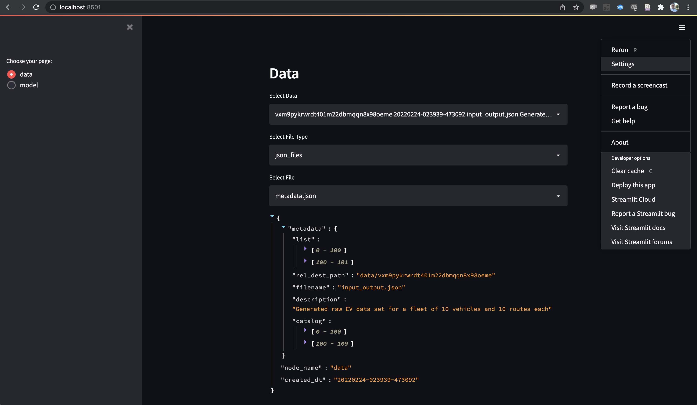
<br/>
Fig 2. - Platform UI menu 
</div>
<br/>

Expand the menu from the upper right corner of the app and select Settings, then under APPEARANCE, select "Wide mode". Then click the "x" to close the settings dialog box. This makes the app screen wider and allows a better view of the data.

<div align="center">
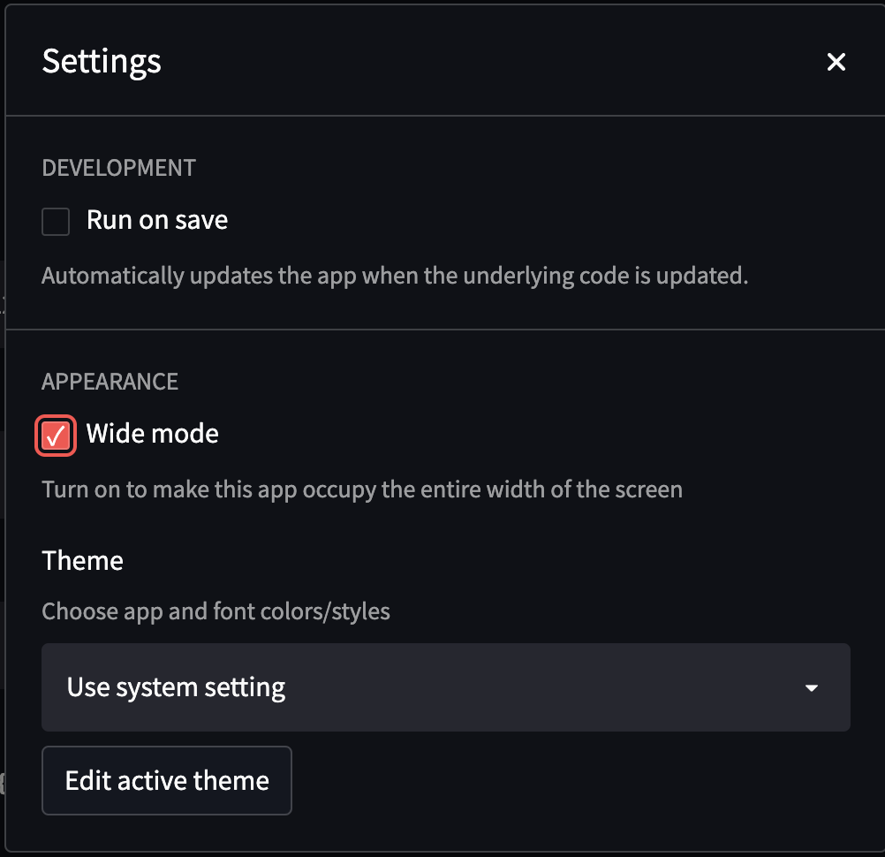
<br/>
Fig 3. - Platform UI wide mode setting 
</div>
<br/>

Pull down the "Select Data" menu and choose the second dataset with description "Selected EV data with filter...", then pull down the "Select File Type" menu and choose "png_files".

<div align="center">

<br/>
Fig 4. - Selected data for vehicle and route, inputs 
</div>
<br/>

This plot shows the input data for trip velocity, trip distance, and trip load.

Pull down the "Select File" menu and choose "output_data_plot.png".

<div align="center">
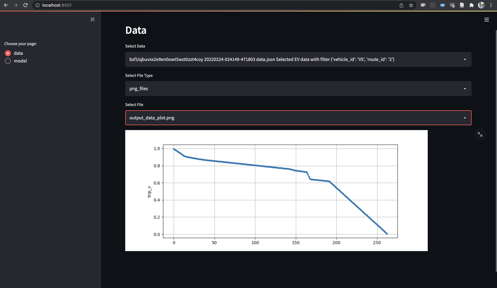
<br/>
Fig 5. - Selected data for vehicle and route, output 
</div>
<br/>

This plot shows the output data for battery voltage.

Next, pull down the "Select Data" menu again, and choose the dataset following the one you selected previously, named "metadata.json". 

<div align="center">
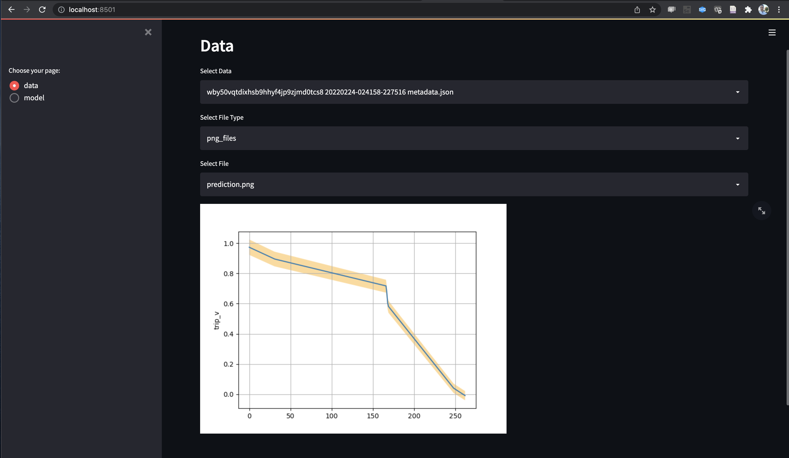
<br/>
Fig 6. - Predicted output with uncertainty bounds
</div>
<br/>

This plot shows the predicted output with a band of uncertainty around the predicted values.

To view model sensitivity analysis plots, pull down the "Select Data" menu and choose the data set with description "Sensitivity Analysis"

<div align="center">
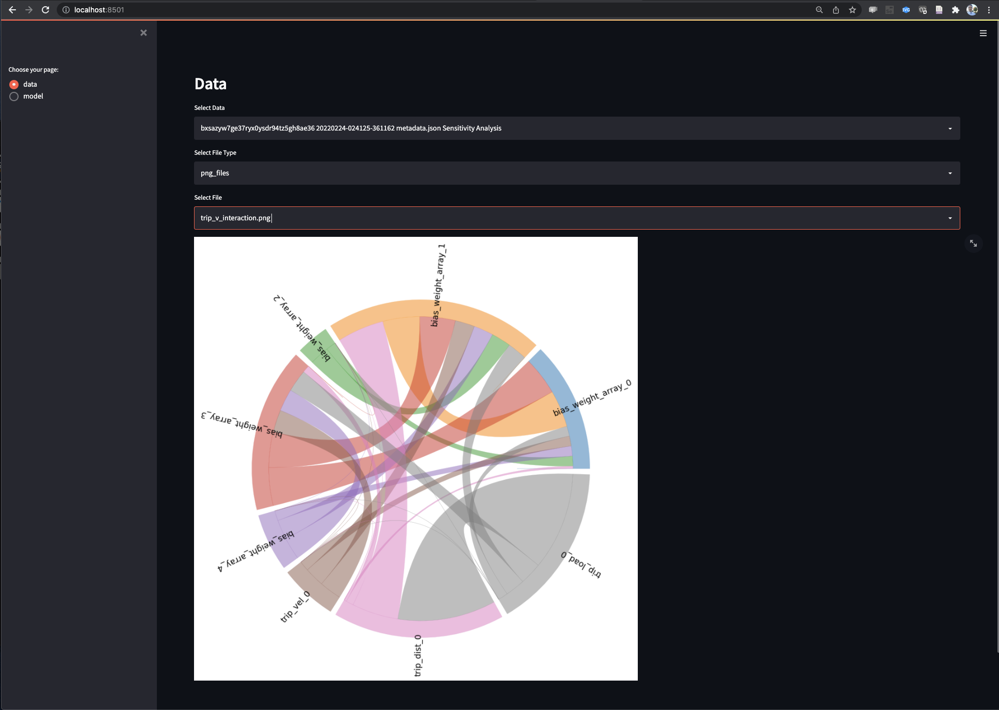
<br/>
Fig 7. - Sensitivity analysis interactions plot 
</div>
<br/>

This plot shows interactions between model inputs and parameters.

Pull down the "Select File" menu and choose "trip_v_total_first_order.png".

<div align="center">
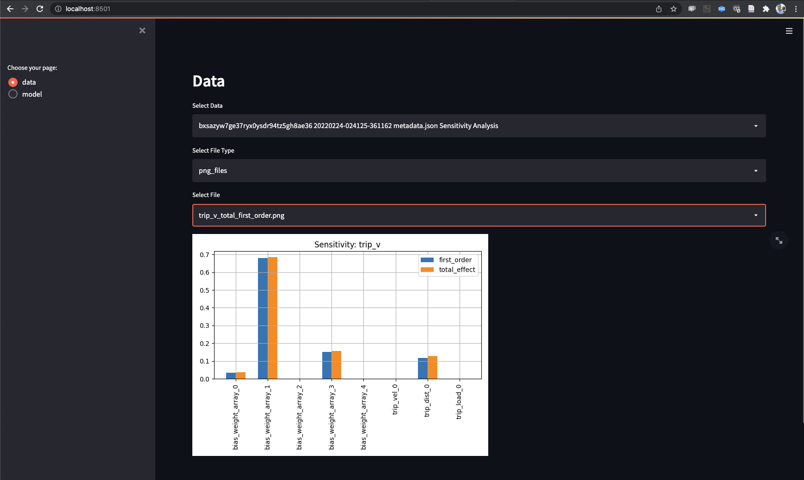
<br/>
Fig 8. - First order and total sensitivity
</div>
<br/>

Next, choose the "model" page from the left navigation pane. Under "Select Model" we will select the option for "Artificial Neural Network model".

<div align="center">

<br/>
Fig 9. - Artificial Neural Network model, actual vs. predicted plots for train and test data
</div>
<br/>

This plot shows plots of actual vs. predicted values for the ANN model. 
Lastly, select the "mlp_train_epoch.png" file. 

<div align="center">
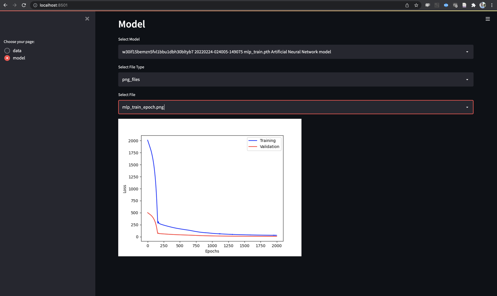
<br/>
Fig 10. - Artificial Neural Network model, training convergeance plot
</div>
<br/>

This plot shows the loss convergeance for the model training over 2000 epochs.

You may choose to browse the emperical data by selecting the "json_files" file Type. All of the data and models can also be accessed through the configured S3 bucket.

### 4.2. Execution graph
To view the execution graph, open the graph database UI by visiting [http://localhost:8529](http://localhost:8529). Log in using the credentials you configured for the graphdb user account and select the pm database.

Once you log in, you will be able to see that the database hosts a nubmer of collections.

<div align="center">
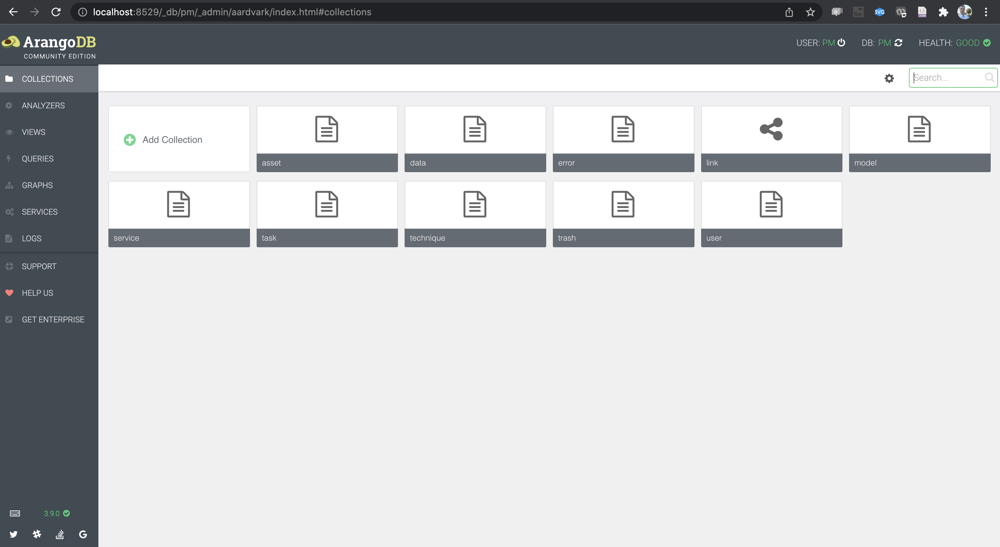
<br/>
Fig 11. - Graphdb, collections
</div>
<br/>

Vertex collections are the nodes in the graph, and edge collections are the links between them. 
Select "GRAPHS" from the left navigation pane.

<div align="center">
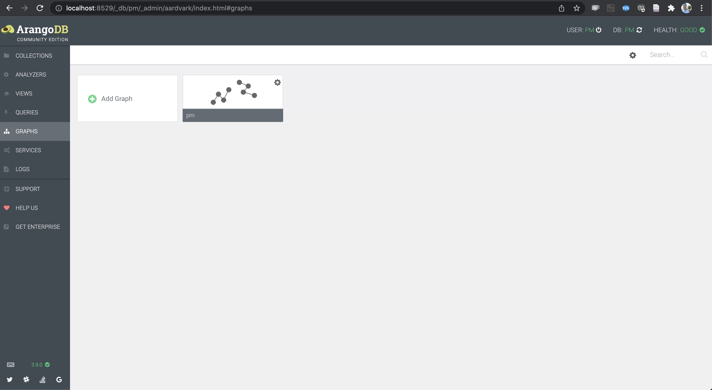
<br/>
Fig 12. - Graphdb, graphs
</div>
<br/>

Then open the graph named "pm"

<div align="center">
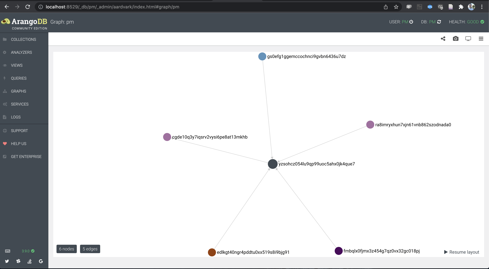
<br/>
Fig 13. - Graphdb, default PM graph
</div>
<br/>

By default the last few nodes of the graph are shown with their unique IDs.

<div align="center">
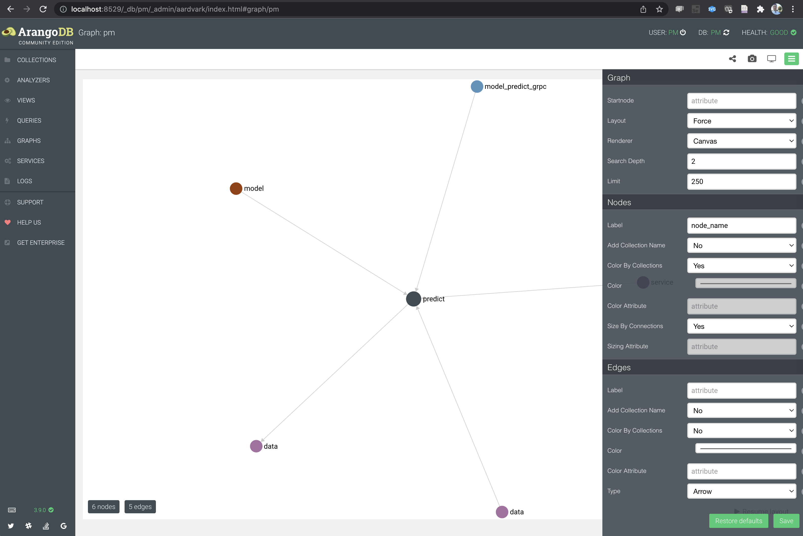
<br/>
Fig 14. - Graphdb, graph with node_name
</div>
<br/>

Click on the menu icon in the upper rigth corner to open the graph settings.
Enter "node_name" under the "Nodes->Labels" section, and click the "Save" button.

<div align="center">
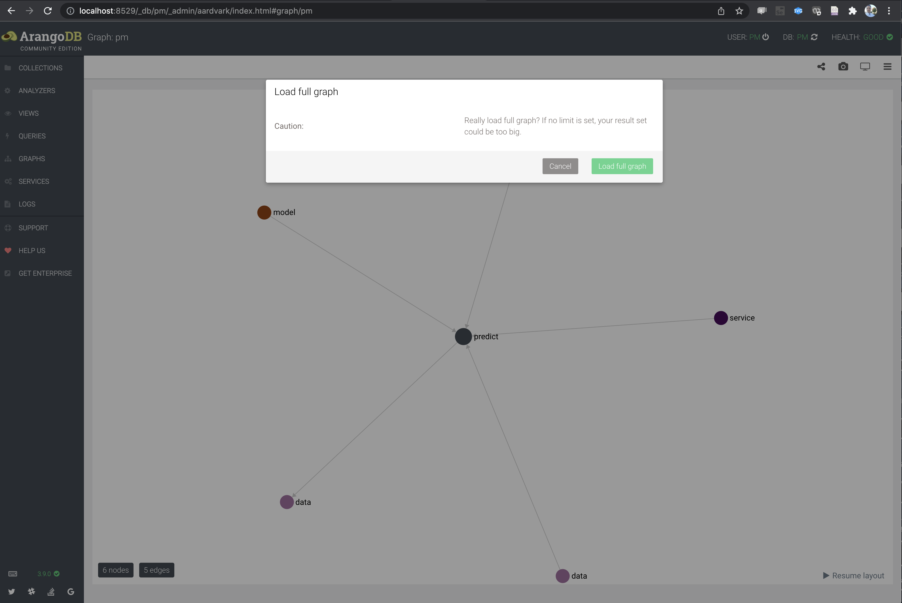
<br/>
Fig 15. - Graphdb, load full graph dialog
</div>
<br/>

The nodes in the graph now have read-friendly labels.
Select the "share" icon from the top right menu and click on the "Load full graph" button.

<div align="center">
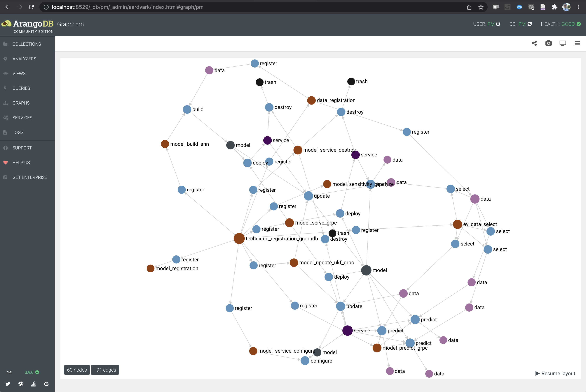
<br/>
Fig 16. - Graph ev-demo full
</div>
<br/>

The full execution graph of the `ev-demo` run is displayed. 
To make the graph easier to understand the nodes can be rearranged as the following. 

<div align="center">
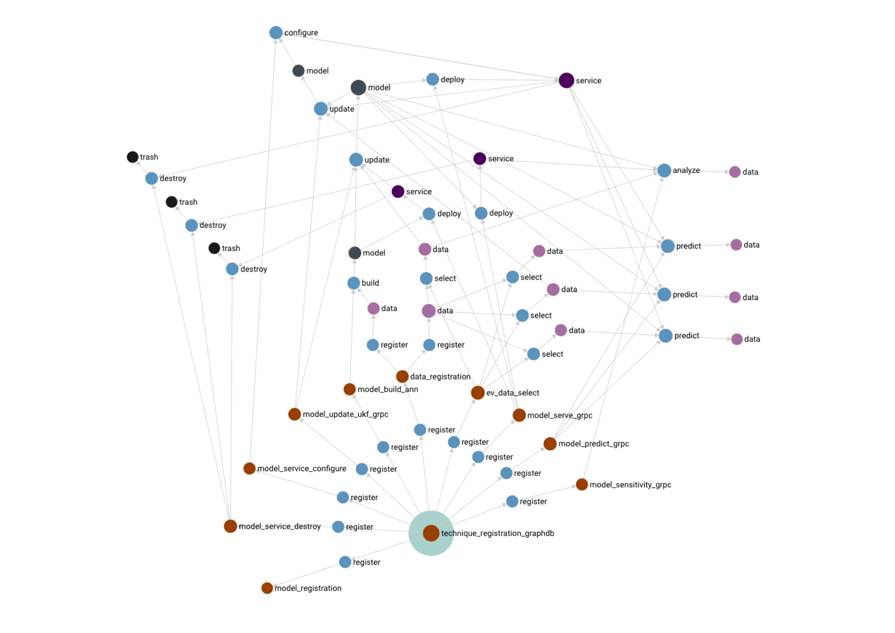
<br/>
Fig 17. - Graph ev-demo full arranged
</div>
<br/>

The root node of the graph is a method for technique registration in the graph database. Several "register" tasks are spawned using this technique during the initialization phase and all system (embedded) techniques are registered. EV data is generated outside of the system and the raw dara set is imported/registered in aws-do-pm. Similarly the model training dataset is registered. A model is built, using the training dataset and the ann model building technique. A custom technique for EV data selection is registered and then used to select data for route 1 of some vehicle from the raw dataset. This data is used to update the model. A model is deployed as a gRPC service and the service is updated as needed. Using the EV data selection technique Data from the raw dataset is extracted for routes 2,3, and 4. The extracted data is used for prediction. The prediction error is compared with a threshold and the model is updated as needed. Once all the predictions are completed and the model services are no longer needed, they are destroyed. The output of the run are predicted data artifacts and an updated model.

An execution graph like this one, helps explain the operation of the system and the sequence of events that occurred during a particular run. The metadata contained within the graph can be used to extract valuable insights about the workload.

<br/>
<br/>

Back to main [README.md](../README.md)
