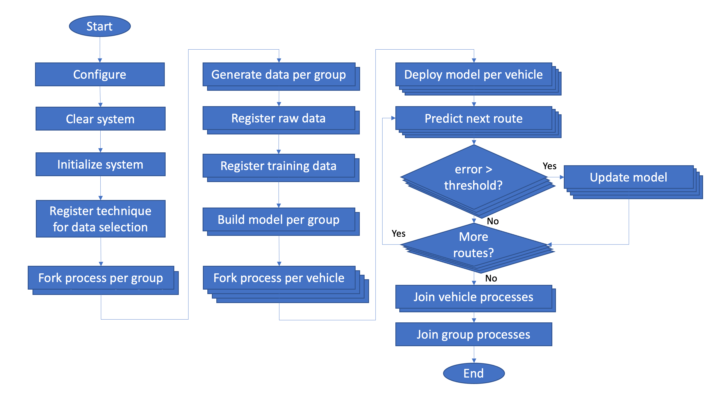
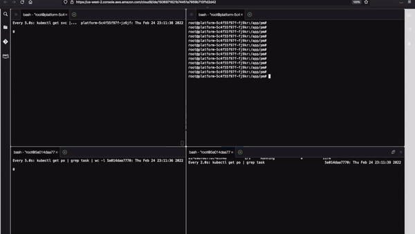
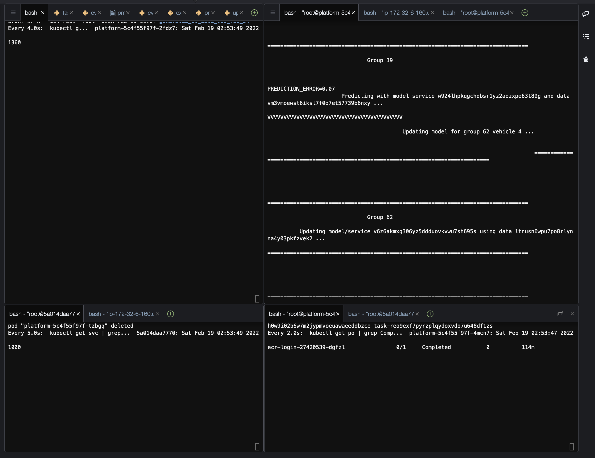
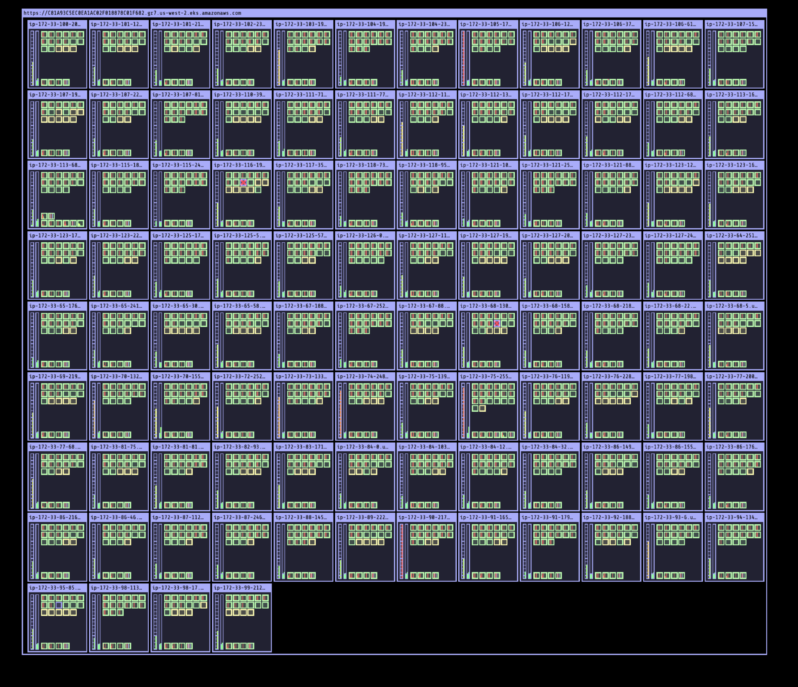
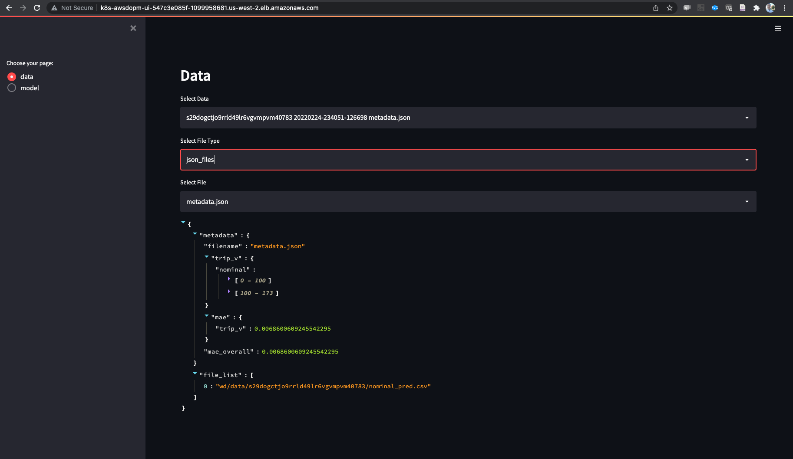
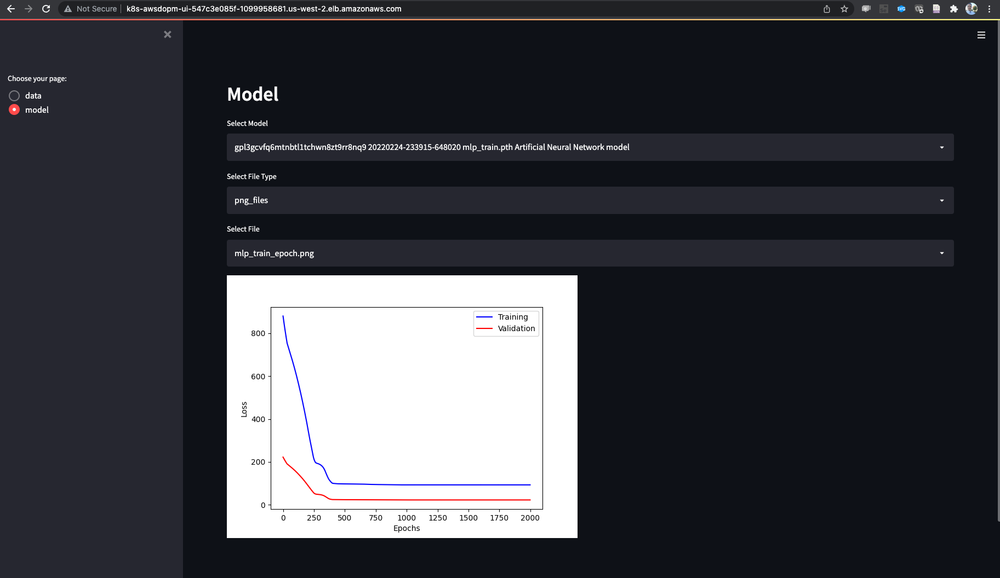
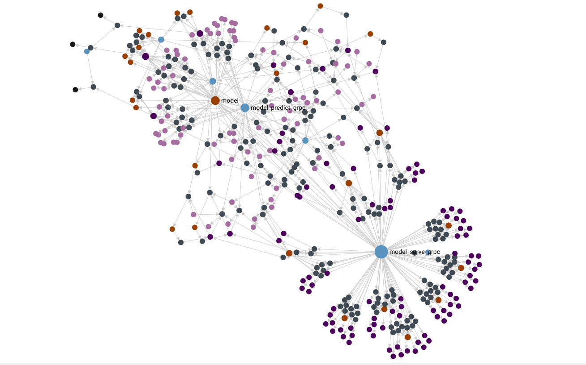
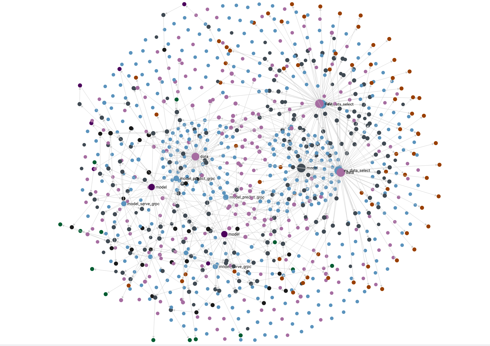

# Fleet of electric vehicles (ev-fleet-demo)

The operations included in `ev-fleet-demo` are shown on the following flowchart:

<div align="center">

<br/>
Fig 1. - ev-fleet-demo flowchart 
</div>
<br/>

The demo script `ev-fleet-demo` executes all the steps automatically. We will run the script from within a platform container. To complete the entire process, we will walk through the following steps: scale, exec, configure, run, monitor, and explore.

## 1. Scale
The [aws-do-pm](https://github.com/aws-samples/aws-do-pm) framework scales both vertically and horizontally using [Amazon EKS](https://aws.amazon.com/eks/). Adding larger nodes to the cluster enables running more vehicles per node (vertical scaling), while adding more nodes to the cluster enables running more vehicles per cluster (horizontal scaling). The demo application also provides an internal scalability mechanism by splitting the total number of vehicles into groups and running each group in parallel. The total runtime depends on the number of vehicles, number of routes, number of groups, and the configuration of the compute environment. A table showing a few verified run configurations for horizontal scalability is shown below. The Docker Desktop experiment is run on a MacBook Pro with 6 CPUs and 16GB RAM. All of the Kubernetes experiments in this table are run against an EKS cluster with c5.4xlarge nodes. 

<div align="center">
<table align="center">
<tr>
<th>Orchestrator</th><th>Nodes</th><th>Groups</th><th>Vehicles</th><th>Routes</th><th>Time[min]</th>
</tr>
<tr>
<td>Docker Desktop</td><td>1</td><td>1</td><td>1</td><td>3</td><td>3</td>
</tr>
<tr>
<td>Kubernetes</td><td>1</td><td>1</td><td>1</td><td>10</td><td>7</td>
</tr>
<tr>
<td>Kubernetes</td><td>1</td><td>1</td><td>2</td><td>10</td><td>11</td>
</tr>
<tr>
<td>Kubernetes</td><td>1</td><td>1</td><td>10</td><td>10</td><td>15</td>
</tr>
<tr>
<td>Kubernetes</td><td>10</td><td>10</td><td>100</td><td>10</td><td>16</td>
</tr>
<tr>
<td>Kubernetes</td><td>100</td><td>100</td><td>1000</td><td>10</td><td>32</td>
</tr>
</table>
Table 1. - aws-do-pm ev-fleet-demo scale
</div>

For the purpose of this document, we will demonstrate 100 vehicles on a 10 node cluster with 10 parallel groups, running 10 vehicles each for up to 10 routes. It is possible to use cluster and pod autoscaling, and this would be the recommended approach for large deployments with unpredictable workloads and tolerance to latency. In order to demonstrate the concept for this demo, we will use manual scaling. 

### 1.1. Scale cluster
We will assume that an EKS cluster with 10 c5.4xlarge nodes is already available. If needed, please refer to the [aws-do-eks](https://github.com/aws-samples/aws-do-eks) project and the [detailed aws-do-pm walkthrough](docs/Deployment.md) for details about setting up and scaling an EKS cluster.

To verify that your cluster has the desired number of nodes, execute:
```
kubectl get nodes
```
Output:
```
NAME                                           STATUS   ROLES    AGE     VERSION
ip-172-33-108-80.us-west-2.compute.internal    Ready    <none>   4m15s   v1.21.5-eks-9017834
ip-172-33-110-52.us-west-2.compute.internal    Ready    <none>   4m15s   v1.21.5-eks-9017834
ip-172-33-112-83.us-west-2.compute.internal    Ready    <none>   21h     v1.21.5-eks-9017834
ip-172-33-124-108.us-west-2.compute.internal   Ready    <none>   4m16s   v1.21.5-eks-9017834
ip-172-33-66-97.us-west-2.compute.internal     Ready    <none>   4m13s   v1.21.5-eks-9017834
ip-172-33-72-203.us-west-2.compute.internal    Ready    <none>   4m15s   v1.21.5-eks-9017834
ip-172-33-73-39.us-west-2.compute.internal     Ready    <none>   4m15s   v1.21.5-eks-9017834
ip-172-33-87-249.us-west-2.compute.internal    Ready    <none>   21h     v1.21.5-eks-9017834
ip-172-33-92-180.us-west-2.compute.internal    Ready    <none>   4m16s   v1.21.5-eks-9017834
ip-172-33-96-140.us-west-2.compute.internal    Ready    <none>   4m16s   v1.21.5-eks-9017834
```

To see the instance types of your nodes (if EKS annotations are present), execute:
```
kubectl get nodes -o yaml "$@" | grep instance-type | grep node | grep -v f:
```
Output:
```
      node.kubernetes.io/instance-type: c5.4xlarge
      node.kubernetes.io/instance-type: c5.4xlarge
      node.kubernetes.io/instance-type: c5.4xlarge
      node.kubernetes.io/instance-type: c5.4xlarge
      node.kubernetes.io/instance-type: c5.4xlarge
      node.kubernetes.io/instance-type: c5.4xlarge
      node.kubernetes.io/instance-type: c5.4xlarge
      node.kubernetes.io/instance-type: c5.4xlarge
      node.kubernetes.io/instance-type: c5.4xlarge
      node.kubernetes.io/instance-type: c5.4xlarge
```
### 1.2. Scale platform
By default the aws-do-pm is deployed with a single platform pod. To scale the platform, we just need to adjust the PM_PLATFORM_SCALE setting in the configuration and execute the `./run.sh` script again.

```
./pm config set PM_PLATFORM_SCALE 10
./run.sh
```

Watch the output of the `./status.sh` script until all of the platform pods enter the `Running` state.

```
watch ./status.sh
```
Output:

```
Showing status on target orchestrator kubernetes ...
NAME                        READY   STATUS      RESTARTS   AGE
ecr-login-27428921-ldvh7    0/1     Completed   0          41s
graphdb-74b77d866-2djhj     1/1     Running     0          120m
platform-5c4f55f97f-46g8l   1/1     Running     0          3m3s
platform-5c4f55f97f-9fbm9   1/1     Running     0          3m3s
platform-5c4f55f97f-hvb6p   1/1     Running     0          120m
platform-5c4f55f97f-jp6wm   1/1     Running     0          3m3s
platform-5c4f55f97f-lhcxd   1/1     Running     0          3m3s
platform-5c4f55f97f-pm9hx   1/1     Running     0          3m3s
platform-5c4f55f97f-svf4v   1/1     Running     0          3m3s
platform-5c4f55f97f-wpg9j   1/1     Running     0          3m3s
platform-5c4f55f97f-xs6nj   1/1     Running     0          3m3s
platform-5c4f55f97f-zdvfd   1/1     Running     0          3m3s
ui-69b78dffdc-mln4d         1/1     Running     0          120m
```

You have scaled the platform and are ready to proceed to the next step.

## 2. Exec
To open a shell into the first platform container, simply run the `./exec.sh` script. Optionally, to open a shell into platform container `n` run `./exec.sh platform n` (replace `n` with a number between 1 and 10).
```
./exec.sh
```
Output:
```
root@platform-5c4f55f97f-46g8l:/app/pm#
```

> Note: `ev-fleet-demo` must be executed from the first platform container 

## 3. Configure

### 3.1. Platform
Within the platform shell, execute `pm config set` and review the current settings. If you are running on Docker Compose, the values will already be set. If you are running on Kubernetes, then you will need to set the same values as the initial [setup](./setup.md#2-configure).

### 3.2. Demo
The ev-fleet-demo script is pre-configured for 10 vehicles and 10 routes and will work by default. To view or adjust the configuration, from within the platform shell, edit file `src/python/example/ev/ev_fleet_demo.json`. Both `nano` and `vi` text editors are available.

```
vi src/python/example/ev/ev_fleet_demo.json
```
Output:
```
{
    "data_path": "wd/generated_ev_data",
    "num_vehicles": 10,
    "num_routes": 10,
    "num_predicted_routes": 1,
    "model_update_threshold": 0.05,
    "max_concurrent_tasks": 0
}
```
This configuration is per vehicle group, below are descriptions of the settings:
```
data_path                - base path where generated data will be stored, a group-specific suffix will be added automatically
num_vehicles             - number of vehicles per group
num_routes               - number of routes per group, each vehicle in the group will drive minimum half and maximum the full number of routes
num_predicted_routes     - number of routes to predict into the future at each step, default 1
model_update_threshold   - prediction error threshold, if this number is exceeded, then the vehicle model is updated with the latest data
max_concurrent_tasks     - maximum number of tasks to run in parallel, not used, default 0
```

## 4. Run
To launch the demo, execute the `./ev-fleet-demo` script within the platform shell

```
./ev-fleet-demo
```
Output:
<details>
<summary>Expand log</summary>
Launch time: 20220224-233625


EV Fleet Configuation per Group:
data_path: wd/generated_ev_data
num_vehicles: 10
num_routes: 10
num_predicted_routes: 1
model_update_threshold: 0.05
max_concurrent_tasks: 0

<pre><small>
=================================================================================
          Clearing system ...
=================================================================================

Removing services ...
Clearing graph database ...
Deleting Vertex Collection: asset
Deleting Vertex Collection: data
Deleting Vertex Collection: error
Deleting Vertex Collection: model
Deleting Vertex Collection: service
Deleting Vertex Collection: task
Deleting Vertex Collection: technique
Deleting Vertex Collection: trash
Deleting Vertex Collection: user
Clearing local storage ...
Clearing cloud storage ...
remove_bucket: aws-do-pm

error: resource(s) were provided, but no name was specified
error: resource(s) were provided, but no name was specified

=================================================================================
          Initializing system ...
=================================================================================

{
    "Location": "http://aws-do-pm.s3.amazonaws.com/"
}
Creating Vertex Collection: technique
Creating Vertex Collection: data
Creating Vertex Collection: model
Creating Vertex Collection: service
Creating Vertex Collection: asset
Creating Vertex Collection: task
Creating Vertex Collection: error
Creating Vertex Collection: trash
Creating Vertex Collection: user
Creating Edge Collection: link

Registering technique data_registration ...
task/ddg7kn6qzdjca5i332xnzyfi6u54ba2x
Executing task from wd/task/ddg7kn6qzdjca5i332xnzyfi6u54ba2x/task.json ...
Executing PM task:
['python', '/src/python/pm/task/task_technique_register.py', '--config', 'wd/task/ddg7kn6qzdjca5i332xnzyfi6u54ba2x/task.json']
technique/i85qy54a1st1u6f6gnm3vembcesxu21g
Return code: 0

Registering technique model_registration ...
task/tmhqn1g5e7olm69kz7w59a6g1577a86k
Executing task from wd/task/tmhqn1g5e7olm69kz7w59a6g1577a86k/task.json ...
Executing PM task:
['python', '/src/python/pm/task/task_technique_register.py', '--config', 'wd/task/tmhqn1g5e7olm69kz7w59a6g1577a86k/task.json']
technique/dq6lmkfryuop6tgcgscejphvfq7bwfzf
Return code: 0

Registering technique model_build_ann ...
task/aqgrl2s845qzeikzee17lc2ekwd7dbkg
Executing task from wd/task/aqgrl2s845qzeikzee17lc2ekwd7dbkg/task.json ...
Executing PM task:
['python', '/src/python/pm/task/task_technique_register.py', '--config', 'wd/task/aqgrl2s845qzeikzee17lc2ekwd7dbkg/task.json']
technique/npt3qa2ss6xfn42vb9debnl1daeqr170
Return code: 0

Registering technique model_serve_grpc ...
task/bmv6fmqsksx1ryl4h9qv9zjqj4a5csfu
Executing task from wd/task/bmv6fmqsksx1ryl4h9qv9zjqj4a5csfu/task.json ...
Executing PM task:
['python', '/src/python/pm/task/task_technique_register.py', '--config', 'wd/task/bmv6fmqsksx1ryl4h9qv9zjqj4a5csfu/task.json']
technique/tseqb6q7g1fmxhknl1mpphd22l6cq1do
Return code: 0

Registering technique model_service_configure ...
task/x7yardc5ri6m3jm4r6ut5k88s2xoufmx
Executing task from wd/task/x7yardc5ri6m3jm4r6ut5k88s2xoufmx/task.json ...
Executing PM task:
['python', '/src/python/pm/task/task_technique_register.py', '--config', 'wd/task/x7yardc5ri6m3jm4r6ut5k88s2xoufmx/task.json']
technique/ai4eho23m19lo31jkjbzdg57e4tvr64q
Return code: 0

Registering technique model_service_destroy ...
task/m2c5lm1xgz680rjdk1dvorr47h9iyr2m
Executing task from wd/task/m2c5lm1xgz680rjdk1dvorr47h9iyr2m/task.json ...
Executing PM task:
['python', '/src/python/pm/task/task_technique_register.py', '--config', 'wd/task/m2c5lm1xgz680rjdk1dvorr47h9iyr2m/task.json']
technique/hmg04g35pgmki5f73jjz2nccevz7srzc
Return code: 0

Registering technique model_update_ukf_grpc ...
task/l95tu3m2hfywak76b9m363zbt3p2ggmi
Executing task from wd/task/l95tu3m2hfywak76b9m363zbt3p2ggmi/task.json ...
Executing PM task:
['python', '/src/python/pm/task/task_technique_register.py', '--config', 'wd/task/l95tu3m2hfywak76b9m363zbt3p2ggmi/task.json']
technique/r7zri9ea9o5e97xnbqvsa2206s7wr7rx
Return code: 0

Registering technique model_predict_grpc ...
task/pm8ksnv4uiwafyndwj550ogw9i3dwzk0
Executing task from wd/task/pm8ksnv4uiwafyndwj550ogw9i3dwzk0/task.json ...
Executing PM task:
['python', '/src/python/pm/task/task_technique_register.py', '--config', 'wd/task/pm8ksnv4uiwafyndwj550ogw9i3dwzk0/task.json']
technique/vhfgkxjtok2tlle7irtw1u1h3ksie7ns
Return code: 0

Registering technique model_sensitivity_grpc ...
task/kij7r32zpa7z1pwo5uq6px2kkgnm5h1t
Executing task from wd/task/kij7r32zpa7z1pwo5uq6px2kkgnm5h1t/task.json ...
Executing PM task:
['python', '/src/python/pm/task/task_technique_register.py', '--config', 'wd/task/kij7r32zpa7z1pwo5uq6px2kkgnm5h1t/task.json']
technique/ejhx4zzzvh7yl0s55fgp1vdt6zv4rqg5
Return code: 0


=================================================================================
          Registering custom technique for EV data selection  ...
          =================================================================================


task/o2gbv04e5ycrzgxrq41hu687cvmmfxks
Executing task from wd/task/o2gbv04e5ycrzgxrq41hu687cvmmfxks/task.json ...
Executing PM task:
['python', '/src/python/pm/task/task_technique_register.py', '--config', 'wd/task/o2gbv04e5ycrzgxrq41hu687cvmmfxks/task.json']
technique/hf3jxqn9kcr6oa7cdjbxy28e4q993u6w
Return code: 0


=================================================================================
          Launching EV Group 1 ...
=================================================================================

EV Group Configuration:

data_path: wd/generated_ev_data

num_vehicles: 10

num_routes: 10

num_predicted_routes: 1

model_update_threshold: 0.05

max_concurrent_tasks: 0


=================================================================================

                             2022-02-24 23:38:50.116035

                               Group 1

                          Executing EV Fleet Demo

                         for 10 electric vehicles

                 driving minimum 5 and maximum 10 routes each

=================================================================================

Generated data found in path wd/generated_ev_data_v10_r10_1

Skipping data generation


=================================================================================

                               Group 1

          Registering data set from path wd/generated_ev_data_v10_r10_1 ...

          Main file: overall_pd.csv

          Description: Raw EV fleet dataset for 10 vehicles and 10 routes

=================================================================================

Registering data from local path: wd/generated_ev_data_v10_r10_1

Temporary destination path: wd/tmp/1/generated_ev_data_v10_r10_1-20220224233850174

task/bo7akux0j4dp84uyndxkquo3yr5a4j17

Executing task from wd/task/bo7akux0j4dp84uyndxkquo3yr5a4j17/task.json ...

Executing PM task:

['python', '/src/python/pm/data/task_executor_register_data.py', '--config', 'wd/task/bo7akux0j4dp84uyndxkquo3yr5a4j17/task.json']

data/s5st3ca0vswdpjn10c3r3yq4g80xllto

Return code: 0

Completed 14.6 KiB/~150.1 KiB (355.6 KiB/s) with ~8 file(s) remaining (calculating...)upload: wd/tmp/1/generated_ev_data_v10_r10_1-20220224233850174/generated_ev_data_v10_r10_1/V0_0/input_output.json to s3://aws-do-pm/data/s5st3ca0vswdpjn10c3r3yq4g80xllto/V0_0/input_output.json

Completed 14.6 KiB/~150.1 KiB (355.6 KiB/s) with ~7 file(s) remaining (calculating...)Completed 31.9 KiB/~271.2 KiB (436.3 KiB/s) with ~14 file(s) remaining (calculating...)upload: wd/tmp/1/generated_ev_data_v10_r10_1-20220224233850174/generated_ev_data_v10_r10_1/V0_1/input_output.json to s3://aws-do-pm/data/s5st3ca0vswdpjn10c3r3yq4g80xllto/V0_1/input_output.json

Completed 31.9 KiB/~271.2 KiB (436.3 KiB/s) with ~13 file(s) remaining (calculating...)Completed 45.3 KiB/~298.2 KiB (574.1 KiB/s) with ~14 file(s) remaining (calculating...)upload: wd/tmp/1/generated_ev_data_v10_r10_1-20220224233850174/generated_ev_data_v10_r10_1/V0_2/input_output.json to s3://aws-do-pm/data/s5st3ca0vswdpjn10c3r3yq4g80xllto/V0_2/input_output.json

Completed 45.3 KiB/~298.2 KiB (574.1 KiB/s) with ~13 file(s) remaining (calculating...)Completed 73.2 KiB/~338.6 KiB (849.0 KiB/s) with ~15 file(s) remaining (calculating...)upload: wd/tmp/1/generated_ev_data_v10_r10_1-20220224233850174/generated_ev_data_v10_r10_1/V0_4/input_output.json to s3://aws-do-pm/data/s5st3ca0vswdpjn10c3r3yq4g80xllto/V0_4/input_output.json

Completed 73.2 KiB/~338.6 KiB (849.0 KiB/s) with ~14 file(s) remaining (calculating...)Completed 86.4 KiB/~380.1 KiB (913.6 KiB/s) with ~16 file(s) remaining (calculating...)upload: wd/tmp/1/generated_ev_data_v10_r10_1-20220224233850174/generated_ev_data_v10_r10_1/V0_5/input_output.json to s3://aws-do-pm/data/s5st3ca0vswdpjn10c3r3yq4g80xllto/V0_5/input_output.json
...
Completed 4.8 MiB/5.3 MiB (7.1 MiB/s) with 10 file(s) remainingCompleted 4.8 MiB/5.3 MiB (7.1 MiB/s) with 10 file(s) remainingCompleted 5.0 MiB/5.3 MiB (7.3 MiB/s) with 10 file(s) remainingdownload: s3://aws-do-pm/data/s5st3ca0vswdpjn10c3r3yq4g80xllto/V9_8/input_output.json to wd/data/s5st3ca0vswdpjn10c3r3yq4g80xllto/V9_8/input_output.json

=================================================================================
          Launching EV Group 2 ...
=================================================================================


EV Group Configuration:

data_path: wd/generated_ev_data

num_vehicles: 10

num_routes: 10

num_predicted_routes: 1

model_update_threshold: 0.05

max_concurrent_tasks: 0


=================================================================================

                             2022-02-24 23:38:51.097045

                               Group 2

                          Executing EV Fleet Demo

                         for 10 electric vehicles

                 driving minimum 5 and maximum 10 routes each

=================================================================================


Generated data found in path wd/generated_ev_data_v10_r10_2

Skipping data generation


=================================================================================

                               Group 2

          Registering data set from path wd/generated_ev_data_v10_r10_2 ...

          Main file: overall_pd.csv

          Description: Raw EV fleet dataset for 10 vehicles and 10 routes

=================================================================================

Registering data from local path: wd/generated_ev_data_v10_r10_2

Temporary destination path: wd/tmp/2/generated_ev_data_v10_r10_2-20220224233851174

task/ytieqdcqivbbqtvwk9wc2pnx3wj97byy

Executing task from wd/task/ytieqdcqivbbqtvwk9wc2pnx3wj97byy/task.json ...

Executing PM task:

['python', '/src/python/pm/data/task_executor_register_data.py', '--config', 'wd/task/ytieqdcqivbbqtvwk9wc2pnx3wj97byy/task.json']

data/wwb062o5hgab3iy9bylje8o8umf09n28

Return code: 0

Completed 13.2 KiB/~162.9 KiB (325.7 KiB/s) with ~9 file(s) remaining (calculating...)upload: wd/tmp/2/generated_ev_data_v10_r10_2-20220224233851174/generated_ev_data_v10_r10_2/V0_0/input_output.json to s3://aws-do-pm/data/wwb062o5hgab3iy9bylje8o8umf09n28/V0_0/input_output.json

Completed 13.2 KiB/~162.9 KiB (325.7 KiB/s) with ~8 file(s) remaining (calculating...)Completed 27.0 KiB/~275.9 KiB (370.0 KiB/s) with ~16 file(s) remaining (calculating...)upload: wd/tmp/2/generated_ev_data_v10_r10_2-20220224233851174/generated_ev_data_v10_r10_2/V0_1/input_output.json to s3://aws-do-pm/data/wwb062o5hgab3iy9bylje8o8umf09n28/V0_1/input_output.json

Completed 27.0 KiB/~275.9 KiB (370.0 KiB/s) with ~15 file(s) remaining (calculating...)Completed 41.0 KiB/~275.9 KiB (552.2 KiB/s) with ~15 file(s) remaining (calculating...)Completed 54.9 KiB/~275.9 KiB (733.2 KiB/s) with ~15 file(s) remaining (calculating...)upload: wd/tmp/2/generated_ev_data_v10_r10_2-20220224233851174/generated_ev_data_v10_r10_2/V0_3/input_output.json to s3://aws-do-pm/data/wwb062o5hgab3iy9bylje8o8umf09n28/V0_3/input_output.json

Completed 54.9 KiB/~275.9 KiB (733.2 KiB/s) with ~14 file(s) remaining (calculating...)upload: wd/tmp/2/generated_ev_data_v10_r10_2-20220224233851174/generated_ev_data_v10_r10_2/V0_2/input_output.json to s3://aws-do-pm/data/wwb062o5hgab3iy9bylje8o8umf09n28/V0_2/input_output.json
...
...
...

=================================================================================
          Launching EV Group 10 ...
=================================================================================


EV Group Configuration:

data_path: wd/generated_ev_data

num_vehicles: 10

num_routes: 10

num_predicted_routes: 1

model_update_threshold: 0.05

max_concurrent_tasks: 0


=================================================================================

                             2022-02-24 23:38:59.096259
                               Group 10

                          Executing EV Fleet Demo

                         for 10 electric vehicles

                 driving minimum 5 and maximum 10 routes each

=================================================================================


Generated data found in path wd/generated_ev_data_v10_r10_10

Skipping data generation


=================================================================================

                               Group 10

          Registering data set from path wd/generated_ev_data_v10_r10_10 ...

          Main file: overall_pd.csv

          Description: Raw EV fleet dataset for 10 vehicles and 10 routes

=================================================================================

Registering data from local path: wd/generated_ev_data_v10_r10_10

Temporary destination path: wd/tmp/10/generated_ev_data_v10_r10_10-20220224233859180

task/bxtuktnlohobbm43via4ihgh3389tmec

Executing task from wd/task/bxtuktnlohobbm43via4ihgh3389tmec/task.json ...

Executing PM task:

['python', '/src/python/pm/data/task_executor_register_data.py', '--config', 'wd/task/bxtuktnlohobbm43via4ihgh3389tmec/task.json']

data/o0fslzkfs49oqmlqjfs6ja5l6rl379h2

Return code: 0

Completed 23.7 KiB/~137.4 KiB (657.2 KiB/s) with ~8 file(s) remaining (calculating...)upload: wd/tmp/10/generated_ev_data_v10_r10_10-20220224233859180/generated_ev_data_v10_r10_10/V0_0/input_output.json to s3://aws-do-pm/data/o0fslzkfs49oqmlqjfs6ja5l6rl379h2/V0_0/input_output.json

Completed 23.7 KiB/~137.4 KiB (657.2 KiB/s) with ~7 file(s) remaining (calculating...)Completed 37.7 KiB/~181.1 KiB (710.4 KiB/s) with ~10 file(s) remaining (calculating...)upload: wd/tmp/10/generated_ev_data_v10_r10_10-20220224233859180/generated_ev_data_v10_r10_10/V0_2/input_output.json to s3://aws-do-pm/data/o0fslzkfs49oqmlqjfs6ja5l6rl379h2/V0_2/input_output.json

Completed 37.7 KiB/~181.1 KiB (710.4 KiB/s) with ~9 file(s) remaining (calculating...)Completed 51.9 KiB/~233.4 KiB (789.7 KiB/s) with ~12 file(s) remaining (calculating...)Completed 66.5 KiB/~233.4 KiB (994.4 KiB/s) with ~12 file(s) remaining (calculating...)upload: wd/tmp/10/generated_ev_data_v10_r10_10-20220224233859180/generated_ev_data_v10_r10_10/V0_3/input_output.json to s3://aws-do-pm/data/o0fslzkfs49oqmlqjfs6ja5l6rl379h2/V0_3/input_output.json
...
Completed 11.0 KiB/11.0 KiB (290.8 KiB/s) with 1 file(s) remainingupload: wd/data/wwb062o5hgab3iy9bylje8o8umf09n28/metadata.json to s3://aws-do-pm/data/wwb062o5hgab3iy9bylje8o8umf09n28/metadata.json


DATA_ID=wwb062o5hgab3iy9bylje8o8umf09n28

=================================================================================

                               Group 2

          Registering data set from path wd/generated_ev_data_v10_r10_2/train_data ...

          Main file: input_output.json

          Description: EV model training dataset

=================================================================================


Registering data from local path: wd/generated_ev_data_v10_r10_2/train_data

Temporary destination path: wd/tmp/2/train_data-20220224233900575

task/q6q5k6ktpfhffa43bl8ayxvy0phmvyok

Executing task from wd/task/q6q5k6ktpfhffa43bl8ayxvy0phmvyok/task.json ...

Executing PM task:

['python', '/src/python/pm/data/task_executor_register_data.py', '--config', 'wd/task/q6q5k6ktpfhffa43bl8ayxvy0phmvyok/task.json']

data/usen7umyz756nd545158uv1gfp3bdgd4

Return code: 0

Completed 171.2 KiB/171.2 KiB (1.5 MiB/s) with 1 file(s) remainingupload: wd/tmp/2/train_data-20220224233900575/train_data/input_output.json to s3://aws-do-pm/data/usen7umyz756nd545158uv1gfp3bdgd4/input_output.json

Completed 171.2 KiB/171.2 KiB (4.8 MiB/s) with 1 file(s) remainingdownload: s3://aws-do-pm/data/usen7umyz756nd545158uv1gfp3bdgd4/input_output.json to wd/data/usen7umyz756nd545158uv1gfp3bdgd4/input_output.json

Completed 244 Bytes/244 Bytes (7.7 KiB/s) with 1 file(s) remainingupload: wd/data/usen7umyz756nd545158uv1gfp3bdgd4/metadata.json to s3://aws-do-pm/data/usen7umyz756nd545158uv1gfp3bdgd4/metadata.json

DATA_ID=usen7umyz756nd545158uv1gfp3bdgd4

=================================================================================

                               Group 2

          Building Neural Network model using DATA_ID usen7umyz756nd545158uv1gfp3bdgd4 ...

=================================================================================


Task: inserting edge from data/usen7umyz756nd545158uv1gfp3bdgd4 to task/ifznks8w3jhk8a57u6adxz3k8mow1w6i

task/ifznks8w3jhk8a57u6adxz3k8mow1w6i

Executing task from wd/task/ifznks8w3jhk8a57u6adxz3k8mow1w6i/task.json ...

Executing PM task:

['kubectl', '-n', 'aws-do-pm', 'run', '-it', '--rm', '--restart=Never', '--wait=true', '--grace-period=10', 'task-ifznks8w3jhk8a57u6adxz3k8mow1w6i', '--image', '594704452476.dkr.ecr.us-west-2.amazonaws.com/aws-do-pm-model_build_ann:latest', '--overrides', '{"metadata": {"labels": {"app": "aws-do-pm", "role": "task"}}, "spec": {"topologySpreadConstraints": [{"labelSelector": {"matchLabels": {"role": "task"}}, "maxSkew": 1, "topologyKey": "kubernetes.io/hostname", "whenUnsatisfiable": "ScheduleAnyway"}], "containers": [{"name": "task-ifznks8w3jhk8a57u6adxz3k8mow1w6i", "image": "594704452476.dkr.ecr.us-west-2.amazonaws.com/aws-do-pm-model_build_ann:latest", "imagePullPolicy": "Always", "command": ["python"], "args": ["/src/python/technique/model_build_ann/train_torch_model.py", "--config", "wd/task/ifznks8w3jhk8a57u6adxz3k8mow1w6i/task.json"], "resources": {}, "volumeMounts": [{"mountPath": "/wd", "name": "wd"}]}], "volumes": [{"name": "wd", "persistentVolumeClaim": {"claimName": "pm-efs-wd-pvc"}}], "imagePullSecrets": [{"name": "regcred"}]}}']

model/gpl3gcvfq6mtnbtl1tchwn8zt9rr8nq9

Return code: 0

Host GPU Check Mode: False

Requested GPU Mode: True

Target GPU Mode: False

Epoch 1 loss: 880.5253295898438, val_loss: 222.17166137695312

Epoch 2 loss: 876.2653198242188, val_loss: 221.102783203125

...

=================================================================================

                               Group 1

          Registering data set from path wd/generated_ev_data_v10_r10_1/train_data ...

          Main file: input_output.json

          Description: EV model training dataset

=================================================================================

Registering data from local path: wd/generated_ev_data_v10_r10_1/train_data

Temporary destination path: wd/tmp/1/train_data-20220224233859593

task/cl7kfrsjbiy0n6xppxhc4cnrbhqpc7l0

Executing task from wd/task/cl7kfrsjbiy0n6xppxhc4cnrbhqpc7l0/task.json ...

Executing PM task:

['python', '/src/python/pm/data/task_executor_register_data.py', '--config', 'wd/task/cl7kfrsjbiy0n6xppxhc4cnrbhqpc7l0/task.json']

data/q2euv4n7ao5teznn39c1tfh3c3cd8oox

Return code: 0

Completed 179.2 KiB/179.2 KiB (1.3 MiB/s) with 1 file(s) remainingupload: wd/tmp/1/train_data-20220224233859593/train_data/input_output.json to s3://aws-do-pm/data/q2euv4n7ao5teznn39c1tfh3c3cd8oox/input_output.json

Completed 179.2 KiB/179.2 KiB (5.6 MiB/s) with 1 file(s) remainingdownload: s3://aws-do-pm/data/q2euv4n7ao5teznn39c1tfh3c3cd8oox/input_output.json to wd/data/q2euv4n7ao5teznn39c1tfh3c3cd8oox/input_output.json

Completed 244 Bytes/244 Bytes (321 Bytes/s) with 1 file(s) remainingupload: wd/data/q2euv4n7ao5teznn39c1tfh3c3cd8oox/metadata.json to s3://aws-do-pm/data/q2euv4n7ao5teznn39c1tfh3c3cd8oox/metadata.json

DATA_ID=q2euv4n7ao5teznn39c1tfh3c3cd8oox

=================================================================================

                               Group 1

          Building Neural Network model using DATA_ID q2euv4n7ao5teznn39c1tfh3c3cd8oox ...

=================================================================================


Task: inserting edge from data/q2euv4n7ao5teznn39c1tfh3c3cd8oox to task/a98jleuwuhmskjfdq0dh07uedjc9u4jf

task/a98jleuwuhmskjfdq0dh07uedjc9u4jf

Executing task from wd/task/a98jleuwuhmskjfdq0dh07uedjc9u4jf/task.json ...

Executing PM task:

['kubectl', '-n', 'aws-do-pm', 'run', '-it', '--rm', '--restart=Never', '--wait=true', '--grace-period=10', 'task-a98jleuwuhmskjfdq0dh07uedjc9u4jf', '--image', '594704452476.dkr.ecr.us-west-2.amazonaws.com/aws-do-pm-model_build_ann:latest', '--overrides', '{"metadata": {"labels": {"app": "aws-do-pm", "role": "task"}}, "spec": {"topologySpreadConstraints": [{"labelSelector": {"matchLabels": {"role": "task"}}, "maxSkew": 1, "topologyKey": "kubernetes.io/hostname", "whenUnsatisfiable": "ScheduleAnyway"}], "containers": [{"name": "task-a98jleuwuhmskjfdq0dh07uedjc9u4jf", "image": "594704452476.dkr.ecr.us-west-2.amazonaws.com/aws-do-pm-model_build_ann:latest", "imagePullPolicy": "Always", "command": ["python"], "args": ["/src/python/technique/model_build_ann/train_torch_model.py", "--config", "wd/task/a98jleuwuhmskjfdq0dh07uedjc9u4jf/task.json"], "resources": {}, "volumeMounts": [{"mountPath": "/wd", "name": "wd"}]}], "volumes": [{"name": "wd", "persistentVolumeClaim": {"claimName": "pm-efs-wd-pvc"}}], "imagePullSecrets": [{"name": "regcred"}]}}']

model/lqk0gr1xuxsmp1tmxw1q0ysq8miqc774

Return code: 0

Host GPU Check Mode: False

Requested GPU Mode: True

Target GPU Mode: False

Epoch 1 loss: 1696.1544189453125, val_loss: 416.80181884765625

Epoch 2 loss: 1687.449951171875, val_loss: 414.63677978515625

Epoch 3 loss: 1678.7982177734375, val_loss: 412.4850769042969

...

Epoch 1998 loss: 92.59425354003906, val_loss: 22.293418884277344

Epoch 1999 loss: 92.61354064941406, val_loss: 22.314910888671875

Epoch 2000 loss: 92.61766815185547, val_loss: 22.292722702026367

Initializing: wd/model/gpl3gcvfq6mtnbtl1tchwn8zt9rr8nq9/mlp_train.pth

Exported: wd/model/gpl3gcvfq6mtnbtl1tchwn8zt9rr8nq9/model.json

Exported: wd/model/gpl3gcvfq6mtnbtl1tchwn8zt9rr8nq9/metadata.json

Export task status: wd/task/ifznks8w3jhk8a57u6adxz3k8mow1w6i/task_status.json

pod "task-ifznks8w3jhk8a57u6adxz3k8mow1w6i" deleted


Completed 7.3 KiB/81.9 KiB (98.6 KiB/s) with 6 file(s) remainingupload: wd/model/gpl3gcvfq6mtnbtl1tchwn8zt9rr8nq9/mlp_train.pth to s3://aws-do-pm/model/gpl3gcvfq6mtnbtl1tchwn8zt9rr8nq9/mlp_train.pth

Completed 7.3 KiB/81.9 KiB (98.6 KiB/s) with 5 file(s) remainingCompleted 8.1 KiB/81.9 KiB (107.1 KiB/s) with 5 file(s) remainingupload: wd/model/gpl3gcvfq6mtnbtl1tchwn8zt9rr8nq9/model.json to s3://aws-do-pm/model/gpl3gcvfq6mtnbtl1tchwn8zt9rr8nq9/model.json

Completed 8.1 KiB/81.9 KiB (107.1 KiB/s) with 4 file(s) remainingCompleted 39.6 KiB/81.9 KiB (493.1 KiB/s) with 4 file(s) remainingupload: wd/model/gpl3gcvfq6mtnbtl1tchwn8zt9rr8nq9/model_history.pkl to s3://aws-do-pm/model/gpl3gcvfq6mtnbtl1tchwn8zt9rr8nq9/model_history.pkl

MODEL_ID=gpl3gcvfq6mtnbtl1tchwn8zt9rr8nq9

Deploying Digital Twin for Group 2 Vehicle 0 ...


=================================================================================

                               Group 2

       Deploying model gpl3gcvfq6mtnbtl1tchwn8zt9rr8nq9 as a gRPC service ...

=================================================================================

Completed 5.3 MiB/5.3 MiB (7.8 MiB/s) with 7 file(s) remainingdownload: s3://aws-do-pm/data/hx5p0in1b8tk0qhzct1l8zbkfmxzqtf0/task_ev_data_generate_status.json to wd/data/hx5p0in1b8tk0qhzct1l8zbkfmxzqtf0/task_ev_data_generate_status.json

Completed 5.3 MiB/5.3 MiB (7.8 MiB/s) with 6 file(s) remainingCompleted 5.3 MiB/5.3 MiB (7.6 MiB/s) with 6 file(s) remainingdownload: s3://aws-do-pm/data/hx5p0in1b8tk0qhzct1l8zbkfmxzqtf0/task_ev_data_generate.json to wd/data/hx5p0in1b8tk0qhzct1l8zbkfmxzqtf0/task_ev_data_generate.json

Completed 5.3 MiB/5.3 MiB (7.6 MiB/s) with 5 file(s) remainingdownload: s3://aws-do-pm/data/hx5p0in1b8tk0qhzct1l8zbkfmxzqtf0/train_data/input_output.json to wd/data/hx5p0in1b8tk0qhzct1l8zbkfmxzqtf0/train_data/input_output.json

Completed 5.3 MiB/5.3 MiB (7.6 MiB/s) with 4 file(s) remainingdownload: s3://aws-do-pm/data/hx5p0in1b8tk0qhzct1l8zbkfmxzqtf0/plots/cumDist.png to wd/data/hx5p0in1b8tk0qhzct1l8zbkfmxzqtf0/plots/cumDist.png

Completed 5.3 MiB/5.3 MiB (7.6 MiB/s) with 3 file(s) remainingdownload: s3://aws-do-pm/data/hx5p0in1b8tk0qhzct1l8zbkfmxzqtf0/V9_9/input_output.json to wd/data/hx5p0in1b8tk0qhzct1l8zbkfmxzqtf0/V9_9/input_output.json

Completed 5.3 MiB/5.3 MiB (7.6 MiB/s) with 4 file(s) remainingdownload: s3://aws-do-pm/data/hx5p0in1b8tk0qhzct1l8zbkfmxzqtf0/plots/cumDist.png to wd/data/hx5p0in1b8tk0qhzct1l8zbkfmxzqtf0/plots/cumDist.png

Completed 5.3 MiB/5.3 MiB (7.6 MiB/s) with 3 file(s) remainingdownload: s3://aws-do-pm/data/hx5p0in1b8tk0qhzct1l8zbkfmxzqtf0/V9_9/input_output.json to wd/data/hx5p0in1b8tk0qhzct1l8zbkfmxzqtf0/V9_9/input_output.json

Completed 5.3 MiB/5.3 MiB (7.6 MiB/s) with 2 file(s) remainingdownload: s3://aws-do-pm/data/hx5p0in1b8tk0qhzct1l8zbkfmxzqtf0/plots/SOC_V_Dist.png to wd/data/hx5p0in1b8tk0qhzct1l8zbkfmxzqtf0/plots/SOC_V_Dist.png

Completed 5.3 MiB/5.3 MiB (7.6 MiB/s) with 1 file(s) remainingdownload: s3://aws-do-pm/data/hx5p0in1b8tk0qhzct1l8zbkfmxzqtf0/overall_pd.csv to wd/data/hx5p0in1b8tk0qhzct1l8zbkfmxzqtf0/overall_pd.csv

Completed 11.0 KiB/11.0 KiB (307.8 KiB/s) with 1 file(s) remainingupload: wd/data/hx5p0in1b8tk0qhzct1l8zbkfmxzqtf0/metadata.json to s3://aws-do-pm/data/hx5p0in1b8tk0qhzct1l8zbkfmxzqtf0/metadata.json

DATA_ID=hx5p0in1b8tk0qhzct1l8zbkfmxzqtf0

=================================================================================

                               Group 3

          Registering data set from path wd/generated_ev_data_v10_r10_3/train_data ...

          Main file: input_output.json

          Description: EV model training dataset

=================================================================================

...

=================================================================================

                               Group 3

          Building Neural Network model using DATA_ID o65atmbw2ton41k70wr4lgkqd34zu5e3 ...

=================================================================================

...

=================================================================================

                               Group 5

          Registering data set from path wd/generated_ev_data_v10_r10_5/train_data ...

          Main file: input_output.json

          Description: EV model training dataset

=================================================================================

...

=================================================================================

                               Group 5

          Building Neural Network model using DATA_ID c15gywuf7oj2s694b9t9bd9bm98x2iyz ...

=================================================================================

...
...
...

Deploying Digital Twin for Group 5 Vehicle 0 ...


=================================================================================

                               Group 5

       Deploying model djffe7u5r18uw21r5yf16mngc6dq48iu as a gRPC service ...

=================================================================================


Deploying Digital Twin for Group 5 Vehicle 1 ...


=================================================================================

                               Group 5

       Deploying model djffe7u5r18uw21r5yf16mngc6dq48iu as a gRPC service ...

=================================================================================


Deploying Digital Twin for Group 5 Vehicle 2 ...

...

Deploying Digital Twin for Group 5 Vehicle 9 ...


=================================================================================

                               Group 5

       Deploying model djffe7u5r18uw21r5yf16mngc6dq48iu as a gRPC service ...

=================================================================================


Task: inserting edge from model/djffe7u5r18uw21r5yf16mngc6dq48iu to task/u0yhflkl1dk10753qftvpldpro546mly

task/u0yhflkl1dk10753qftvpldpro546mly

Executing task from wd/task/u0yhflkl1dk10753qftvpldpro546mly/task.json ...

Executing PM task:

['kubectl', '-n', 'aws-do-pm', 'run', '--restart=Always', '--wait=false', 'task-u0yhflkl1dk10753qftvpldpro546mly', '--image', '594704452476.dkr.ecr.us-west-2.amazonaws.com/aws-do-pm-model_serve_grpc:latest', '--overrides', '{"metadata": {"labels": {"app": "aws-do-pm", "role": "task"}}, "spec": {"topologySpreadConstraints": [{"labelSelector": {"matchLabels": {"role": "task"}}, "maxSkew": 1, "topologyKey": "kubernetes.io/hostname", "whenUnsatisfiable": "ScheduleAnyway"}], "containers": [{"name": "task-u0yhflkl1dk10753qftvpldpro546mly", "image": "594704452476.dkr.ecr.us-west-2.amazonaws.com/aws-do-pm-model_serve_grpc:latest", "imagePullPolicy": "Always", "command": ["python"], "args": ["/src/python/technique/model_serve_grpc/model_server_startup.py", "--config", "wd/task/u0yhflkl1dk10753qftvpldpro546mly/task.json"], "resources": {}, "volumeMounts": [{"mountPath": "/wd", "name": "wd"}]}], "volumes": [{"name": "wd", "persistentVolumeClaim": {"claimName": "pm-efs-wd-pvc"}}], "imagePullSecrets": [{"name": "regcred"}]}}']

service/umlvv9dpdjqizssdv9f1lq4wtwejvvme

Task is waiting for wd/service/umlvv9dpdjqizssdv9f1lq4wtwejvvme/metadata.json ...

Task is waiting for wd/service/umlvv9dpdjqizssdv9f1lq4wtwejvvme/metadata.json ...

Task is waiting for wd/service/umlvv9dpdjqizssdv9f1lq4wtwejvvme/metadata.json ...

Return code: 0

pod/task-u0yhflkl1dk10753qftvpldpro546mly created


Exposing pod task-u0yhflkl1dk10753qftvpldpro546mly as a service ...

service/service-umlvv9dpdjqizssdv9f1lq4wtwejvvme exposed

SERVICE_ID=umlvv9dpdjqizssdv9f1lq4wtwejvvme


SERVICE_ID=umlvv9dpdjqizssdv9f1lq4wtwejvvme

Task: inserting edge from model/djffe7u5r18uw21r5yf16mngc6dq48iu to task/vkrxhnysdeqiwz1982nf92cissw7vvjc

task/vkrxhnysdeqiwz1982nf92cissw7vvjc

Executing task from wd/task/vkrxhnysdeqiwz1982nf92cissw7vvjc/task.json ...

...

Deploying Digital Twin for Group 3 Vehicle 2 ...


=================================================================================

                               Group 3

       Deploying model fknxw7efap2dybrnkvqsagyrn37rgllk as a gRPC service ...

=================================================================================


Deploying Digital Twin for Group 3 Vehicle 3 ...


=================================================================================

                               Group 3

       Deploying model fknxw7efap2dybrnkvqsagyrn37rgllk as a gRPC service ...

=================================================================================

...
...
...

SERVICE_ID=jf4r0d3jt62iaqojgu2b0mi6c6p4imjx

Running Digital Twin for Group 2 Vehicle 0 ...

Group 2 vehicle 0 will run for 7 routes

Running Digital Twin for Group 2 Vehicle 1 ...

Group 2 vehicle 1 will run for 7 routes


=================================================================================

                               Group 2

          Selecting new data for vehicle # 0, route # 0 ...

=================================================================================


Running Digital Twin for Group 2 Vehicle 2 ...

Group 2 vehicle 2 will run for 8 routes

...

=================================================================================

                               Group 2

          Selecting new data for vehicle # 9, route # 0 ...

=================================================================================


Task: inserting edge from data/wwb062o5hgab3iy9bylje8o8umf09n28 to task/vy2cua44rna2zbkxtdev6wyvox7xl5ka

task/vy2cua44rna2zbkxtdev6wyvox7xl5ka

Executing task from wd/task/vy2cua44rna2zbkxtdev6wyvox7xl5ka/task.json ...

Executing PM task:

['kubectl', '-n', 'aws-do-pm', 'run', '-it', '--rm', '--pod-running-timeout=90s', '--restart=Never', '--wait=true', '--grace-period=10', 'task-vy2cua44rna2zbkxtdev6wyvox7xl5ka', '--image', '594704452476.dkr.ecr.us-west-2.amazonaws.com/aws-do-pm-ev_datagen_em:latest', '--overrides', '{"metadata": {"labels": {"app": "aws-do-pm", "role": "task"}}, "spec": {"topologySpreadConstraints": [{"labelSelector": {"matchLabels": {"role": "task"}}, "maxSkew": 1, "topologyKey": "kubernetes.io/hostname", "whenUnsatisfiable": "ScheduleAnyway"}], "containers": [{"name": "task-vy2cua44rna2zbkxtdev6wyvox7xl5ka", "image": "594704452476.dkr.ecr.us-west-2.amazonaws.com/aws-do-pm-ev_datagen_em:latest", "imagePullPolicy": "Always", "command": ["python"], "args": ["/src/python/example/ev/technique/ev_data_select/extract_filter_data.py", "--config", "wd/task/vy2cua44rna2zbkxtdev6wyvox7xl5ka/task.json"], "resources": {}, "volumeMounts": [{"mountPath": "/wd", "name": "wd"}]}], "volumes": [{"name": "wd", "persistentVolumeClaim": {"claimName": "pm-efs-wd-pvc"}}], "imagePullSecrets": [{"name": "regcred"}]}}']

data/oxcycnamduorm38jlwyka3z0gyu2t97v

Return code: 0

Executing data selection task: wd/task/vy2cua44rna2zbkxtdev6wyvox7xl5ka/task.json ...

Len of Data sets: 101

{'vehicle_id': 'V0', 'route_id': '0'}

Len of Filtered Data: 1

Exported Data: wd/data/oxcycnamduorm38jlwyka3z0gyu2t97v/data.json

Exported Data: wd/data/oxcycnamduorm38jlwyka3z0gyu2t97v/metadata.json

pod "task-vy2cua44rna2zbkxtdev6wyvox7xl5ka" deleted

data/p280rjb1twhn68e39jyn953qu1r7i9hg

Return code: 0

DATA_ID=p280rjb1twhn68e39jyn953qu1r7i9hg


=================================================================================

                               Group 1

  Predicting with model service wnf3seos0yi7cownf5h5c1ydmtwdzfhq and data p280rjb1twhn68e39jyn953qu1r7i9hg ...

=================================================================================

...

=================================================================================

                               Group 1

  Predicting with model service yqesss8cpzbubbpw8i8ecarct9wsos8m and data qqw52reukvvsay7lho7shd2kgxtp11o4 ...

=================================================================================

...

=================================================================================

                               Group 2

  Predicting with model service bvalqekkccle6p1kvr3pec8vw3iepr4q and data nqnx72em9c72dxv3f3omwcw0i02jlm3m ...

=================================================================================

...

Group 3 vehicle 4 will run for 7 routes


=================================================================================

                               Group 3

          Selecting new data for vehicle # 3, route # 0 ...

=================================================================================


Running Digital Twin for Group 3 Vehicle 5 ...

Group 3 vehicle 5 will run for 9 routes


=================================================================================

                               Group 3

          Selecting new data for vehicle # 4, route # 0 ...

=================================================================================

...

=================================================================================

                               Group 3

  Predicting with model service kij3qe63hodf20ycaoekcz0gpbqd7xfe and data vvt1c8eh5gn0vn60fw5e907g5w57f0od ...

=================================================================================

...

DATA_ID=vug72of6eqp7l4nh9la3kiw5cwgtxbo0


=================================================================================

                               Group 2

  Predicting with model service slfgq5k13gbc9a663gffq07uzmoco84g and data vug72of6eqp7l4nh9la3kiw5cwgtxbo0 ...

=================================================================================


Task: inserting edge from data/vumum6w1jay1qu0pzf8uzifh99gmiyyj to task/aw7k8fdoj4ml19bd6ji1wfzg8kdum8m6

Task: inserting edge from model/gpl3gcvfq6mtnbtl1tchwn8zt9rr8nq9 to task/aw7k8fdoj4ml19bd6ji1wfzg8kdum8m6

Task: inserting edge from service/rbmbagbthuy1x4vksj3j33kfsqqlhean to task/aw7k8fdoj4ml19bd6ji1wfzg8kdum8m6

task/aw7k8fdoj4ml19bd6ji1wfzg8kdum8m6

Executing task from wd/task/aw7k8fdoj4ml19bd6ji1wfzg8kdum8m6/task.json ...

Executing PM task:

['kubectl', '-n', 'aws-do-pm', 'run', '-it', '--rm', '--restart=Never', '--wait=true', '--grace-period=10', 'task-aw7k8fdoj4ml19bd6ji1wfzg8kdum8m6', '--image', '594704452476.dkr.ecr.us-west-2.amazonaws.com/aws-do-pm-model_update_ukf_grpc:latest', '--overrides', '{"metadata": {"labels": {"app": "aws-do-pm", "role": "task"}}, "spec": {"topologySpreadConstraints": [{"labelSelector": {"matchLabels": {"role": "task"}}, "maxSkew": 1, "topologyKey": "kubernetes.io/hostname", "whenUnsatisfiable": "ScheduleAnyway"}], "containers": [{"name": "task-aw7k8fdoj4ml19bd6ji1wfzg8kdum8m6", "image": "594704452476.dkr.ecr.us-west-2.amazonaws.com/aws-do-pm-model_update_ukf_grpc:latest", "imagePullPolicy": "Always", "command": ["python"], "args": ["/src/python/technique/model_update_ukf_grpc/update_model_data.py", "--config", "wd/task/aw7k8fdoj4ml19bd6ji1wfzg8kdum8m6/task.json"], "resources": {}, "volumeMounts": [{"mountPath": "/wd", "name": "wd"}]}], "volumes": [{"name": "wd", "persistentVolumeClaim": {"claimName": "pm-efs-wd-pvc"}}], "imagePullSecrets": [{"name": "regcred"}]}}']

model/dty7sbsydjtsxlalxr1yz6l3iofwsgeh

Return code: 0

model/dty7sbsydjtsxlalxr1yz6l3iofwsgeh

Return code: 0


PREDICTION_ERROR=0.08

VVVVVVVVVVVVVVVVVVVVVVVVVVVVVVVVVVVVVVVVVV

Updating model for group 4 vehicle 7 ...


=================================================================================

                               Group 4

          Updating model/service tkr80k6kzt5tbhsnp1xwbr1o5vkez3c1 using data vc7uoutqhaqidq9vd0a1lnnyikhinl7g ...

=================================================================================

Initial State after UKF initialization [ 5.72738826e-01  3.14587325e-01 -1.45255784e-02 -4.14575815e-01

 -2.99346077e-08]

Starting Iterative UKF update

Iteration:  1

Initial State at this iteration [ 5.72738826e-01  3.14587325e-01 -1.45255784e-02 -4.14575815e-01

 -2.99346077e-08]

Updated State at this iteration [ 3.26243911e-01  5.50194480e-01 -1.45255784e-02 -4.14575815e-01

 -2.99346077e-08]


Iteration:  2

Initial State at this iteration [ 3.26243911e-01  5.50194480e-01 -1.45255784e-02 -4.14575815e-01

 -2.99346077e-08]

Updated State at this iteration [ 2.61836593e-01  6.45434933e-01 -1.45255784e-02 -4.14575815e-01

 -2.99346077e-08]

...

Exported: wd/model/dty7sbsydjtsxlalxr1yz6l3iofwsgeh/model.json

Exported: wd/model/dty7sbsydjtsxlalxr1yz6l3iofwsgeh/metadata.json

Export task status: wd/task/aw7k8fdoj4ml19bd6ji1wfzg8kdum8m6/task_status.json

pod "task-aw7k8fdoj4ml19bd6ji1wfzg8kdum8m6" deleted


Completed 5.4 KiB/10.8 KiB (106.3 KiB/s) with 2 file(s) remainingupload: wd/model/dty7sbsydjtsxlalxr1yz6l3iofwsgeh/metadata.json to s3://aws-do-pm/model/dty7sbsydjtsxlalxr1yz6l3iofwsgeh/metadata.json

Completed 5.4 KiB/10.8 KiB (106.3 KiB/s) with 1 file(s) remainingCompleted 10.8 KiB/10.8 KiB (98.5 KiB/s) with 1 file(s) remainingupload: wd/model/dty7sbsydjtsxlalxr1yz6l3iofwsgeh/model.json to s3://aws-do-pm/model/dty7sbsydjtsxlalxr1yz6l3iofwsgeh/model.json

UPDATED_MODEL_ID=dty7sbsydjtsxlalxr1yz6l3iofwsgeh

=================================================================================

                               Group 2

Configuring service id rbmbagbthuy1x4vksj3j33kfsqqlhean with model dty7sbsydjtsxlalxr1yz6l3iofwsgeh

=================================================================================

data/rdnbssq1yf8olqa0hst2ikln5ypv8bxy

Return code: 0

Exported: wd/data/rdnbssq1yf8olqa0hst2ikln5ypv8bxy/metadata.json

pod "task-xo4my9j56pi44a2vh97kvp9pmb0rsjj9" deleted


Completed 3.7 KiB/21.3 KiB (109.3 KiB/s) with 3 file(s) remainingupload: wd/data/rdnbssq1yf8olqa0hst2ikln5ypv8bxy/metadata.json to s3://aws-do-pm/data/rdnbssq1yf8olqa0hst2ikln5ypv8bxy/metadata.json

Completed 3.7 KiB/21.3 KiB (109.3 KiB/s) with 2 file(s) remainingCompleted 7.6 KiB/21.3 KiB (129.4 KiB/s) with 2 file(s) remainingupload: wd/data/rdnbssq1yf8olqa0hst2ikln5ypv8bxy/nominal_pred.csv to s3://aws-do-pm/data/rdnbssq1yf8olqa0hst2ikln5ypv8bxy/nominal_pred.csv

Completed 7.6 KiB/21.3 KiB (129.4 KiB/s) with 1 file(s) remainingCompleted 21.3 KiB/21.3 KiB (335.1 KiB/s) with 1 file(s) remainingupload: wd/data/rdnbssq1yf8olqa0hst2ikln5ypv8bxy/prediction.png to s3://aws-do-pm/data/rdnbssq1yf8olqa0hst2ikln5ypv8bxy/prediction.png

...

PREDICTION_ERROR=0.07

VVVVVVVVVVVVVVVVVVVVVVVVVVVVVVVVVVVVVVVVVV

Updating model for group 3 vehicle 7 ...

=================================================================================

                               Group 3

          Updating model/service epw8cuovcwby6wnuqc7hr5sq7twfct8z using data hgnijxmk5av3oyfhpfzgm5y5sgvvf79j ...

=================================================================================

...
...
...

=================================================================================

                               Group 7

          Selecting new data for vehicle # 4, route # 2 ...

=================================================================================


Task: inserting edge from data/in8hfjcfzwt97dpam7dmc95foff9qwut to task/wsgf7xv2uqu7eoka2bjk7yx7g82l0m5b

Task: inserting edge from model/p3o2rp9n34rxa379naltubikm4857ar4 to task/wsgf7xv2uqu7eoka2bjk7yx7g82l0m5b

Task: inserting edge from service/lx96kfpuzq3j03ejxt4b0aopxetqwrkq to task/wsgf7xv2uqu7eoka2bjk7yx7g82l0m5b

task/wsgf7xv2uqu7eoka2bjk7yx7g82l0m5b

Executing task from wd/task/wsgf7xv2uqu7eoka2bjk7yx7g82l0m5b/task.json ...


Executing PM task:

['kubectl', '-n', 'aws-do-pm', 'run', '-it', '--rm', '--restart=Never', '--wait=true', '--grace-period=10', 'task-wsgf7xv2uqu7eoka2bjk7yx7g82l0m5b', '--image', '594704452476.dkr.ecr.us-west-2.amazonaws.com/aws-do-pm-model_predict_grpc:latest', '--overrides', '{"metadata": {"labels": {"app": "aws-do-pm", "role": "task"}}, "spec": {"topologySpreadConstraints": [{"labelSelector": {"matchLabels": {"role": "task"}}, "maxSkew": 1, "topologyKey": "kubernetes.io/hostname", "whenUnsatisfiable": "ScheduleAnyway"}], "containers": [{"name": "task-wsgf7xv2uqu7eoka2bjk7yx7g82l0m5b", "image": "594704452476.dkr.ecr.us-west-2.amazonaws.com/aws-do-pm-model_predict_grpc:latest", "imagePullPolicy": "Always", "command": ["python"], "args": ["/src/python/technique/model_predict_grpc/predict_model_data.py", "--config", "wd/task/wsgf7xv2uqu7eoka2bjk7yx7g82l0m5b/task.json"], "resources": {}, "volumeMounts": [{"mountPath": "/wd", "name": "wd"}]}], "volumes": [{"name": "wd", "persistentVolumeClaim": {"claimName": "pm-efs-wd-pvc"}}], "imagePullSecrets": [{"name": "regcred"}]}}']

data/mm5u2t1va34mogf8jvt0bsq9hf3s0jqb

Return code: 0

Exported: wd/data/mm5u2t1va34mogf8jvt0bsq9hf3s0jqb/metadata.json

pod "task-wsgf7xv2uqu7eoka2bjk7yx7g82l0m5b" deleted


Completed 3.6 KiB/27.0 KiB (83.3 KiB/s) with 3 file(s) remainingupload: wd/data/mm5u2t1va34mogf8jvt0bsq9hf3s0jqb/metadata.json to s3://aws-do-pm/data/mm5u2t1va34mogf8jvt0bsq9hf3s0jqb/metadata.json

Completed 3.6 KiB/27.0 KiB (83.3 KiB/s) with 2 file(s) remainingCompleted 7.3 KiB/27.0 KiB (126.2 KiB/s) with 2 file(s) remainingupload: wd/data/mm5u2t1va34mogf8jvt0bsq9hf3s0jqb/nominal_pred.csv to s3://aws-do-pm/data/mm5u2t1va34mogf8jvt0bsq9hf3s0jqb/nominal_pred.csv

Completed 7.3 KiB/27.0 KiB (126.2 KiB/s) with 1 file(s) remainingCompleted 27.0 KiB/27.0 KiB (255.3 KiB/s) with 1 file(s) remainingupload: wd/data/mm5u2t1va34mogf8jvt0bsq9hf3s0jqb/prediction.png to s3://aws-do-pm/data/mm5u2t1va34mogf8jvt0bsq9hf3s0jqb/prediction.png

selected line: data/mm5u2t1va34mogf8jvt0bsq9hf3s0jqb

DATA_ID=mm5u2t1va34mogf8jvt0bsq9hf3s0jqb


PREDICTION_ERROR=0.01

Task: inserting edge from data/nk401othw0vn4l7dhovfqzb69i3558tm to task/yekhz86rcipqmcmgq08te99b76xoa4ow

Task: inserting edge from model/p3o2rp9n34rxa379naltubikm4857ar4 to task/yekhz86rcipqmcmgq08te99b76xoa4ow

Task: inserting edge from service/r6wilyfc7qnzcxplx3u5jl2ulfd2e6q7 to task/yekhz86rcipqmcmgq08te99b76xoa4ow

task/yekhz86rcipqmcmgq08te99b76xoa4ow

Executing task from wd/task/yekhz86rcipqmcmgq08te99b76xoa4ow/task.json ...


=================================================================================

                               Group 8

          Selecting new data for vehicle # 1, route # 2 ...

=================================================================================

...

DATA_ID=ev45wpb9bxsd81224ddzmzbcoutm2iyt

=================================================================================

                               Group 8

  Predicting with model service t2msywvjgoa4ym55z0ng62n05tlcps3y and data ev45wpb9bxsd81224ddzmzbcoutm2iyt ...

=================================================================================

...

PREDICTION_ERROR=0.08

VVVVVVVVVVVVVVVVVVVVVVVVVVVVVVVVVVVVVVVVVV

Updating model for group 1 vehicle 2 ...


=================================================================================

                               Group 1

          Updating model/service fno60gjd4r9edh1p411m359cplr459b2 using data ypzdhir0amu5v46aj9j699aavwrlw5di ...

=================================================================================

...
...
...

=================================================================================

                               2022-02-24 23:52:02.073941

                               Group 5

                        EV Fleet Demo Completed


                            Elapsed 13 minutes

=================================================================================

...


UPDATED_MODEL_ID=nipw7gij4cr45x2fsd91ci2vyy0glom5


=================================================================================

                               Group 9

Configuring service id sy6ali99iqy54fd9mceeekvv3qoz22m0 with model nipw7gij4cr45x2fsd91ci2vyy0glom5

=================================================================================

...


=================================================================================

                               Group 3

                      Decomissioning Digital Twins ...

=================================================================================


=================================================================================

  Destroying service id jbf9lot9mqe6ynzq8ntpp7id60rkzxdv

=================================================================================


=================================================================================

  Destroying service id epw8cuovcwby6wnuqc7hr5sq7twfct8z

=================================================================================

...

=================================================================================

                               Group 4

                      Decomissioning Digital Twins ...

=================================================================================

=================================================================================

  Destroying service id c88a38inps52pjd2lf8ligavla32tpea

=================================================================================

=================================================================================

  Destroying service id pgekb7vs682wt8lhb6xcwydj45sayqiu

=================================================================================

...

=================================================================================

                               2022-02-24 23:53:14.578887

                               Group 4

                        EV Fleet Demo Completed

                            Elapsed 14 minutes

=================================================================================

...


=================================================================================

                               2022-02-24 23:53:19.315763

                               Group 9

                        EV Fleet Demo Completed

                            Elapsed 14 minutes

=================================================================================


Launch end time: 20220224-235319

Total elapsed time: 16 minutes

Total number of groups: 10

</small></pre>

</details>

<p></p>

## 5. Monitor
While the `ev-fleet-demo` is running for ~16 minutes, we can monitor the workload in Kubernetes

### 5.1. Logs and Kubernetes objects
The run logs can be seen interactively in the window where the script was started. The tasks can be monitored by executing the following command:
```
watch "kubectl get pods | grep task"
```
The number of tasks can be monitored by executing:
```
watch "kubectl get pods | grep task | wc -l"
```
And the number of deployed model services can be monitored via:
```
watch "kubectl get service | grep service | wc -l"
```
The screencast of a run for 100 electric vehicles has been edited and accelerated 8x. The total time of the run is 16 minutes.

<div align="center">

<br/>
Fig 2. - ev-fleet-demo 100 electric vehicles run monitoring screencast 
</div>
<br/>

In the screencast of an ev-fleet-demo run, there are four windows. Starting from the top right and going clockwise, it displays the interactive logs, the task pods, the count of task pods, and the count of services.

For comparison, a screen from a 1,000 electric vehicles run is shown below.

<div align="center">

<br/>
Fig 3. - ev-fleet-demo 1,000 electric vehicles run monitoring screen
</div>
<br/>

### 5.2. Cluster

The kube-ops-view during the run is shown below. The screencast has been edited and accelerated 8x.

<div align="center">

<br/>
Fig 4. - ev-fleet-demo kube-ops-view of 100 electric vehicles run
</div>
<br/>

For comparison, a kube-ops-view from 1,000 electric vehicles run is shown below.
<div align="center">

<br/>
Fig 5. - ev-fleet-demo 1,000 electric vehicles run kube-ops-view
</div>
<br/>

## 6. Explore
The user interfaces are available through Kubernetes Ingress objects.
```
kubectl -n aws-do-pm get ingress
```
### 6.1. Platform UI
Open the URL provided by the Kubernetes ingress object for platform.

<div align="center">

<br/>
Fig 6. - ev-fleet-demo 100 electric vehicles platform ui - data
</div>
<br/>

Select the model tab on the left if you would like to browse model results.
<div align="center">

<br/>
Fig 7. - ev-fleet-demo 100 electric vehicles platform ui - model
</div>
<br/>

### 6.2. Graph UI
To view the graph, log on to the graph database with the user credentials you configured at deployment time and navigate to `GRAPHS->pm`. Modify the graph settings to use `node_name` as a label, `200` as search depth, and 1000 as limit. There is no need to load the full graph with this configuration.
<div align="center">

<br/>
Fig 8. - ev-fleet-demo 100 electric vehicles graph
</div>
<br/>

For comparison, below is a graph from a run with 100 nodes and 1000 electric vehicles.

<div align="center">

<br/>
Fig 9. - ev-fleet-demo 1,000 electric vehicles graph
</div>
<br/>

<br/>
<br/>

Back to main [README.md](../README.md)
