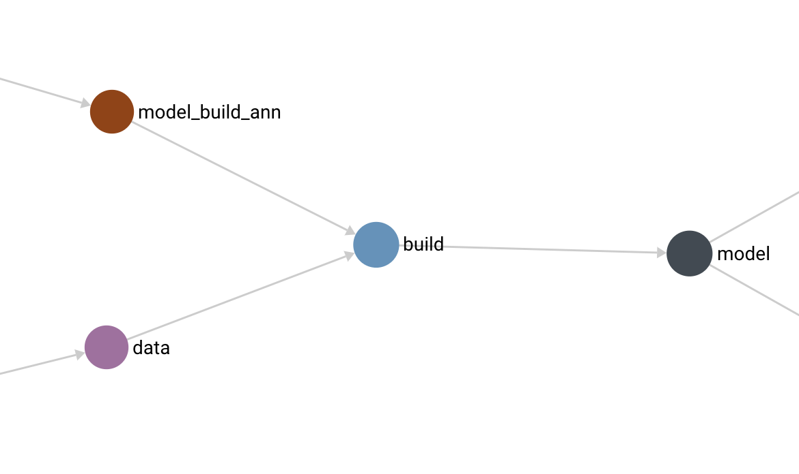
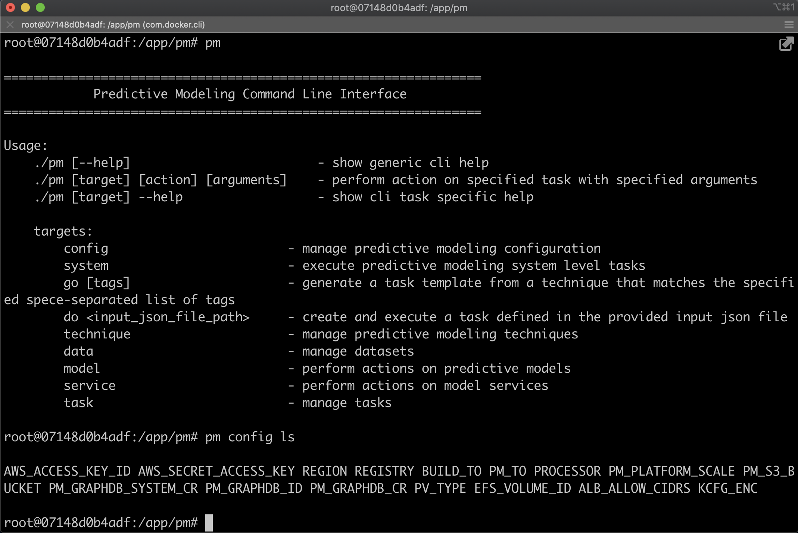
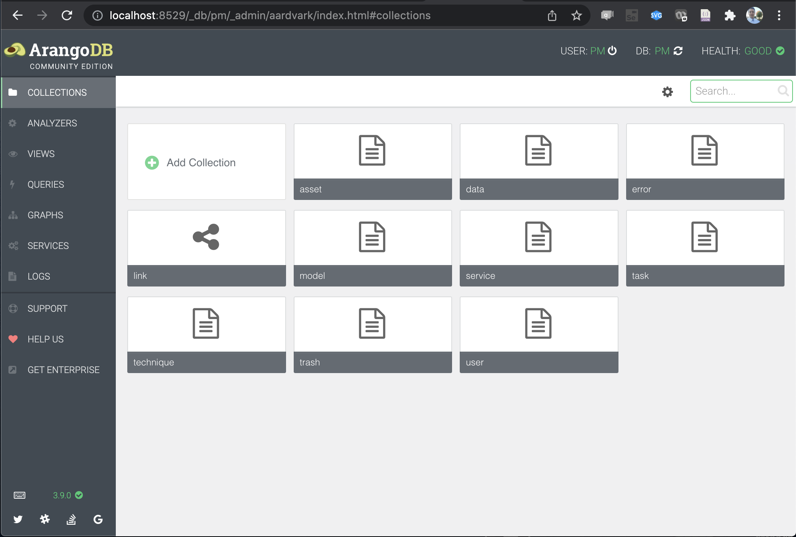
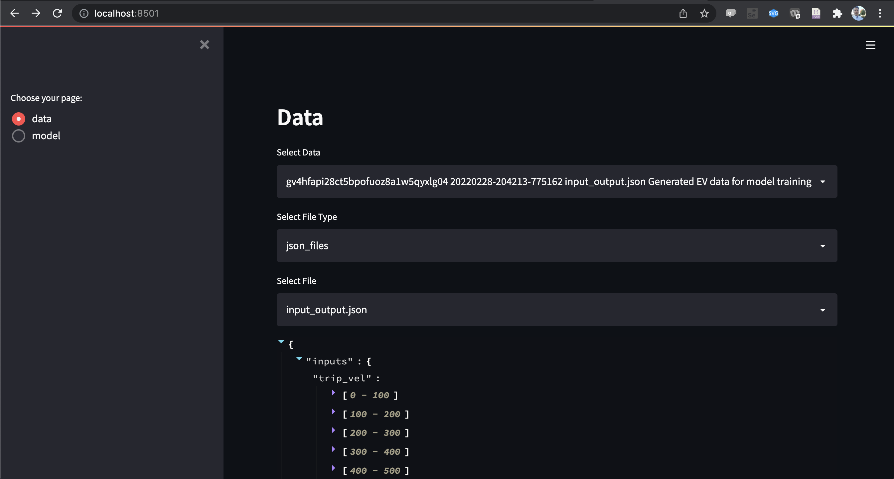

# Framework

# 1. Overview
The [aws-do-pm](https://github.com/aws-samples/aws-do-pm) project provides an extensible framework for building predictive modeling and other applications. This document describes the reference architecture, the implemented entities, and how to interact with them.

# 2. Architecture
The reference architecture of [aws-do-pm](https://github.com/aws-samples/aws-do-pm) (Fig. 1) consists of three layers: Services, Entities, and Interfaces.

<div align="center">

<br/>
Fig 1. - aws-do-pm architecture
</div>
<br/>

The architecture is containerized and implemented as a [Do framework](https://github.com/aws-samples/aws-do-docker) project. It can run locally or on the cloud. It supports EKS and Docker/docker-compose as target container orchestrators. Users and applications interact with [aws-do-pm](https://github.com/aws-samples/aws-do-pm) through its CLI and SDK interfaces. 

# 3. Interfaces
To interact with [aws-do-pm](https://github.com/aws-samples/aws-do-pm), use either the `pm` CLI or the platform SDK. 

## 3.1. CLI
The [`pm`](../pm) cli is available in the root of the [aws-do-pm](https://github.com/aws-samples/aws-do-pm) project as well as in the default work directory (`/app/pm`) of the platform container.
To learn more about the functionality included in the `pm` CLI, use:
```
./pm --help
```
or 
```
./pm <target> --help
```
In addition to the static targets (config, system, technique, data, model, service, task), the `pm` CLI comes with a system of dynamic targets, driven by the tags of the techniques that are registered in the system. To access this functionality, use:
``` 
./pm go [tags]
```
If you specify no tags, the `pm` CLI will show prompt you to qualify your command further and show a list of possible options. It will continue do ing that until you enter a combination of tags that uniquely identifies a technique. Then it will generate and provide a task json, using the selected technique. You can edit the task json as needed, then execute the task by using the `pm do` command.
```
pm do <task.json>
```

## 3.2. SDK
The [aws-do-pm](https://github.com/aws-samples/aws-do-pm) project provides a [Python](https://python.org) SDK throught the packages described in this section.

### 3.2.1. pm
The [`pm`](../src/python/pm) package provides access to the framework entities and the functionality they offer. This package is available in the platform container. Optionally you can build your own container which includes this package.

### 3.2.2. lib
The [`lib`](../src/python/lib) package contains common code that is shared by `pm` entities. It includes some utilities that could be useful for external code as well. Each entity in [aws-do-pm](https://github.com/aws-samples/aws-do-pm) has a unique identifier. The [UID generator](../src/python/lib/uid_generator.py) is located at the root of the [lib package](../src/python/lib).

# 4. Entities
Entities are at the core of the [aws-do-pm](https://github.com/aws-samples/aws-do-pm) framework. 

## 4.1. Technique
A [technique](../src/python/pm/technique/technique.py) defines how to complete a task. A technique contains a task template. A technique can be registered with [aws-do-pm](https://github.com/aws-samples/aws-do-pm). Detailed information about techniques is available here: [Techniques.md](./Techniques.md). To list all available techniques, use `./pm technique ls`.

## 4.2. Task
While a technique defines `how` to do work, the [task](../src/python/pm/task/task.py) defines `what` is the work to do. The connection between a [technique](../src/python/pm/technique) and a [task](../src/python/pm/task) is the [task template](../src/python/pm/task/task_template.json) that is registered within a technique. Each unit of work / operation that the platform executes, is a task. As the system operates, it builds a graph. The entities are nodes in the graph. The task entity is a node in the graph which acts as the connection between input and output entities.

<div align="center">

<br/>
Fig 2. - aws-do-pm task
</div>
<br/>

In Fig.2 the "build" node is an example of a task. To list all tasks, use `./pm task ls`.

## 4.3. Data
A [data](../src/python/pm/data/data.py) entity can be any dataset either generated by the system or generated externally and then registered with [aws-do-pm](https://github.com/aws-samples/aws-do-pm). To list all available datasets, use `./pm data ls`. For further information, please refer to `./pm data --help`.

## 4.4. Model
A [model](../src/python/pm/model/model.py) entity can be either a model built within the system or one that was created externally and then registered with [aws-do-pm](https://github.com/aws-samples/aws-do-pm). To list all available models, use `./pm model ls`. For further information, please refer to `./pm model --help`.

# 5. Services
When [aws-do-pm](https://github.com/aws-samples/aws-do-pm) is deployed, it starts three containers: platform, graphdb, and ui. The containers can be seen by executing the `./status.sh` script. Each of these containers represents a service.

## 5.1. Platform
The `platform` service is responsible for the orchestration and execution of tasks as well as persistence and synchronization of data between the object store, the graph database, and local storage. To avoid differences in user's local shell environments, it is recommended that `pm` CLI commands are executed from a platform shell when possible. To open a platform shell, run the `./exec.sh` script. Running `pm` CLI commands within a platform container can be done by just typing `pm` vs `./pm`, though either one will work.

<div align="center">

<br/>
Fig 3. - aws-do-pm platform service
</div>
<br/>

## 5.2. Graph DB
The `graphdb` service is responsible for storing metadata about the operations and entities. The current implementation of [aws-do-pm](https://github.com/aws-samples/aws-do-pm) uses [ArangoDB](https://www.arangodb.com/) as a graph database.

<div align="center">

<br/>
Fig 4. - aws-do-pm graphdb service
</div>
<br/>

## 5.3. UI
The `ui` service is a web application built using [Streamlit](https://streamlit.io/). It can be used to browse and explore data and models from [aws-do-pm](https://github.com/aws-samples/aws-do-pm) in json form as well as display images / charts that are produced by the techniques.

<div align="center">

<br/>
Fig 5. - aws-do-pm ui service
</div>
<br/>

# 6. Applications
Predictive modeling and other applications can be built using the [aws-do-pm](https://github.com/aws-samples/aws-do-pm) framework. Several [techniques](./Techniques.md) are already included and get automatically registered when the system initializes. Those techniques can be used as building blocks for new applications. When new techniques are needed, they can be built either by extending this project, or externally and then registered with the system. One predictive modeling application, build using this framework is the included [EV example](../src/python/example/ev). It uses built-in as well as custom techniques to demostrate modeling of a single electric vehicle as well as a fleet of electric vehicles. 

## 6.1. Building custom techniques

### 6.1.1. System techniques
System techniques are ones that can be used by more than one appliction. To use the current project template and add another system technique follow the process below:

#### 6.1.1.1. Add technique code
System techniques are included under [../src/python/technique](../src/python/technique/). If you are developing a technique that is generic and reusable, consider adding it as a system technique.

#### 6.1.1.2. Add Dockerfile
Add another container to the project by creating a Dockerfile in the project's root folder, named Dockerfile-<container_name>. The build script will automatically pick up the new file when executing `./build.sh ls` or `./build.sh all`. You can build only your new container by specifying the name of your Dockerfile as an argument: `./build.sh Dockerfile-<container_name>`.

#### 6.1.1.3. Create task template
Each technique should define a task template. See examples of task templates in each of the existing techniques. The following is an example of a task template for the model_predict_grpc technique: [../src/python/technique/model_predict_grpc/task_template_model_predict_grpc.json](../src/python/technique/model_predict_grpc/task_template_model_predict_grpc.json).

#### 6.1.1.4. Create technique registration
A technique registration json is necessary in order to add a technique to [aws-do-pm](https://github.com/aws-samples/aws-do-pm). Please follow the examples from [../src/python/pm/technique](../src/python/pm/technique) to create a technique_registration.json for your new technique. The technique registration must contain the task template you created in the previous step. Example: [../src/python/pm/technique/technique_registration_model_predict_grpc.json](../src/python/pm/technique/technique_registration_model_predict_grpc.json)

#### 6.1.1.5. Create a technique registration task
A technique registration task is needed in odrder to execute the technique registration you configured in the previous step. Examples of such tasks are available in the [pm/task](../src/python/pm/task/) folder. Example: [../src/python/pm/task/task_technique_register_model_predict_grpc.json](../src/python/pm/task/task_technique_register_model_predict_grpc.json).

#### 6.1.1.6. Add technique to system init
To include the new system technique to the initialization script, add a section at the end of the following python script: [../src/python/pm/task/task_register_system_techniques.py](../src/python/pm/task/task_register_system_techniques.py). Then re-initialize the system by executing `./pm system clear` and `./pm system init`. When initialization is done, you should be able to see the new technique in the list of techniques shown by `./pm technique ls`.

## 6.1.2. Application-specific techniques
Application-specific techniques should be placed in their own folder ( e.g. ../src/python/app/name or ../src/python/example/name ) or developed in a separate project. Example techniques for the EV demo are included here: [../src/python/example/ev/technique](../src/python/example/ev/technique).A good project structure for containerized applications and techniques that could accelerate your development process is available here: [https://github.com/aws-samples/aws-do-docker](https://github.com/aws-samples/aws-do-docker).

To register your custom technique, follow steps 6.1.1.3 and 6.1.1.4, then execute `./pm technique register <technique_registration_json>`

# 7. Target Orchestrator
The [aws-do-pm](https://github.com/aws-samples/aws-do-pm) project was built using the [aws-do-docker](https://github.com/aws-samples/aws-do-docker) template and supports deployment to different target container orchestrators. It has been implemented and tested to work on [Amazon EKS](https://aws.amazon.com/eks) (TO=kubernetes) and [Docker Compose](https://docs.docker.com/compose/) (TO=compose), provided by either [Docker Desktop](https://www.docker.com/products/docker-desktop), or [docker-compose for Linux](https://docs.docker.com/compose/install/). Other target orchestrator may be enabled by implementing them in this project using the templates in the [to](../to) folder.

To configure the target orchestrator use `./pm config set PM_TO`.

# 8. Infrastructure
The [aws-do-pm](https://github.com/aws-samples/aws-do-pm) project can be deployed locally, on-premises, or in the cloud. It can run on a single machine or a multi-node cluster. This implementation of the project is specific to AWS because it uses the following [AWS](https://aws.amazon.com) utilities and services: [AWS CLI](https://aws.amazon.com/cli/), [Amazon S3](https://aws.amazon.com/s3/), [Amazon EFS](https://aws.amazon.com/efs/),[Amazon ECR](https://aws.amazon.com/ecr/), [Amazon EKS](https://aws.amazon.com/eks/).  

<br/>
<br/>

Back to main [README.md](../README.md)
