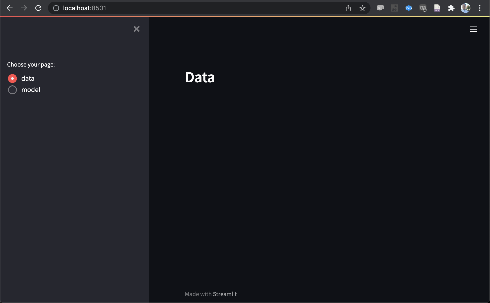
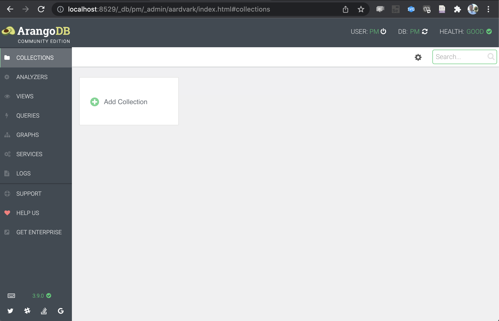
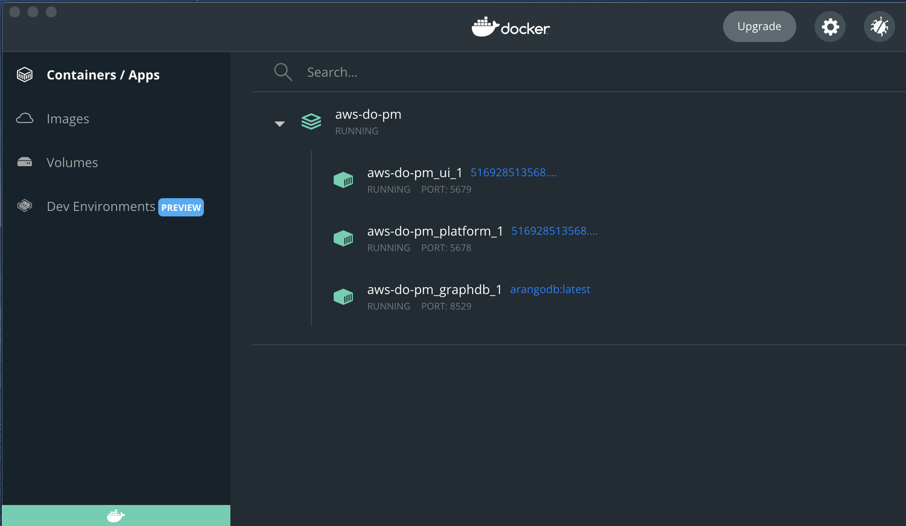
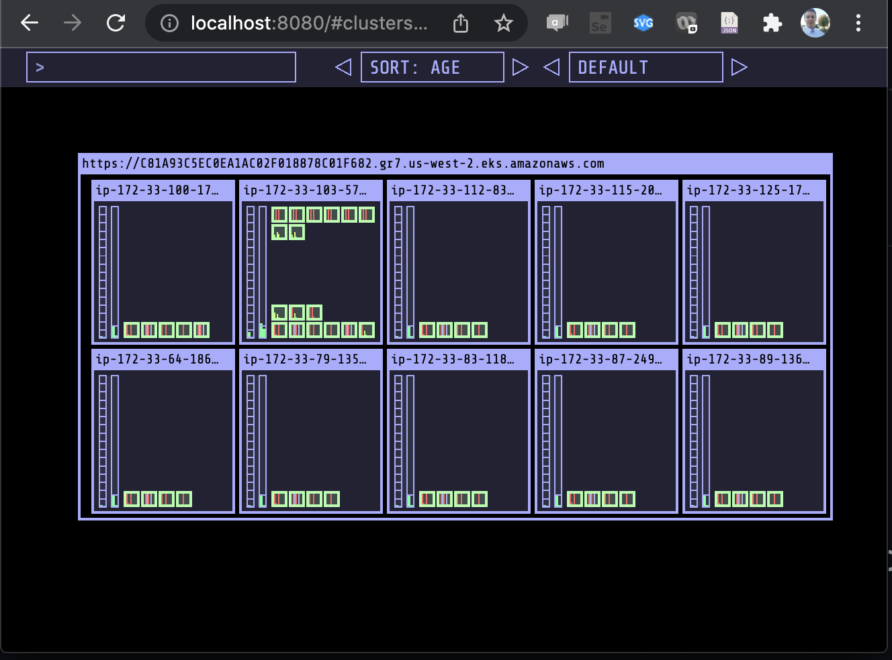

# Setup
This document will walk through a one-time setup that is needed to operationalize the [aws-do-pm](https://github.com/aws-samples/aws-do-pm) project in your environment starting from source.

## 1. Clone

```
git clone https://github.com/aws-samples/aws-do-pm
```

## 2. Configure

The project comes with a command line interface (CLI). To invoke the CLI, just type `./pm` and hit `Enter`. The CLI is equipped with help menus that can be accessed by adding `--help` as an argument on the command line.

```
./pm --help

================================================================
            Predictive Modeling Command Line Interface
================================================================

Usage:
    ./pm [--help]                         - show generic cli help
    ./pm [target] [action] [arguments]    - perform action on specified task with specified arguments
    ./pm [target] --help                  - show cli task specific help

    targets:
        config                        - manage predictive modeling configuration
        system                        - execute predictive modeling system level tasks
        go [tags]                     - generate a task template from a technique that matches the specified spece-separated list of tags
        do <input_json_file_path>     - create and execute a task defined in the provided input json file
        technique                     - manage predictive modeling techniques
        data                          - manage datasets
        model                         - perform actions on predictive models
        service                       - perform actions on model services
        task                          - manage tasks
```

To review the available configuration options, please execute:
 ```
./pm config --help`
```
Output:
```
Usage:
    ./pm config <action> [arguments]

    actions:
        ls                            - list standard config items
        show [item]                   - show value of all or a single config item
        set  [[item] [value]]         - set values of all or a specific config item

  items:
    AWS_ACCESS_KEY_ID     - key id for access to AWS API, if not specified, settings from 'aws configure' take effect
    AWS_SECRET_ACCESS_KEY - secret key for access to AWS API, if not specified, settings from 'aws configure' take effect
    REGION                - AWS default region, default: us-west-2
    REGISTRY              - container registry URI including trailing '/', can be blank if running locally
    BUILD_TO              - target orchestrator for building container images. Options: docker(default), compose
    PM_TO                 - target orchestrator for running aws-do-pm containers. Options: compose(default), kubernetes
    PROCESSOR             - target processor to run model operations on. Options: cpu(default), gpu
    PM_PLATFORM_SCALE     - number of platform containers to run (default: 1)
    PM_S3_BUCKET          - S3 bucket name for storing aws-do-pm data and models
    PM_GRAPHDB_SYSTEM_CR  - credential to configure for system access to the graph database
    PM_GRAPHDB_USER       - login id to configure for user access to the graph db
    PM_GRAPHDB_PWD        - credential to configure for user access to the graph database
    PV_TYPE               - persistent volume type, use 'efs'(default) for multi-node Kubernetes on AWS, and 'hostpath' for local deployments
    EFS_VOLUME_ID         - EFS file system id to use as a shared volume for aws-do-pm workloads (used only when PM_TO=kubernetes, default='')
    ALB_ALLOW_CIDRS       - comma-separated list of IP CIDRs that will be allowed to connect to aws-do-pm UIs (used only when PM_TO=kubernetes, default=0.0.0.0/0)
    KCFG_ENC              - base64 encoded kube config for aws-do-pm to use when orchestrating tasks on kubernetes (used only when PM_TO=kubernetes, default='')
```

Next, perform initial configuration of the project by executing `./pm config set` similarly to the example below. Please use actual values for the AWS credentials and your REGISTRY. A blank REGISTRY setting is acceptable if you are planning to only run the demo locally.

```
./pm config set
```
```
Enter value for AWS_ACCESS_KEY_ID [Enter=]: ABABABABABABABABABAB
Enter value for AWS_SECRET_ACCESS_KEY [Enter=]: mlkajhdlkjhqoiuelkjahsdlfhl
Enter value for REGION [Enter=]: us-west-2
Enter value for REGISTRY [Enter=]: 123456789876.dkr.ecr.us-west-2.amazonaws.com/
Enter value for BUILD_TO [Enter=docker]: docker
Enter value for PM_TO [Enter=compose]: compose
Enter value for PROCESSOR [Enter=cpu]: cpu
Enter value for PM_S3_BUCKET [Enter=aws-do-pm]: aws-do-pm
Enter value for PM_GRAPHDB_SYSTEM_CR [Enter=]: root
Enter value for PM_GRAPHDB_ID [Enter=]: pm
Enter value for PM_GRAPHDB_CR [Enter=]: pm
Enter value for PV_TYPE [Enter=efs]:
Enter value for EFS_VOLUME_ID [Enter=]: 
Enter value for ALB_ALLOW_CIDRS [Enter=0.0.0.0/0]: 
Enter value for KCFG_ENC [Enter=]:
```

This script configures all necessary settings for the predictive modeling application. You can re-run the `./pm config set` command again if you wish to make additional changes. To edit a single value interactively, you can use `./pm config set <SETTING_NAME>`. To configure a setting with a particular value, you can use `./pm config set <SETTING_NAME> <VALUE>` and to enter expert configuration mode, you can execute `./config.sh`.  

> Note: [Enter=] in the settings above, means that the default value is blank. When a value is not specifiec after the ":", it means that it is ok to leave it blank for docker-compose. Settings PV_TYPE, EFS_VOLUME_ID, ALB_ALLOW_CIDRS, and KCFG_ENC are needed only when the target orchestrator is Kubernetes. 

> Note: The PROCESSOR value specified here is a global setting. Each technique can be registered with a task-specific processor setting which overrides this value (Example: [../src/python/pm/technique/technique_registration_model_build_ann.json](../src/python/pm/technique/technique_registration_model_build_ann.json) ). If the processor is set to GPU and a GPU device is not available in the container, then the task will run on CPU. If the processor is set to a blank string then CPU will be used by default.

## 3. Build

The project runs all workloads in containers.

```
./build.sh --help
```
```

Usage:
    ./build.sh [option] - builds one or more containers in this project.

                  The build behavior is controlled by settings
                  in the configuration file .env

                  BUILD_TO -       controls whether the build is run by docker or docker-compose
                                   use './config.sh BUILD_TO docker' or './config.sh BUILD_TO compose' to set
                                   BUILD_TO=docker is recommended since it can build all container images
                                   BUILD_TO=compose will only build the platform and ui container image

       options when BUILD_TO=docker:
            ''         - build the last built Dockerfile
            ls         - list available Dockerfiles to build
            all        - build all Dockerfiles sequentially
```

To build the container images from source, simply execute: 
```
./build.sh all
```

## 4 Push

If you would like to run aws-do-pm on Kubernetes or outside of your build environment, you will need to push the container images to a Docker registry. The project provides scripts to automate this task. You would have to specify a REGISTRY in the project configuration before you build and push container images.

`./pm config set REGISTRY`   - provide container registry URI, including `/` at the end

`./ecr-setup.sh`             - create all necessary repositories in the registry

`./login.sh`                 - authenticate with Amazon Elastic Container Registry

`./push.sh all`              - push all container images built by the aws-do-pm project


```
./push.sh --help

Usage: ./push.sh [arg] - push one or more images to the configured registry

      arg:

        ''      - push the latest build image only
        ls      - list available images to push
        all     - push all project images
        image   - push specified image
```

To push the images to your registry execute the one-time setup:
```
./pm config set REGISTRY
./ecr-setup.sh
```
then each time you'd like to push changes to your container images, you can execute:
```
./login.sh
./push.sh all
```

## 5. Deploy

The project can be deployed on a single host or a cluster of machines using [docker-compose](https://docs.docker.com/compose/) or [kubernetes](https://kubernetes.io). The [Do framework](https://github.com/aws-samples/aws-do-docker) management scripts (`./run.sh`, `./status.sh`, `./stop.sh`) will be used to run, monitor, and stop the deployment on any of the configured target orchestrators.

### 5.1. Docker Compose
This target orchestrator is suitable for use on a single machine running either [Docker Engine](https://docs.docker.com/engine/) or [Docker Desktop](https://docs.docker.com/desktop/). 

#### 5.1.1. Run

To bring the application up, using docker-compose, ensure `PM_TO` is set to `compose` and then execute `./run.sh`.

```
./pm config set PM_TO compose
./run.sh
```
Output:
```
Running container aws-do-pm-platform-compose on compose ...
Generating compose files ...
Creating network "aws-do-pm_default" with the default driver
Creating aws-do-pm_platform_1 ... done
Creating aws-do-pm_ui_1       ... done
Creating aws-do-pm_graphdb_1  ... done
```

> Note: `docker-compose` refers to the [standalone Docker Compose](https://docs.docker.com/compose/install/) distribution, while `docker compose` refers to the Docker Compose distribution that is included in [Docker Desktop](https://docs.docker.com/desktop/). By default [aws-do-pm](https://github.com/aws-samples/aws-do-pm) uses `docker-compose`. If you would like to use `docker compose`, just modify the `DOCKER_COMPOSE` setting in the advanced configuration by executing `./config.sh` and setting this line: [export DOCKER_COMPOSE="docker compose"](https://github.com/aws-samples/aws-do-pm/.env#L176).

#### 5.1.2. Check status
To verify that aws-do-pm containers have started successfully, execute the `./status.sh` script:

```
./status.sh
```
Output:
```
Showing status on target orchestrator compose ...
62d1e9425256   arangodb:latest                                                          "/entrypoint.sh aran…"   5 seconds ago   Up 3 seconds                0.0.0.0:8529->8529/tcp                           aws-do-pm_graphdb_1
65fa7f6f0bb6   ************.dkr.ecr.us-west-2.amazonaws.com/aws-do-pm-platform:latest   "streamlit run /src/…"   5 seconds ago   Up 3 seconds                0.0.0.0:5679->5679/tcp, 0.0.0.0:8501->8501/tcp   aws-do-pm_ui_1
2b7908df5caa   ************.dkr.ecr.us-west-2.amazonaws.com/aws-do-pm-platform:latest   "/startup.sh"            5 seconds ago   Up 3 seconds                0.0.0.0:5678->5678/tcp                           aws-do-pm_platform_1
```

#### 5.1.3. Browse
The framework provides two user interfaces. A platform UI ( [http://localhost:8501](http://localhost:8501) ), and a graph database UI ( [http://localhost:8529](http://localhost:8529) ). You may browse each of these URLs to ensure the services are reachable. There will be no data since the system has not been initialized. The platform UI does not require a login, use the configured login id and credential for the the graphdb user account to gain access to the database UI. 

<table>
<tr>
<td>
<div align="center">

<br/>
Fig 1. - Platform UI service, blank
</div>
</td>
<td>
<div align="center">

<br/>
Fig 2. - Graphdb UI, blank
</div>
</td>
</tr>
</table>
<br/>

You have deployed [aws-do-pm](https://github.com/aws-samples/aws-do-pm) locally on [Docker Compose](https://docs.docker.com/compose). Next, you may proceed to running the single EV demo. 

### 5.2. Kubernetes
A [Kubernetes](https://kubernetes.io) instance can run locally on a single node, or it can run distributed in a multi-node cluster.

#### 5.2.1. Local Kubernetes instance
This deployment is suitable for use on a local, single-node [Kubernetes instance](https://www.docker.com/products/kubernetes) like the one provided by [Docker Desktop](https://docs.docker.com/desktop/).

##### 5.2.1.1. Run
To run [aws-do-pm](https://github.com/aws-samples/aws-do-pm) on a single-node local Kubernetes instance, set the PM Target Orchestrator to `kubernetes`, set the persistent volume type to `hostpath` and execute the `./run.sh` script as shown below:
```
./pm config set PM_TO kubernetes
./pm config set PV_TYPE hostpath
./run.sh
```
Output:
```
Running container aws-do-pm-platform-kubernetes on kubernetes ...
Generating Kubernetes manifests ...
secret/regcred created
```
##### 5.2.1.2. Check status
To verify that aws-do-pm has started successfully, execute the `./status.sh` script:
```
./status.sh
```
Output:
```
Showing status on target orchestrator kubernetes ...
NAME                        READY   STATUS    RESTARTS   AGE
graphdb-74b77d866-k5clv     1/1     Running   0          45s
platform-7cd9895987-tkvbz   1/1     Running   0          45s
ui-799cc55c79-mc794         1/1     Running   0          45s
```
> Note: Please allow at least 45 seconds for the pods to enter the Running state. You may run the `./status.sh` script multiple times, or execute `watch ./status.sh` to observe the deployment status while the pods are starting up.

##### 5.2.1.3. Browse
To browse the UI services that this deployment offers, we will use port forwarding from a local port to the corresponding service port in Kubernetes. The `./expose.sh` script can be used for this purpose.

```
./expose.sh --help
```
Output:
```
Usage: ./expose.sh [service_name] [local_port_number] - expose a service locally through port forwarding

      service_name       - name of service to expose (ui|grapdb), default: ui
      local_port_number  - local port number to forward to the service port, default: 8501
```

To expose the platform UI service, execute:
```
./expose.sh ui
```
Then browse [http://localhost:8501](http://localhost:8501) and you should see the screen shown on Fig. 1

Similarly you can expose the graphdb UI by executing:
```
./expose.sh graphdb
```
You can then browse [http://localhost:8529](http://localhost:8529) and see the screen shown on Fig. 2


#### 5.2.2. Distributed Kubernetes instance
A deployment of this type is suitable for running large, distributed, predictive modeling tasks. 

This section assumes that a Kubernetes cluster is available and we have credentials that allow full access to the cluster for deployment of [aws-do-pm](https://github.com/aws-samples/aws-do-pm). Also we assume that the [EFS CSI Driver](https://github.com/aws-samples/aws-do-eks/tree/main/Container-Root/eks/deployment/efs-csi) is deployed on the cluster since we will be using an [Amazon EFS](https://aws.amazon.com/efs) volume as shared storage. Setting up an [Amazon Elastic Kubernetes Service (EKS)](https://aws.amazon.com/eks/) cluster and deployig the [EFS CSI driver](https://github.com/aws-samples/aws-do-eks/tree/main/Container-Root/eks/deployment/efs-csi) can be done by using the [aws-do-eks](https://github.com/aws-samples/aws-do-eks) project. Alternatively, you can follow the steps in this end-to-end [deployment walkthrough](docs/Deployment.md) which creates a cluster using [aws-do-eks](https://github.com/aws-samples/aws-do-eks) and then deploys [aws-do-pm](https://github.com/aws-samples/aws-do-pm) on it.

##### 5.2.2.1. Run
To run aws-do-pm, ensure `PM_TO` is set to `kubernetes`, `PV_TYPE` is set to `efs`, as well as `REGISTRY, EFS_VOLUME_ID, ALB_ALLOW_CIDRS, and KCFG_ENC` are configured, then execute the `./run.sh` script.

The `KCFG_ENC` setting can be configured by executing the kube config script: `./kcfg.sh`

```
./kcfg.sh --help
```
Output:
```
Usage ./kcfg.sh [kubeconfig_path]      - configure pm platform for access to Kubernetes

          kubeconfig_path       - optional location of the kube config file to encode
                                  default: ~/.kube/config
```

```
./kcfg.sh
```
Output:
```
NEW_VALUE is:
YXBpVmVyc2lvbjogd...
... ... ... ... ...
... ... ... TmZtTGcK
```

To configure the rest of the settings, it is convenient to use the interactive wizard.
```
./pm config set
```
And last, execute the `./run.sh` script to deploy aws-do-pm.
```
./run.sh
```
Output:
```
Running container aws-do-pm-platform-kubernetes on kubernetes ...
Generating Kubernetes manifests ...
Warning: batch/v1beta1 CronJob is deprecated in v1.21+, unavailable in v1.25+; use batch/v1 CronJob
secret/regcred created
```

##### 5.2.2.2. Check status
To make sure that aws-do-pm is healthy, execute the `./status.sh` script.
```
./status.sh
```
Output:
```
Showing status on target orchestrator kubernetes ...
NAME                        READY   STATUS    RESTARTS   AGE
graphdb-74b77d866-2djhj     1/1     Running   0          2m12s
platform-5c4f55f97f-hvb6p   1/1     Running   0          2m12s
ui-69b78dffdc-mln4d         1/1     Running   0          2m12s
```

##### 5.2.2.3. Browse
The aws-do-pm UIs running in a distributed Kubernetes instance are exposed via ingress objects and Application Load Balancers, managed by the AWS Load Balancer Controller, deployed to the cluster. The ingress objects are created automatically by the run script. To view the URLs corresponding to the ingress objects, execute the command below:

```
kubectl get ingress
```
Output:
```
NAME      CLASS    HOSTS   ADDRESS                                                               PORTS   AGE
graphdb   <none>   *       k8s-awsdopm-graphdb-5bb477c842-43825769.us-west-2.elb.amazonaws.com   80      16h
ui        <none>   *       k8s-awsdopm-ui-547c3e085f-1541392111.us-west-2.elb.amazonaws.com      80      16h
```

If you copy and paste the `ui` address into your browser, you will see the screen shown on Fig. 1. Similarly, browsing the address for `graphdb` will bring up the screen shown on Fig. 2. 

> Note: If you need to temporarily change the allowed CIDRs for an ingress, you can open the ingress object, by executing `kubectl edit ingress <ingress_name>` and edit the `alb.ingress.kubernetes.io/inbound-cidrs:` annotation in place.

## 6. Monitor 
Several tools are availble for monitoring and visualization of container workloads. The tools utilized in this section is optional and they can be substituted as needed.

### 6.1. Docker Compose
The [Docker Desktop Dashboard](https://docs.docker.com/desktop/dashboard/) can be used to monitor the local containers. Fig. 3 shows a local [aws-do-pm](https://github.com/aws-samples/aws-do-pm) deployment on [Docker Compose](https://docs.docker.com/compose).

<div align="center">

<br/>
Fig 3. - Docker Desktop Dashboard
</div>
<br/>

Alternatively, the following docker CLI command can be used:
```
watch docker ps -a
```
Output:
```
Every 2.0s: docker ps -a                                                                               88665a0cc820.ant.amazon.com: Wed Feb 23 17:28:59 2022

CONTAINER ID   IMAGE             COMMAND                  CREATED       STATUS       PORTS                                            NAMES
34ad08b7ca42   9248046a6a72      "streamlit run /src/…"   2 hours ago   Up 2 hours   0.0.0.0:5679->5679/tcp, 0.0.0.0:8501->8501/tcp   aws-do-pm_ui_1
3ac1395eec5e   9248046a6a72      "/startup.sh"            2 hours ago   Up 2 hours   0.0.0.0:5678->5678/tcp                           aws-do-pm_platform_1
685af435cf90   arangodb:latest   "/entrypoint.sh aran…"   2 hours ago   Up 2 hours   0.0.0.0:8529->8529/tcp                           aws-do-pm_graphdb_1
```

### 6.2. Kubernetes
[Kube-ops-view](https://codeberg.org/hjacobs/kube-ops-view) is a tool which allows visualization of a [Kubernetes](https://kubernetes.io) cluster. 
We can use the following command to run [kube-ops-view](https://codeberg.org/hjacobs/kube-ops-view) locally:
```
docker run -it -p 8080:8080 -v ~/.kube/config:/root/.kube/config -e KUBECONFIG_CONTEXTS=aws-do-pm-eks,docker-desktop -e KUBECONFIG_PATH=/root/.kube/config  hjacobs/kube-ops-view
```
After the kube-ops-view container is up, browsing the url [http://localhost:8080](http://localhost:8080) visualizes the clusters we have configured through the previous command. Fig. 4 below shows a 10-node Kubernetes cluster where [aws-do-pm](https://github.com/aws-samples/aws-do-pm) has been deployed.

<div align="center">

<br/>
Fig 4. - kube-ops-view, 10 nodes, idle
</div>
<br/>

Alternatively, the following kubectl CLI command can be used:
```
watch "kubectl -n aws-do-pm get pods"
```
Output:
```
Every 2.0s: kubectl -n aws-do-pm get pods           5a014daa7770: Thu Feb 24 01:37:06 2022

NAME                        READY   STATUS    RESTARTS   AGE
graphdb-74b77d866-7vgk9     1/1     Running   0          48s
platform-5c4f55f97f-fc5r4   1/1     Running   0          48s
ui-69b78dffdc-hcpsx         1/1     Running   0          48s
```

When the number of pods is too large to fit on one screen, we could count just watch the number of pods, using the following command:
```
watch "kubectl -n aws-do-pm get pods | grep -v NAME | wc -l"
```
Sample output:
```
Every 2.0s: kubectl -n aws-do-pm get pods | gre...  5a014daa7770: Thu Feb 24 01:38:46 2022

1360
```

At this time your project is configured, built, and deployed. A great way to see predictive modeling in action, using the aws-do-pm framework is to run the included demos.

<br/>
<br/>

Back to main [README.md](../README.md)